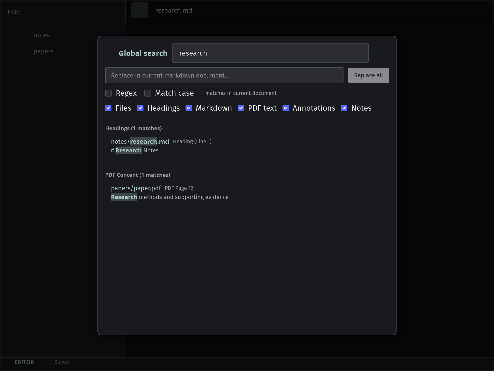
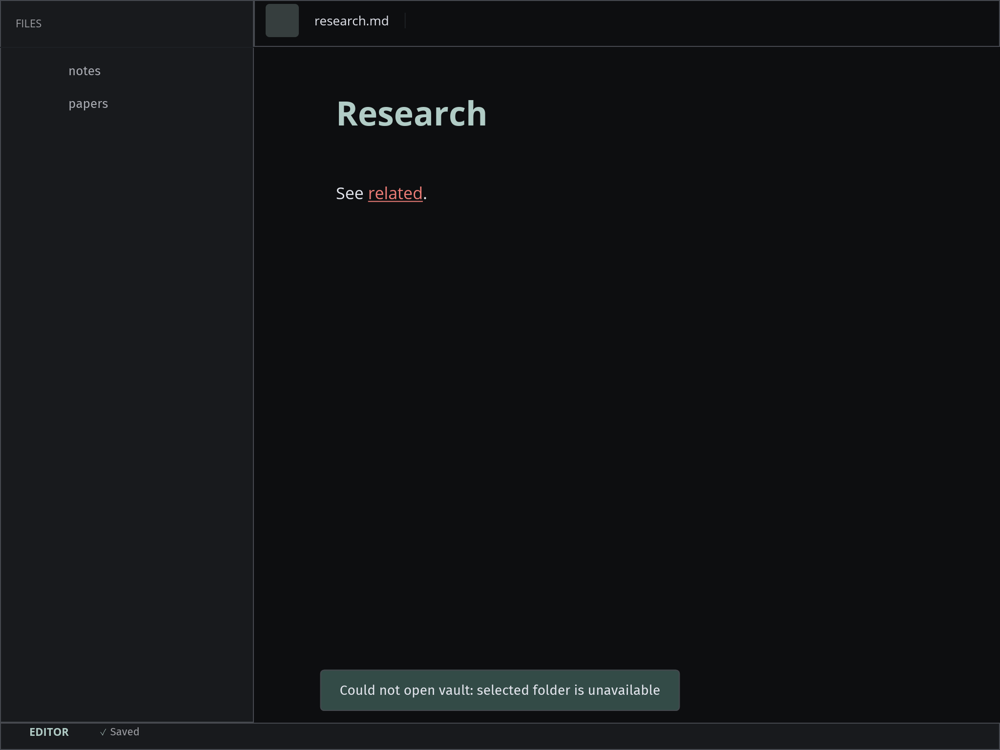

# MD Editor

**A calm, local-first Markdown workspace for notes, PDFs, images, search, backlinks, and study progress.**


MD Editor is a native desktop app for people who do serious work with ordinary
files. Open a folder as your vault, write in Markdown, read PDFs beside your
notes, keep track of study sessions, and search across everything without moving
your thinking into a cloud-only system.

It is designed to feel personal and practical: a desk for your notes, papers,
references, and progress, all stored locally in formats you can keep using
outside the app.

---

## At A Glance

| Work locally | Read deeply | Find quickly | Keep momentum |
| --- | --- | --- | --- |
| Use any folder as a vault. Your Markdown, PDFs, and images stay as normal files. | Open PDFs beside notes, copy text, create sidecar highlights, and link important passages back to Markdown. | Search the active file, the full vault, and PDF text with focused result navigation. | Track sessions, reading, project stages, and study gates in the same workspace. |

## Why It Exists

Most writing tools are either too small for research or too eager to own your
workflow. MD Editor takes a quieter route.

You bring a folder. The app gives you a native workspace around it: an editor,
file tree, backlinks, table of contents, PDF viewer, search tools, image preview,
and study tracker. When you close the app, your work is still there as plain
Markdown and local files.

Use it for:

- research notes and reading logs;
- study vaults and course material;
- project journals and technical documentation;
- paper review, PDF annotation, and linked notes;
- any long-running body of notes that should remain portable.

## The Workspace

### 1. Open A Vault

Choose a folder and MD Editor turns it into a working vault. The file panel
indexes supported files and gives you a familiar tree for opening, creating, and
deleting notes.

### 2. Write In Markdown

The editor renders Markdown live as you type and supports the things you expect
in a real Markdown workspace:

- headings, emphasis, links, blockquotes, and task checkboxes;
- fenced code blocks with syntax highlighting;
- tables, images, and math rendering;
- in-file search with highlighted matches;
- table of contents navigation for longer notes;
- backlinks for discovering connected material;
- a tree-structured undo history that never discards your redo path.

### 3. Keep References Beside Your Notes

PDFs open inside the app, so reading and writing can happen in one place.

- Continuous page rendering and fit-to-width viewing
- PDF table of contents and internal links
- Text selection and copy
- PDF search with highlighted matches
- Sidecar highlights and quick notes
- Linked Markdown notes for important passages

PDF highlights are stored separately, so the original PDF is not modified, and
they are keyed by content hash so they survive renaming or moving the file.

### 4. Search Without Breaking Flow

MD Editor has separate search modes for different kinds of work:

- `Ctrl+F` searches the active note or PDF (whichever pane is focused).
- `Ctrl+Shift+F` searches the whole vault, including indexed PDF text.
- `Ctrl+P` quick-opens a file by name.
- `Ctrl+Shift+P` opens the command palette.

### 5. Track Study Progress

The built-in tracker (`Ctrl+Shift+T`) helps you record sessions, reading,
project stages, gates, and configuration — stored in your vault alongside your
notes, for when your notes are part of a steady study or research routine.

See the [User Guide](docs/USER_GUIDE.md) for a full tour and the
[Keyboard Shortcuts](docs/SHORTCUTS.md) for every binding.

## Screenshots

### Markdown Editing


### Notes And PDFs Together


### Study Tracker


### Global Search



### Recoverable Vault Error



## A Local-First Promise

MD Editor does not hide your work inside a proprietary database.

- Your vault is a normal folder.
- Notes are normal Markdown files; PDFs and images stay where you put them.
- App-managed state for a vault lives under `<vault>/.md-editor/` (search index,
  annotations, session, keymap overrides). It is rebuildable and can be deleted
  safely — it never mixes into your content.
- Global state (recent vaults, the study tracker database) lives beside the
  executable for **portable** builds, or in the platform configuration directory
  for **installed** builds.

Release archives are portable by default — they ship a `portable.flag` next to
the executable. For a custom build, place a `portable.flag` beside the
executable (or beside `MD Editor.app` on macOS) to opt into portable mode.

## Supported Files

| Type | Extensions |
| --- | --- |
| Markdown | `.md`, `.markdown` |
| PDF | `.pdf` |
| Images | `.png`, `.jpg`, `.jpeg`, `.gif`, `.bmp`, `.webp` |

## Supported Platforms

MD Editor targets:

| Platform | Architectures |
| --- | --- |
| Windows | x64, ARM64 |
| Linux | x64, ARM64 |
| macOS | Intel, Apple Silicon |

PDF rendering uses [PDFium](https://pdfium.googlesource.com/pdfium/). Official
release packages bundle the matching PDFium library next to the executable; see
[Build From Source](#build-from-source) for running with PDF support locally.

## Build From Source

### Requirements

- Rust stable with Cargo
- A desktop environment capable of creating native windows
- Network access on the first `pdfium` build, or a local `libpdfium`

### Run In Development

```bash
cargo run -- <vault-folder>
```

Omitting the folder (`cargo run`) opens the welcome screen. With
[`just`](https://github.com/casey/just) installed, `just run <vault-folder>`
does the same.

The default build does **not** include PDF rasterization. Enabling the `pdfium`
feature downloads a pinned, checksum-verified PDFium build for the current
Windows, Linux, or macOS architecture and caches it under `target/pdfium`:

```bash
cargo run --features pdfium -- <vault-folder>
```

For offline or custom builds, set `PDFIUM_LIB_DIR` to a directory containing
the platform library (`pdfium.dll`, `libpdfium.so`, or `libpdfium.dylib`).

### Build A Release Binary

```bash
cargo build --release -p md-shell --features pdfium
```

| Platform | Executable |
| --- | --- |
| Windows | `target\release\md-editor.exe` |
| Linux/macOS | `target/release/md-editor` |

For full release packages (archives, installers, bundled PDFium and licenses),
use `cargo xtask dist` — see [Releasing](docs/RELEASING.md).

## Optional Linux Desktop Integration

Linux release archives are portable by default; desktop integration is opt-in.

Install the launcher and icons:

```bash
./md-editor --install-desktop
```

This creates `~/.local/share/applications/md-editor.desktop`, installs resized
icons under `~/.local/share/icons/hicolor/`, and refreshes the desktop/icon
caches when those tools are available.

Remove the launcher and icons:

```bash
./md-editor --uninstall-desktop
```

## Project Structure

MD Editor is a Cargo workspace. The engine crates are toolkit-agnostic; only the
shell knows about the GUI toolkit (see [Architecture](docs/ARCHITECTURE.md)).

```text
md-editor/
├── kernel/   workspace model: panes, focus, commands, keymap (UI-free)
├── editor/   text buffer, layout, undo, Markdown parse/style (UI-free)
├── vault/    files, search index, annotations, tracker, links (UI-free)
├── pdf/      tiles, render queue, PDFium wiring (UI-free)
├── shell/    iced desktop app; builds the `md-editor` binary
├── xtask/    release packaging (`cargo xtask dist`)
├── docs/     architecture, user guide, ADRs, contributor docs
└── images/   README screenshots and intro media
```

Useful development commands (or run `just check` for all of them):

```bash
cargo fmt --all -- --check
cargo clippy --workspace --all-targets -- -D warnings
cargo test --workspace
./scripts/architecture-check.sh
./scripts/size-budget.sh
```

## Documentation

- [Architecture](docs/ARCHITECTURE.md) — crate graph, boundaries, and data flow.
- [User Guide](docs/USER_GUIDE.md) — vaults, editing, PDFs, search, tracker.
- [Keyboard Shortcuts](docs/SHORTCUTS.md) — every command and its binding.
- [Design](docs/DESIGN.md) — the visual language and tokens.
- [Releasing](docs/RELEASING.md) — packaging, smoke testing, and PDFium bundling.
- [Architecture Rules](docs/ARCHITECTURE_RULES.md) and
  [Coding Standards](docs/CODING_STANDARDS.md) — enforced boundaries and
  conventions for contributors.
- [Testing](docs/TESTING.md) — the test layers and the pre-handoff gate.
- [Decision records](docs/adr/) — the ADR log.

## License

MD Editor is released under the MIT License. See [LICENSE](LICENSE) for details.
