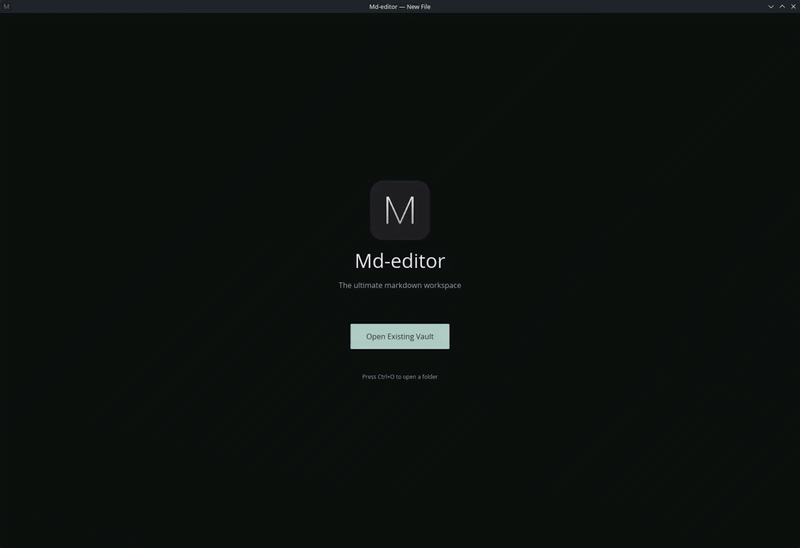
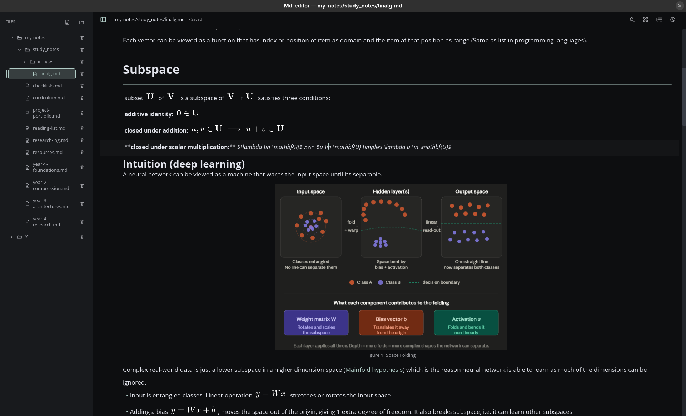
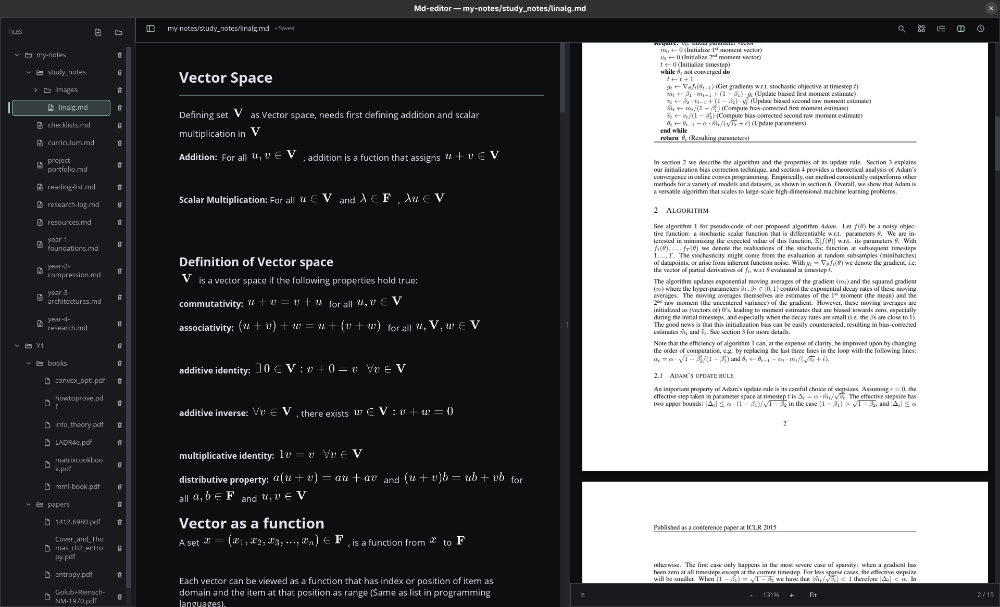
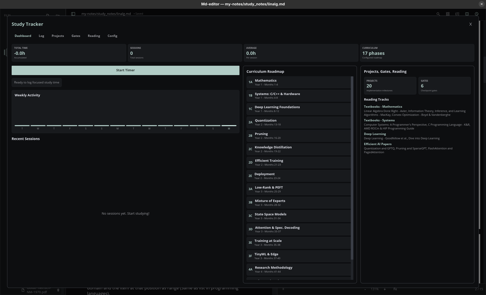

# MD Editor

**A calm, local-first Markdown workspace for notes, PDFs, images, search, backlinks, and study progress.**



MD Editor is a native desktop app for people who do serious work with ordinary
files. Open a folder as your vault, write in Markdown, read PDFs beside your
notes, keep track of study sessions, and search across everything without moving
your thinking into a cloud-only system.

It is designed to feel personal and practical: a desk for your notes, papers,
references, and progress, all stored locally in formats you can keep using
outside the app.

---

## At A Glance

| Work locally | Read deeply | Find quickly | Keep momentum |
| --- | --- | --- | --- |
| Use any folder as a vault. Your Markdown, PDFs, and images stay as normal files. | Open PDFs beside notes, copy text, create sidecar highlights, and link important passages back to Markdown. | Search the active file, the full vault, and PDF text with focused result navigation. | Track sessions, reading, project stages, and study gates in the same workspace. |

## Why It Exists

Most writing tools are either too small for research or too eager to own your
workflow. MD Editor takes a quieter route.

You bring a folder. The app gives you a native workspace around it: an editor,
file tree, backlinks, table of contents, PDF viewer, search tools, image preview,
and study tracker. When you close the app, your work is still there as plain
Markdown and local files.

Use it for:

- research notes and reading logs;
- study vaults and course material;
- project journals and technical documentation;
- paper review, PDF annotation, and linked notes;
- any long-running body of notes that should remain portable.

## The Workspace

### 1. Open A Vault

Choose a folder and MD Editor turns it into a working vault. The sidebar indexes
supported files and gives you a familiar tree for opening, creating, and deleting
notes.

### 2. Write In Markdown

The editor supports the things you expect in a real Markdown workspace:

- headings, emphasis, links, blockquotes, and task checkboxes;
- fenced code blocks with syntax highlighting;
- tables, images, and math rendering;
- in-file search with highlighted matches;
- table of contents navigation for longer notes;
- backlinks for discovering connected material.

### 3. Keep References Beside Your Notes

PDFs open inside the app, so reading and writing can happen in one place.

- Continuous page rendering
- Fit-to-width viewing
- PDF table of contents
- Internal PDF links
- Text selection and copy
- PDF search with highlighted matches
- Sidecar highlights and quick notes
- Linked Markdown notes for important passages

PDF highlights are stored separately, so the original PDF is not modified.

### 4. Search Without Breaking Flow

MD Editor has separate search modes for different kinds of work:

- `Ctrl+F` in Markdown searches the active note.
- Global search scans the vault and indexed PDF text.
- `Ctrl+F` in the PDF pane searches the active PDF.
- Split view keeps Markdown and PDF search behavior tied to the active pane.

### 5. Track Study Progress

The built-in tracker helps you record sessions, reading, project stages, gates,
and configuration. It is useful when your notes are not just reference material,
but part of a steady study or research routine.

## Screenshots

### Markdown Editing



### Notes And PDFs Together



### Study Tracker



## A Local-First Promise

MD Editor does not try to hide your work inside a proprietary database.

- Your vault is a normal folder.
- Notes are normal Markdown files.
- PDFs and images stay where you put them.
- Settings and app state are stored beside the executable by default.
- No system-wide configuration directories are used automatically.

The app creates a local SQLite file named:

```text
md_editor_settings.sqlite
```

This keeps the application portable and easy to reason about.

## Supported Files

| Type | Extensions |
| --- | --- |
| Markdown | `.md`, `.markdown` |
| PDF | `.pdf` |
| Images | `.png`, `.jpg`, `.jpeg`, `.gif`, `.bmp`, `.webp` |

## Supported Platforms

MD Editor 1.0+ targets:

| Platform | Architectures |
| --- | --- |
| Windows | x64, ARM64 |
| Linux | x64, ARM64 |
| macOS | Intel, Apple Silicon |

PDF support uses PDFium. The build script downloads the matching PDFium binary
for the target operating system and architecture, then copies the shared library
next to the executable.

## Build From Source

### Requirements

- Rust stable with Cargo
- A desktop environment capable of creating native windows
- Internet access on the first build if PDFium is not already cached

### Run In Development

```bash
cargo run
```

### Build A Release Binary

```bash
cargo build --release
```

Release output:

| Platform | Executable |
| --- | --- |
| Windows | `target\release\md-editor.exe` |
| Linux/macOS | `target/release/md-editor` |

The PDFium library is copied into the same Cargo profile output directory during
the build.

## PDFium Placement

For packaged or portable builds, place the PDFium shared library in either:

1. a `resources` folder next to the executable; or
2. the same directory as the executable.

Expected library names:

| Platform | Library |
| --- | --- |
| Windows | `pdfium.dll` |
| Linux | `libpdfium.so` |
| macOS | `libpdfium.dylib` |

## Optional Linux Desktop Integration

Linux builds are portable by default. Desktop integration is opt-in.

Install launcher and icons:

```bash
./md-editor --install
```

This creates:

```text
~/.local/share/applications/md-editor.desktop
```

It also installs resized icons under `~/.local/share/icons/hicolor/` and refreshes
desktop/icon caches when those tools are available.

Remove launcher and icons:

```bash
./md-editor --uninstall
```

## Project Structure

```text
md-editor/
+-- core/      vaults, indexing, search, PDF rendering, settings, tracker storage
+-- native/    Iced desktop UI, editor, views, commands, interaction state
+-- docs/      feature notes, launch checklist, architecture notes
+-- images/    README screenshots and intro media
```

Useful development commands:

```bash
cargo fmt --check
cargo check
cargo test
cargo test -p md-editor-native
```

## Documentation

- [Feature document](docs/FEATURES.md) covers the version 1 feature set,
  platform notes, and architecture summary.
- [Launch checklist](docs/LAUNCH.md) covers release checks, smoke testing,
  PDFium packaging, and known constraints.

## License

MD Editor is released under the MIT License. See [LICENSE](LICENSE) for details.
