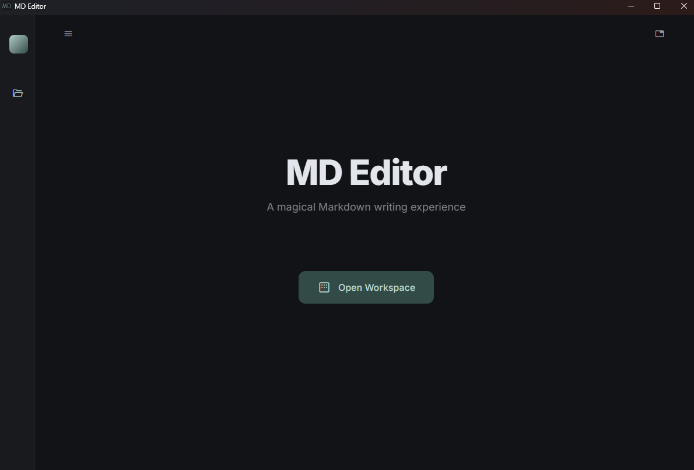

## Have you used **Tauri**?
If yes, this app is similar. I have a plan to add more by stealing features from **Obsidian**.

---

## How to use it?
- Run `npm install` then `cargo tauri build` from the root folder. You might need to install tauri cli `cargo install tauri-cli`
- A portable zip will be built on the root folder (works on linux and windows, I don't have mac to test). Extract and double click the `md-editor.exe` file.
- Then figure out.

---
## Screenshot
