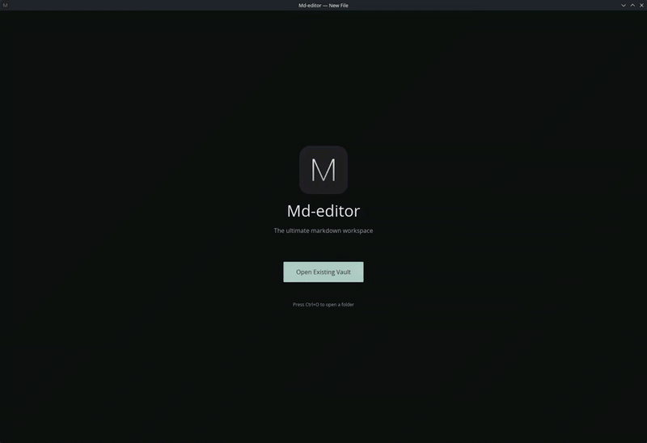
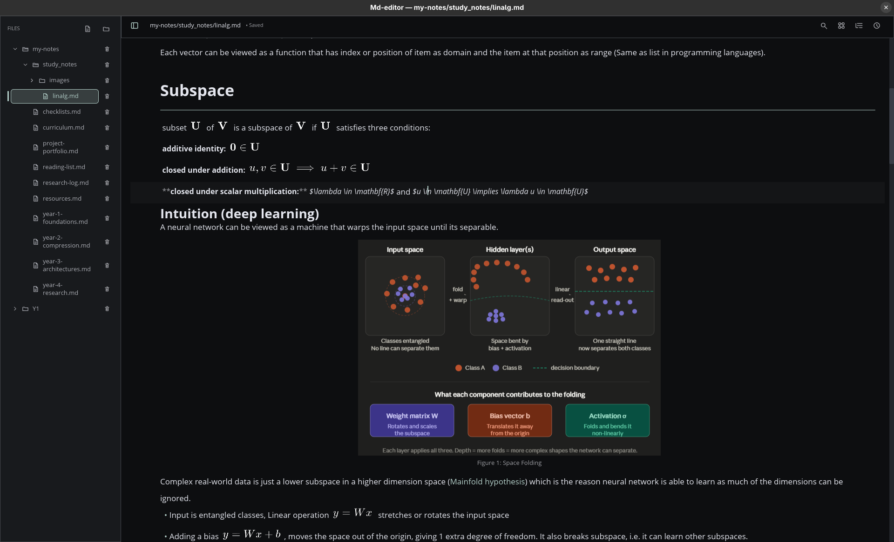
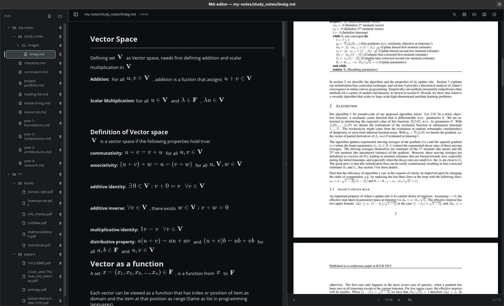
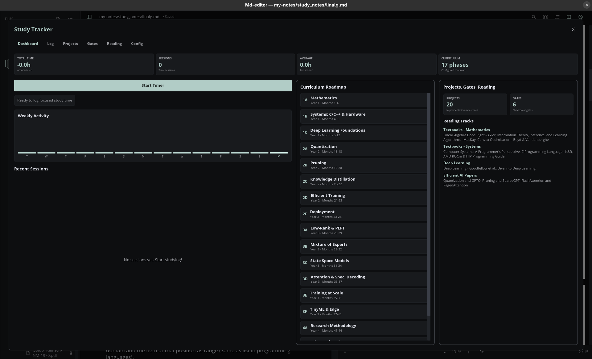

# MD Editor

**A calm, local-first Markdown workspace for notes, PDFs, images, search, backlinks, and study progress.**



MD Editor is a native desktop app for people who do serious work with ordinary files. Open a
folder as your vault, write in Markdown, read PDFs beside your notes, keep track of study
sessions, and search across everything without moving your thinking into a cloud-only system.

It is designed to feel personal and practical: a desk for your notes, papers, references, and
progress, all stored locally in formats you can keep using outside the app.

---

## At A Glance

| Work locally | Read deeply | Find quickly | Keep momentum |
| --- | --- | --- | --- |
| Use any folder as a vault. Your Markdown, PDFs, and images stay as normal files. | Open PDFs beside notes, copy text, create sidecar highlights, and link important passages back to Markdown. | Search the active file, the whole vault, and PDF text, with focused result navigation. | Track sessions, reading, project stages, and study gates in the same workspace. |

## Why It Exists

Most writing tools are either too small for research or too eager to own your workflow.
MD Editor takes a quieter route.

You bring a folder. The app gives you a native workspace around it: an editor, file tree,
backlinks, table of contents, PDF viewer, search tools, image preview, and study tracker.
When you close the app, your work is still there as plain Markdown and local files.

Use it for:

- research notes and reading logs;
- study vaults and course material;
- project journals and technical documentation;
- paper review, PDF annotation, and linked notes;
- any long-running body of notes that should remain portable.

## The Workspace

### 1. Open A Vault

Choose a folder and MD Editor turns it into a working vault. The sidebar indexes supported
files and gives you a familiar tree for opening, creating, and deleting notes. Indexing skips
`node_modules`, `target`, `build`, `dist`, `__pycache__`, `.trash`, and every dotfolder, so
`.git` stays out of the way. A filesystem watcher picks up changes made outside the app.

### 2. Write In Markdown

- Hybrid live preview: markers hide when the cursor is elsewhere and reappear on the line
  you are editing, so you always edit real source.
- Headings, emphasis, links, blockquotes, task checkboxes, tables, images, and math.
- Fenced code blocks with syntax highlighting.
- Wide tables and code blocks scroll horizontally on their own.
- In-file search with regex, match case, and replace-all.
- Auto-pairing of brackets and quotes, with contraction apostrophes left alone.
- List continuation, including numbered lists that increment.
- Undo grouped into word-sized runs, preserved when you switch between notes.
- Table of contents navigation, and backlinks for discovering connected material — bare
  `[[Name]]` links resolve across subfolders by filename.
- Autosave 400ms after typing stops, with atomic writes: a crash cannot truncate a note, and
  existing permissions and symlinks are preserved.

### 3. Keep References Beside Your Notes

PDFs open inside the app, so reading and writing happen in one place.

- Continuous page rendering, fit-to-width, and zoom, supersampled so pages stay sharp in a
  narrow split pane and on HiDPI displays.
- A PDF table of contents, recovered from the document itself when there are no embedded
  bookmarks — from a printed contents page, its dot leaders, or a typographic heuristic.
- Internal PDF links, plus recognition of by-number cross-references (equations, figures,
  tables, sections) that you can right-click to preview in place.
- Text selection and copy.
- PDF search with highlighted matches, including a loose mode that matches across line breaks.
- Sidecar highlights with auto-cycling colours, quick notes, and an orphan/drift report.
- Linked Markdown notes with a `pdf://` deep link back to the exact page and highlight.

PDF highlights and recognized references are stored separately, so the original PDF is never
modified.

### 4. Search Without Breaking Flow

- `Ctrl+F` in Markdown searches the active note.
- Global search scans the vault and indexed PDF text through SQLite FTS5.
- `Ctrl+F` in the PDF pane searches the active PDF.
- In split view, `Ctrl+F` follows whichever pane you last touched.
- `Ctrl+P` opens a command palette that searches commands and vault files together.

### 5. Track Study Progress

A built-in tracker records sessions, reading, project stages, and checkpoint gates. It ships
seeded with a four-year efficient-ML research roadmap, which you replace with your own
through a JSON config tab — the tracker itself only knows about phases, projects, gates, and
reading sections.

## Screenshots

### Markdown Editing



### Notes And PDFs Together



### Study Tracker



## A Local-First Promise

MD Editor does not hide your work inside a proprietary database.

- Your vault is a normal folder.
- Notes are normal Markdown files.
- PDFs and images stay where you put them.
- Settings and app state are stored beside the executable by default.
- No system-wide configuration directories are used automatically, and nothing is sent
  anywhere — no accounts, no telemetry.

The app creates a single SQLite file:

```text
md_editor_settings.sqlite
```

It lives next to the executable, so the whole app travels as one portable folder. Only when
the executable's directory is not writable (a read-only system install) does it fall back to
the per-user platform data directory and then the current directory; a database left in that
per-user directory by an interim version is migrated back beside the executable on first run.

## Supported Files

| Type | Extensions |
| --- | --- |
| Markdown | `.md`, `.markdown` |
| PDF | `.pdf` |
| Images | `.png`, `.jpg`, `.jpeg`, `.gif`, `.bmp`, `.webp` |

## Supported Platforms

MD Editor 1.0+ targets:

| Platform | Architectures |
| --- | --- |
| Windows | x64, ARM64 |
| Linux | x64, ARM64 |
| macOS | Intel, Apple Silicon |

Prebuilt Windows x64 and Linux x64 packages are produced by CI. PDF support uses PDFium: the
build script downloads the matching binary for the target OS and architecture and copies the
shared library next to the executable.

## Build From Source

### Requirements

- Rust stable 1.85+ with Cargo (2024 edition)
- A C compiler, for the bundled SQLite
- A desktop environment capable of creating native windows
- Internet access on the first build, if PDFium is not already cached

### Run In Development

```bash
cargo run
```

### Build A Release Binary

```bash
cargo build --release
```

| Platform | Executable |
| --- | --- |
| Windows | `target\release\md-editor.exe` |
| Linux/macOS | `target/release/md-editor` |

The PDFium library is copied into the same Cargo profile output directory during the build.
To pin and verify that download, set `PDFIUM_RELEASE` and `PDFIUM_SHA256`.

## PDFium Placement

For packaged or portable builds, place the PDFium shared library in either:

1. a `resources` folder next to the executable; or
2. the same directory as the executable.

| Platform | Library |
| --- | --- |
| Windows | `pdfium.dll` |
| Linux | `libpdfium.so` |
| macOS | `libpdfium.dylib` |

## Optional Linux Desktop Integration

Linux builds are portable by default. Desktop integration is opt-in.

```bash
./md-editor --install     # or --install-desktop
./md-editor --uninstall   # or --uninstall-desktop
```

`--install` creates `~/.local/share/applications/md-editor.desktop`, installs resized icons
under `~/.local/share/icons/hicolor/`, and refreshes the desktop and icon caches when those
tools are available.

## Project Structure

```text
md-editor/
+-- core/      vaults, indexing, search, PDF rendering, settings, tracker storage
+-- native/    Iced desktop UI, editor, views, commands, interaction state
+-- wiki/      all project documentation
+-- images/    README screenshots and intro media
```

Useful development commands:

```bash
cargo fmt --check
cargo check --workspace
cargo test --workspace              # 158 tests
cargo clippy --workspace                # 34 warnings baseline; do not add more
```

## Documentation

All documentation lives in the [**project wiki**](wiki/Home.md) — there is no separate `docs/`
tree to keep in sync.

| Start here | |
| --- | --- |
| [User Guide & Feature Manual](wiki/User-Guide-and-Feature-Manual.md) | Every feature and workflow |
| [Keyboard Shortcuts](wiki/Keyboard-Shortcuts.md) | Every binding, and which layer owns it |
| [Architecture & Philosophy](wiki/Architecture-and-Philosophy.md) | Design tenets and the threading model |
| [Repository Structure](wiki/Repository-Structure.md) | Workspace layout and per-file responsibilities |
| [Developer Guide & Testing](wiki/Developer-Guide-and-Testing.md) | Toolchain, builds, PDFium, tests |
| [Contributor Guidelines](wiki/Contributor-Guidelines.md) | The rules that are expensive to rediscover |
| [Release Checklist](wiki/Release-Checklist.md) | Pre-release verification and packaging |

Deep dives: [Core Services](wiki/Core-Services.md) ·
[Native Desktop GUI](wiki/Native-Desktop-GUI.md) ·
[Markdown Pipeline](wiki/Markdown-Pipeline.md) ·
[PDF Engine & Sidecars](wiki/PDF-Engine-and-Sidecars.md) ·
[PDF Viewer Internals](wiki/PDF-Viewer-Internals.md) ·
[Design Tokens, Motion & Palette](wiki/Design-Tokens-Motion-and-Palette.md) ·
[Study Tracker](wiki/Study-Tracker.md) ·
[Data Flows & Durability Invariants](wiki/Data-Flows-and-Durability-Invariants.md)

## License

MD Editor is released under the **GNU General Public License v3.0**.
See [LICENSE](LICENSE) for the full text.
