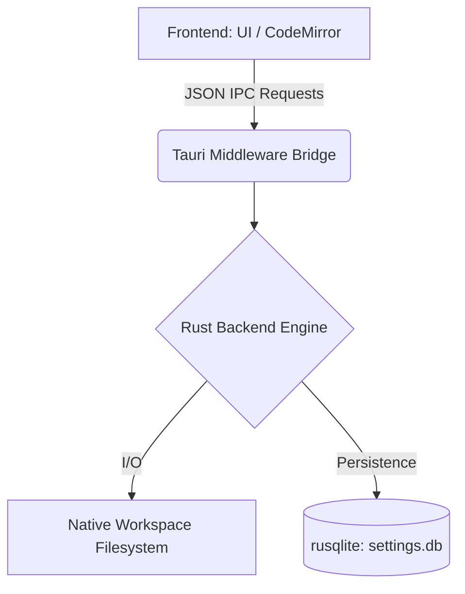
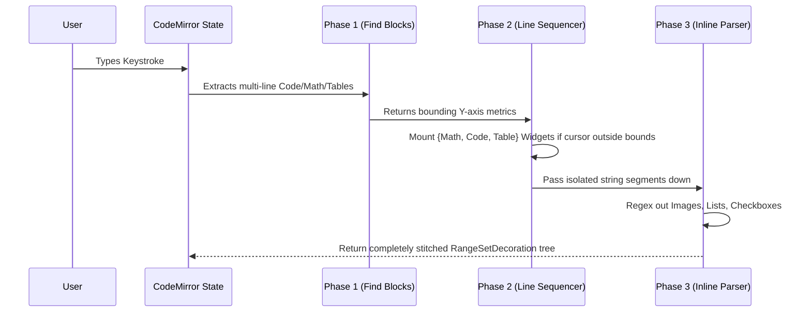

# Technical Documentation & System Architecture

This manifesto details the core engineering engines that bridge the MD Editor V1.0 between a raw text pipeline and an immersive DOM.

## 1. System Architecture (Tauri + SQLite)

The MD Editor uses **Tauri 2.0** to strip the heavyweight Chromium overhead associated with Electron. The backend runs purely over native OS-level Rust bindings.



- **Persistent Telemetry**: The UI requests boot sequences (`get_sys_config`) via IPC to safely hydrate session bounds without relying on volatile browser `localStorage`.
- **Vault Indexing**: The Rust backend scans the host root asynchronously to establish Backlink maps seamlessly across the AST.

## 2. CodeMirror 6 Injection Pipeline

Our WYSIWYG "Live Preview" relies on a meticulously crafted 3-Phase Abstract Syntax Tree mutation loop executing natively within CodeMirror's update lifecycle.



## 3. Geometric Parity (Zero-Shift Scaling)

A foundational UI problem we conquered handles the physical rendering differences between replacing standard DOM text with stylized structural UI Widgets.
- **The Issue**: Click an elegant `CodeBlockWidget` to edit it, and the layout forces it back to Raw Text!
- **The Math**: The Raw Text explicitly renders **two additional active lines of text** (```` ```rust ```` and ```` ``` ````). When a widget suddenly expands by two font-sized text lines, the browser aggressively drops the anchor.
- **The Fix**: The `.md-code-render-block` CSS enforces rigid `padding: 32px 20px !important`. This deliberately bloats out the exact height equivalent of 2 CodeMirror line bounds + minimum active borders (approx ~64 pixels total parity). Toggling active states now exhibits **zero pixels of layout shift**. 

## 4. AST Link Resolution

Relative and Internal linking intercept purely off generic `.cm-link` mouse queries. The engine recursively probes `syntaxTree(view.state)`, locating isolated `URL` nodes bound directly underneath localized cursor points, allowing the browser to resolve exact physical anchor jumps completely independently of absolute routing states.
