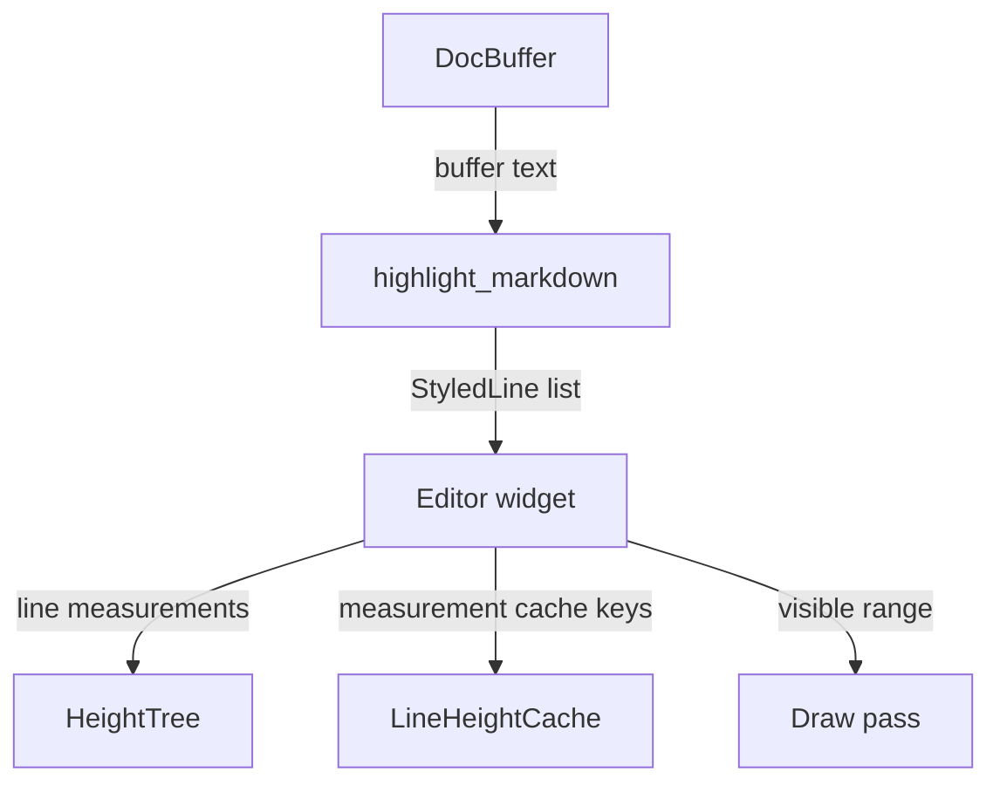

# Markdown Editor Architecture Guide

This document describes the markdown editor pipeline in `md-editor-native`: text storage, markdown parsing, live-preview rendering, layout caching, and large-document performance behavior.

## Architectural Overview

The editor is split into four native modules:

1. `buffer.rs`: owns mutable document text, cursor state, selection state, undo/redo transactions, and editor commands.
2. `highlight.rs`: parses markdown text into `StyledLine` and `StyledSpan` values.
3. `layout_tree.rs` and `layout_cache.rs`: track measured line heights and cache expensive layout measurements.
4. `renderer.rs`: implements the custom iced editor widget, including layout, drawing, hit testing, selection painting, and block-level horizontal scrolling.

`app.rs` coordinates the pipeline. It owns `highlighted_lines`, image and math render caches, scroll state, and background tasks.

## Text Buffer

`DocBuffer` in `native/src/editor/buffer.rs` uses a `ropey::Rope`, which keeps inserts, deletes, line lookup, and character-offset conversion efficient for large files.

Editor actions are expressed as `EditorCommand` values and applied through `DocBuffer::execute()`. The result tells the app whether text or projection state changed, so the app can decide whether to refresh parsing, media caches, and scroll position.

Important behavior:

- Text edits produce transactions with inverse operations for undo/redo.
- Cursor and selection state are stored alongside transactions.
- Formatting commands wrap selections or insert markdown placeholders.
- Movement commands operate on rope character positions, while visual movement delegates to renderer geometry.

## Markdown Parsing

`highlight.rs` turns raw markdown into renderer-ready structures:

- `StyledLine`: one physical source line plus block metadata such as code block, math block, table row, blockquote, fence, and `block_id`.
- `StyledSpan`: a styled text segment with flags for links, images, math, checkboxes, headings, syntax markers, and inline code.

Syntax markers such as `**`, `$`, and code fences are represented as spans with `is_syntax = true` and often `display_text = Some("")`. This lets the renderer hide inactive markdown markers while preserving exact source text when the user edits the active span or block.

Parser-owned metadata helpers live in the same module:

- `extract_outline()`: heading outline entries for TOC/navigation.
- `extract_markdown_links()`: inline, reference, wiki, and footnote link metadata.
- `extract_markdown_anchors()`: heading slugs and generated widget IDs.
- `extract_frontmatter_metadata()`: shallow top-of-file `---` metadata for aliases and tags.
- `extract_document_metadata()`: combined outline, link, anchor, and frontmatter metadata.

Renderer code consumes styled spans and metadata; it must not add markdown parser rules.

## Highlight Scheduling

Small documents are highlighted synchronously after text changes. Large documents use a delayed path:

- Documents above `LARGE_DOC_LINE_THRESHOLD` debounce highlighting during typing.
- Very large files opened from disk first receive plain placeholder lines, then a background highlight task replaces them when ready.
- Highlight tasks carry a generation id. Stale task results are ignored if the document changed before the task completed.

After highlighting completes, `app.rs` refreshes image discovery and LaTeX render tasks.

## Layout Model

The editor widget uses a Fenwick tree (`HeightTree`) to store total visual height per physical line.

Each stored height includes:

- Optional block-top spacer for inactive code/table blocks.
- The measured visual line height.
- Table scrollbar gutter when applicable.

This gives the renderer:

- `O(log N)` line lookup from a y coordinate.
- `O(log N)` y-position lookup for a line.
- `O(log N)` updates when a line height changes.
- `O(1)` total document height after layout has updated the tree.

`layout_cache.rs` provides `LineHeightCache` and hash helpers. A cached measurement is reused when line content, active edit state, active column, layout width, and media/math dimensions have not changed. The resource hash is important because late-arriving image or math renders can change line height.

## Draw Model

The draw pass is viewport-oriented.

1. Use `HeightTree::find_line_at_y` to locate the first and last visible physical lines.
2. Build block metadata only for blocks intersecting the visible line range.
3. Draw visible block backgrounds.
4. Draw only visible lines and stop once the y position passes the viewport.

The draw pass should not do full-document measurement. Full-document scans in draw are a performance regression, especially in debug builds.

## Hit Testing and Navigation

Mouse hit testing and visual cursor movement use height-tree geometry:

- Click and drag y positions map to line indices through `HeightTree`.
- Block lookup for horizontal wheel/scrollbar interaction uses `block_ranges` plus prefix sums.
- Visual up/down movement computes the current visual y position from the tree, then hit-tests the target y position.

Horizontal placement still walks visible spans because column mapping depends on inline wrapping, font metrics, math/image width, and hidden markdown markers.

## Width and Media Caches

Renderer text measurement is expensive in debug builds. The renderer caches single-character width measurements by character, font, and size for fallback wrapping and hit testing.

Media caches live in `app.rs`:

- `image_cache`: local image handle plus dimensions.
- `math_cache`: rendered LaTeX image handle plus dimensions.

The editor reads these caches during layout and draw. When cache entries arrive asynchronously, layout cache hashes change and affected lines are remeasured.

## Hybrid Live Preview

The renderer shows markdown as live preview unless the current cursor is inside an editable block or active inline span.

Inactive view:

- Markdown syntax markers are hidden.
- Math renders as cached images when available.
- Tables render as grids.
- Checkboxes render as clickable controls.
- Images render inline with captions.

Active edit view:

- Code, math, and table blocks expose raw source text.
- Inline syntax around the active markdown span is shown so the user can edit exact source.

## Maintenance Notes

- Keep parsing in `highlight.rs`; do not add parsing rules directly in the renderer.
- Keep height and cache invalidation logic in `layout_tree.rs` and `layout_cache.rs`.
- Keep draw proportional to visible content, not total document length.
- When adding media that can affect layout height, include its dimensions in the line resource hash.
- When adding new block types, update block range tracking, height measurement, draw metadata, and hit testing together.
