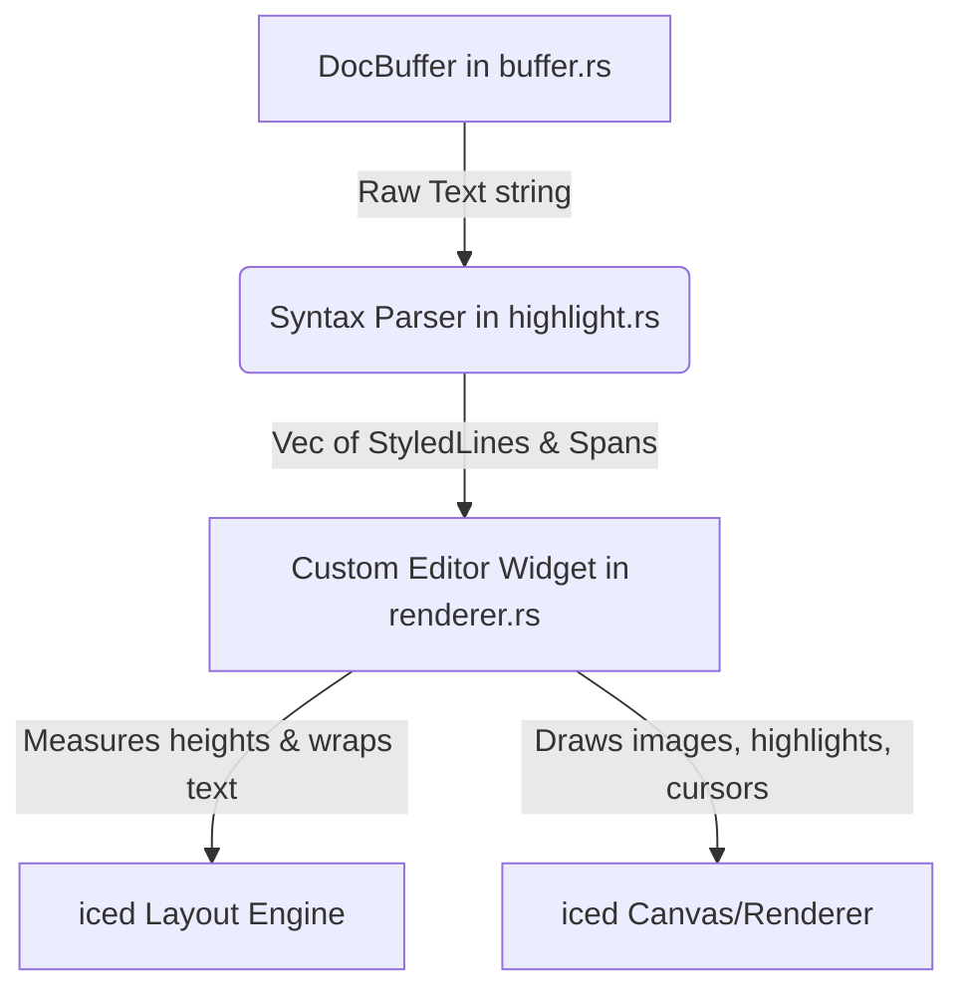

# Markdown Editor Architecture Guide

This document details the architecture, data flow, and components of the Markdown editor. It explains how the editor stores text, performs syntax analysis, and implements the **Hybrid Live Preview (WYSIWYG)** editor widget.

---

## 🗺️ Architectural Overview

The markdown editor is structured into three layers within the `native` codebase:
1. **Text Buffer (`buffer.rs`)**: Handles raw text mutations, cursor navigation, and transactional Undo/Redo operations.
2. **Syntax Parser (`highlight.rs`)**: Parses raw text into structured paragraphs, headings, block segments, lists, code fences, math blocks, and tables.
3. **Editor Widget (`renderer.rs`)**: A custom [iced](https://github.com/iced-rs/iced) `Widget` that performs layout measurements and draws text spans, highlights, block background containers, and inline media.

---

## 🗄️ Text Storage & Transactions

### 1. [buffer.rs](file:///home/sur/repo/md-editor/native/src/editor/buffer.rs)
The core data storage for text is managed by the `DocBuffer` struct. It utilizes a **Rope** data structure via the [ropey](https://docs.rs/ropey/latest/ropey/) crate, enabling efficient insertions, deletions, and line-to-character offset conversions even in large files.

#### Key Features:
- **Command Dispatch**: Actions (such as character input, cursor movement, or text formatting) are encapsulated inside the `EditorCommand` enum and applied via `DocBuffer::execute()`.
- **Undo / Redo Stack**:
    - Whenever text is inserted, deleted, or formatted, an `EditTransaction` containing a list of `EditOp` operations (e.g., `Insert` or `Delete`) is generated.
    - Transactions save the cursor position and selection offsets before and after the modification. Calling `undo()` applies the inverse operations and restores the previous selections.
- **Auto-Formatting wrappers**:
    - `wrap_selection_or_insert()` wraps current selections in Markdown markers (e.g. `**` for bold, `*` for italic, or `\`` for inline code).
    - If nothing is selected, it inserts placeholder text (e.g. `*italic*`) and selects the placeholder so the user can immediately overwrite it.

---

## 🔍 Syntax Parser

### 2. [highlight.rs](file:///home/sur/repo/md-editor/native/src/editor/highlight.rs)
Markdown syntax parsing is implemented from scratch for high performance, returning styled elements suitable for the custom renderer.

- **`StyledLine`**: Represents a physical line of text. It has metadata indicating whether it is a code block, math block, blockquote, table row, or a horizontal rule.
- **`StyledSpan`**: Represents a contiguous segment of text within a line. It contains style attributes (bold, italic, color, font size) and tag flags (is code, is link, is heading, is image, is syntax marker).
- **Line Parsing Logic**:
    - Structural blocks (headings, code blocks, lists, math environments, and tables) are identified at the line level.
    - Inline formatting is parsed sequentially by walking characters to match symbols like `**`, `*`, `[[`, `[`, `$`, and `
The editor is built as a custom `iced::advanced::widget::Widget`. This gives full control over horizontal wrapping, vertical offset measurement, mouse drag gestures, selection painting, and media embedding.

#### The Hybrid Live Preview Model:
The editor maintains a hybrid view where blocks are rendered as visual previews unless they are actively being edited:
- **Active Block Detection**: The function `is_block_editing_line()` checks if the user's cursor is currently inside a code block, math block, or table.
- **Edit vs. Preview Drawing**:
    - **Active blocks** render all text formatting literally, displaying raw markdown characters (e.g. showing `| header |`, code block backticks, or LaTeX source `\sum`).
    - **Inactive blocks** apply styles, hide syntax markers, and render visual controls (e.g. drawing checklist markers `- [ ]` as interactive clickable boxes `☐`/`☑`, rendering LaTeX math images, rendering structured table grids, and embedding local images).

#### Layout Constraints (`layout()`):
- Measures the wrap height of every line in `lines: &[StyledLine]`.
- Determines sizes of block containers (such as code block boxes or tables).
- Computes inline graphics scale factors (e.g., scaling images to fit within the editor view).

#### Visual Drawing (`draw()`):
- **Selections**: Draws translucent colored boxes behind text ranges if a selection is active.
- **Cursor**: Draws a vertical line at the computed cursor offset.
- **Inline Images**: Loads local/vault image handles from the `image_cache` and draws them on screen.
- **Block Formatting**: Adds custom borders, background colors, and padding around code and math blocks.

---

## 🧮 LaTeX Integration

Math equations are parsed and drawn dynamically:
1. **Scanning**: The app scans `highlighted_lines` for math spans (`span.is_math`).
2. **Rendering Task**: If a formula is not present in `math_cache`, a rendering task is spawned in the background (`app.rs` / `render_latex_task`).
3. **Rendering Pipeline**:
    - Uses `ratex-parser` to parse LaTeX source.
    - Uses `ratex-layout` to structure the mathematical layout.
    - Uses `ratex-render` to output a high-dpi transparent PNG byte array.
4. **Caching**: PNG bytes are converted into an iced `Handle` and stored in `math_cache`, which the editor widget references during draw passes.

---

## 💡 Tips for Modifying the Editor

1. **Changing Styles (Colors, Fonts, Sizes)**:
    - Check `native/src/theme.rs` to modify base colors (e.g. `ACCENT`, `BG_PRIMARY`, `BORDER`).
    - Line and header sizes can be altered in the parsing functions in `highlight.rs` (e.g. `heading_size()`, `StyledSpan::plain()`).
2. **Adding a New Markdown Token (e.g. Strikethrough `~~text~~`)**:
    - Add a `strikethrough` boolean flag to `StyledSpan`.
    - Update `parse_inline_spans` in `highlight.rs` to look for double tildes `~~` and emit spans with `strikethrough = true`.
    - In `renderer.rs`, update the drawing passes to draw a horizontal line through text runs where `strikethrough` is true.
3. **Extending Editor Commands**:
    - Add the command variant to `EditorCommand` in `buffer.rs`.
    - Implement the corresponding text manipulation inside `DocBuffer::execute()`.
    - Wire up key bindings or toolbar buttons in `app.rs` to trigger the new message command.
