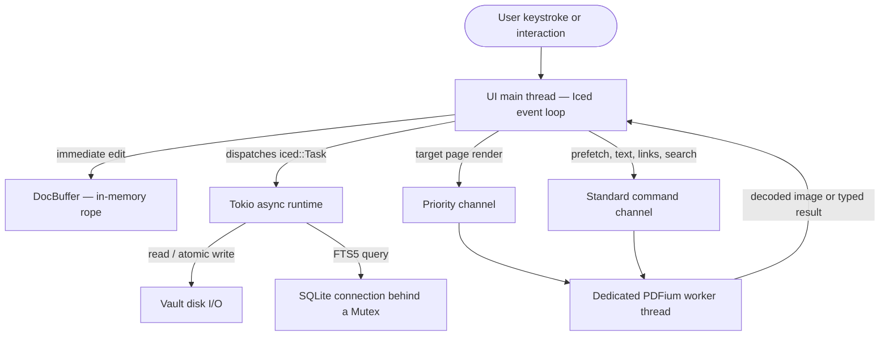

# Architecture & Philosophy

MD Editor is a calm, reliable, local-first desktop environment for technical notes,
academic papers, and deep study. Its design balances performance, crash resilience,
and portability, and it deliberately keeps the domain engine free of any GUI toolkit.

---

## 1. The Four Foundational Pillars

### Pillar 1: Local-First & Non-Proprietary Formats

Nothing is locked inside a proprietary database, an opaque container, or a cloud account.

- **The vault is just a directory.** Your workspace is an ordinary folder on the local
  filesystem, opened through a native folder picker.
- **Plain files.** Markdown notes (`.md`, `.markdown`), PDFs (`.pdf`), and images
  (`.png`, `.jpg`, `.jpeg`, `.gif`, `.bmp`, `.webp`) stay usable by any editor, CLI tool,
  or backup system — Git, rsync, Syncthing.
- **No account, no network.** There are no user accounts, licence keys, or telemetry, and
  the app never requires connectivity. The only network access in the whole project is the
  *build script* fetching PDFium (see [Developer Guide](Developer-Guide-and-Testing.md)).

### Pillar 2: Zero-Configuration Portability

- **One SQLite file.** All application state — settings, window size, per-document scroll
  and cursor positions, PDF sidecar annotations, cached PDF text, resolved references, and
  study history — lives in a single database, `md_editor_settings.sqlite`.
- **Placed beside the executable by default.** `core/src/state.rs::data_dir()` puts the
  database in `current_exe().parent()` whenever that directory is writable, so the whole
  application travels as one folder on a USB stick or between workstations.
- **Graceful fallback.** If the executable's directory is read-only (a system install under
  `/usr/bin`, say), the resolution order continues:
  1. the per-user platform data directory —
     `$XDG_DATA_HOME/md-editor/` or `~/.local/share/md-editor/` on Linux,
     `%APPDATA%\md-editor\` on Windows,
     `~/Library/Application Support/md-editor/` on macOS;
  2. the current working directory.
- **One-time migration back to portable.** An interim version stored the database in the
  per-user directory. If the portable location has no database yet but that legacy one
  exists, `migrate_legacy_db()` copies it — along with its `-wal` and `-shm` sidecars —
  beside the executable on launch. The legacy file is *left in place*, so an interrupted
  copy loses nothing.

### Pillar 3: Durability & Continuity

Work typed into the app must survive crashes, power loss, and abrupt window termination.

- **Disk is the source of truth.** Edits are committed by an autosave debounce:
  `AUTOSAVE_DEBOUNCE = 400ms` after the last keystroke, polled every
  `AUTOSAVE_POLL = 100ms` (`native/src/editor_state.rs`).
- **Atomic save protocol** (`core/src/vault.rs::write_file`), in the order the code
  performs it:
  1. the destination path is canonicalized, so a symlinked note is written *through* to its
     target rather than replaced by a regular file;
  2. content is written to a sibling temporary file in the same directory,
     `.<filename>.<uuid>.tmp`, so the final rename can never cross a filesystem boundary;
  3. the destination's existing permissions (for example `0600`) are copied onto the
     temporary file;
  4. `file.sync_all()` flushes the contents to physical storage;
  5. `fs::rename()` atomically replaces the destination;
  6. the parent directory is `sync_all()`ed, best-effort, so the rename itself survives a
     power loss.
- **Flush before switching.** Opening another note, a PDF, or an image flushes the active
  buffer first. If that write fails, navigation is refused and the failure is reported,
  rather than walking away from work that could not be persisted.
- **Flush on close.** `Message::WindowCloseRequested` triggers one last save. It is
  best-effort and does not block the close — an app that refuses to quit because a write is
  failing is worse than losing the few hundred milliseconds autosave had not yet committed.
- **Retained buffer history.** Switching documents parks the `DocBuffer` (with its undo
  stack, cursor, and scroll offset) in an in-memory registry holding
  `MAX_RETAINED_BUFFERS = 32` documents, evicting least-recently-used. A parked buffer is
  discarded if the file's on-disk content diverged while it was away.
- **Session restoration.** Window size (`window_size`), last vault (`last_vault`), last file
  (`last_file`), and per-document scroll and cursor offsets (`scroll:<path>`,
  `cursor:<path>`) are persisted to the `settings` table and restored on the next launch.
  Window *position* is not persisted — only size.

### Pillar 4: Non-Destructive Sidecar Annotations

Academic papers and technical specifications are reference material: the app treats them as
immutable.

- **PDFs are never rewritten.** MD Editor never modifies, re-saves, or injects annotation
  streams into a `.pdf` file.
- **External SQLite storage.** Highlights, quick notes, linked-note paths, and resolved
  cross-references live in the `pdf_annotations` and `pdf_references` tables, keyed by a
  content-derived `document_id`.
- **Drift detection.** `pdf_orphan_report` compares each highlight's stored `selected_text`
  against the text currently under its saved rectangle and reports how many annotations have
  drifted. Because page text is loaded lazily, the report also states how many of the
  annotations were actually checkable.

---

## 2. Architectural Boundaries & Crate Topology

```
┌────────────────────────────────────────────────────────┐
│                   md-editor-native                     │
│  - Iced 0.14 application loop and subscriptions        │
│  - Custom markdown editor Widget (DocBuffer, ropey)    │
│  - Fenwick HeightTree for O(log N) line geometry       │
│  - Hybrid (Typora-style) markdown preview              │
│  - Design tokens and motion, zero idle CPU             │
│  - Command palette and fuzzy matcher                   │
│  - Interactive PDF widget, overlays, drag selection    │
└───────────────────────────┬────────────────────────────┘
                            │ depends on
┌───────────────────────────▼────────────────────────────┐
│                   md-editor-core                       │
│  - AppState, thread-safe context (Arc + Mutex)         │
│  - SQLite engine (WAL, schema, user_version migrations)│
│  - Vault traversal and atomic write primitives         │
│  - Wikilink resolution and bidirectional backlinks     │
│  - Full-text search over SQLite FTS5                   │
│  - PDFium worker thread with a priority render queue   │
│  - Internal reference resolver (equations/figures/…)   │
│  - Study tracker domain logic and persistence          │
└────────────────────────────────────────────────────────┘
```

### Decoupling Rules

1. **`md-editor-core` is headless.** It must never depend on `iced`, `winit`,
   `ratex-render`, or any windowing or graphics toolkit. Every core operation is testable
   in a headless CI environment; the 56 core tests run without a display server.
2. **`md-editor-native` owns presentation.** Interaction, painting, input routing, and
   animation live here, and reach core only through thread-safe `AppState` methods or
   async tasks.
3. **PDFium is contained.** `pdfium-render` is interfaced *only* through
   `core/src/pdf.rs`. Native views deal in safe messages, decoded images, and plain data.

---

## 3. Concurrency & Threading Model



1. **UI main thread (Iced event loop).** Window events, typing, clicks, layout, and drawing.
   It never blocks on disk or PDF work.
2. **Tokio async runtime.** Background tasks dispatched as `iced::Task`: autosave writes,
   vault indexing, FTS queries, PDF page renders and text extraction, and syntax
   highlighting for large documents.
3. **Dedicated PDFium worker thread.** `pdfium-render` stores its bindings in a
   process-global cell, so exactly one `Pdfium` binding exists per process and *all* PDF
   work is serialized onto one background thread spawned by `PdfRenderer::new()`. It
   communicates over two `std::sync::mpsc` channels — a **priority** channel for the page
   the reader is looking at, and a **standard** channel for everything else. The worker
   drains the priority channel (keeping only the newest request) before each standard
   command. It cannot interrupt an operation already in flight; see
   [PDF Viewer Internals](PDF-Viewer-Internals.md) for the full scheduling rules.
