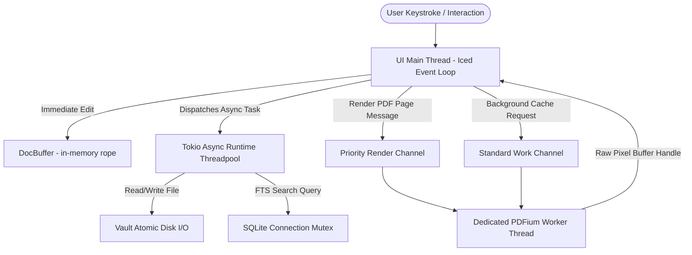

# Architecture & Philosophy

MD Editor is designed to be a calm, reliable, local-first desktop environment for technical notes, academic papers, and deep study. The software balances performance, crash resilience, and portability.

---

## 1. The Four Foundational Pillars

### Pillar 1: Local-First & Non-Proprietary Formats

MD Editor does not lock your thoughts inside a proprietary database, an opaque container file, or a closed cloud ecosystem.
- **The Vault is Just a Directory**: Your workspace is an ordinary folder on your local filesystem.
- **Plain Files**: Markdown notes (`.md`, `.markdown`), PDF documents (`.pdf`), and media files (`.png`, `.jpg`, `.svg`, etc.) remain accessible to any standard CLI utility, text editor, or backup system (e.g., Git, rsync, Syncthing).
- **No Cloud Synchronization Lock**: The application does not require user accounts, subscription keys, or continuous network connectivity.

### Pillar 2: Zero-Configuration Portability

Portability is an absolute guarantee. When you download or install MD Editor, it is engineered to run as a fully self-contained unit:
- **Portable SQLite Database**: All application state, recent files, study tracker history, UI layouts, and PDF sidecar annotations reside in a single SQLite database: `md_editor_settings.sqlite`.
- **Placement Strategy**: By default, this database is placed **directly beside the executable binary**. The entire application folder can be placed on a portable USB drive or moved across workstations without losing settings or annotations.
- **Graceful Fallback Hierarchy**: If the application executable directory is read-only (e.g., packaged in a system-wide read-only directory like `/usr/bin`), the system automatically detects write restrictions and falls back gracefully:
  1. Operating system user data directory:
     - Linux: `$XDG_DATA_HOME/md-editor/` or `~/.local/share/md-editor/`
     - Windows: `%APPDATA%\md-editor\`
     - macOS: `~/Library/Application Support/md-editor/`
  2. Current working directory fallback if platform directories are unavailable.
- **Automatic Upstream Migration**: If an interim or legacy installation created a database in the user data directory, and the user subsequently runs a portable copy with write access beside the executable, the engine automatically migrates the database and its WAL/SHM sidecars back beside the executable on launch without data loss.

### Pillar 3: Rock-Solid Durability & Continuity

The editor guarantees that work typed into the application will not be lost due to application crashes, power outages, or accidental window termination.
- **Memory is Transient, Disk is Source of Truth**: User edits are committed to disk via an automated debounce timer (400ms after the last keystroke).
- **Atomic Save Protocol**: To avoid file truncation or corruption during an interrupted write:
  1. Content is written to a temporary sibling file in the same directory (`.<filename>.<uuid>.tmp`).
  2. The operating system kernel is instructed to flush its dirty pages to physical disk via `sync_all()`.
  3. Existing filesystem permissions (e.g., `0600` on POSIX systems) are copied onto the replacement file.
  4. The file is atomically renamed over the destination using the operating system's atomic rename primitive.
- **Flush-Before-Switch Invariant**: Navigating to another note or opening a PDF automatically flushes any uncommitted edits in the active buffer to disk before switching views. If the write fails, navigation aborts to keep the user informed.
- **Retained Buffer History (LRU)**: Switching between documents does not destroy undo/redo history. An in-memory LRU cache retains up to 32 active document buffers with their full undo stacks and cursor positions. If a file is modified externally while parked, the cache is cleanly invalidated.
- **Session Restoration**: Application window size, open vault, active file, scroll positions, and cursor offsets are persisted to SQLite on exit and restored on restart.

### Pillar 4: Non-Destructive Sidecar Annotations

Academic papers, technical specifications, and legal briefs are immutable reference materials.
- **Immutable PDFs**: MD Editor never modifies, rewrites, or inserts proprietary annotation streams into original PDF files.
- **External SQLite Storage**: All highlights, bookmarks, cross-references, notes, and backlink anchors are stored as sidecar entries in the SQLite database (`pdf_annotations` and `pdf_references`).
- **Drift & Orphan Detection**: An integrated verification scanner checks whether the text currently under a saved bounding box matches the recorded annotation text, immediately alerting the user if an underlying PDF has been modified externally.

---

## 2. Architectural Boundaries & Crate Topology

The repository is divided into two distinct Rust crates with clear separation of concerns:

```
┌────────────────────────────────────────────────────────┐
│                   md-editor-native                     │
│  - Iced 0.14 GUI Application Loop & Subscriptions      │
│  - Custom Canvas Markdown Editor (DocBuffer, Ropey)    │
│  - Fenwick HeightTree (O(log N) line height indexing)  │
│  - Typora-style Hybrid Syntax Highlighter              │
│  - Design Tokens & Motion Subsystem (0% Idle CPU)      │
│  - Command Palette & Contextual Fuzzy Matcher          │
│  - Interactive PDF Canvas & Drag Selection             │
└───────────────────────────┬────────────────────────────┘
                            │ depends on
┌───────────────────────────▼────────────────────────────┐
│                   md-editor-core                       │
│  - AppState & Thread-safe Context (Arc, Mutex)         │
│  - SQLite Engine (WAL mode, migrations, settings)      │
│  - Vault Traversal & Atomic Write Primitives           │
│  - Wikilink Resolution Engine & Backlink Graph         │
│  - Full-Text Search (SQLite FTS5)                      │
│  - PDFium Rendering Engine & Priority Worker Loop      │
│  - Heuristic Reference Detection (Equations/Figures)   │
│  - Study Tracker Domain Logic & Persistence            │
└────────────────────────────────────────────────────────┘
```

### Decoupling Rules

1. **`md-editor-core` is Headless**:
   - Must never depend on `iced`, `winit`, or any windowing / graphical toolkit.
   - All core operations must be 100% testable in headless automated test suites and CLI environments.
2. **`md-editor-native` Owns Presentation**:
   - Owns user interactions, canvas painting, input routing, and animation loops.
   - Interacts with core services exclusively via thread-safe `AppState` methods or asynchronous background tasks.

---

## 3. Concurrency & Threading Model



1. **UI Main Thread (Iced Event Loop)**:
   - Handles OS window events, keyboard typing, mouse clicks, and canvas rendering.
   - Never blocks on long-running disk operations or PDF rendering.
2. **Tokio Async Runtime**:
   - Executes background tasks: autosave flushes, full-text search indexing, and syntax highlighting for large files (> 5,000 lines).
3. **Dedicated PDFium Worker Thread**:
   - Google's PDFium library maintains process-global state through internal C++ static structures.
   - To eliminate race conditions and avoid multi-threading conflicts in PDFium FFI, all PDF operations run on a **single, dedicated background worker thread**.
   - Communication with the worker uses two prioritized MPSC channels: a **priority channel** for immediately visible pages, and a **normal channel** for background prefetching.
