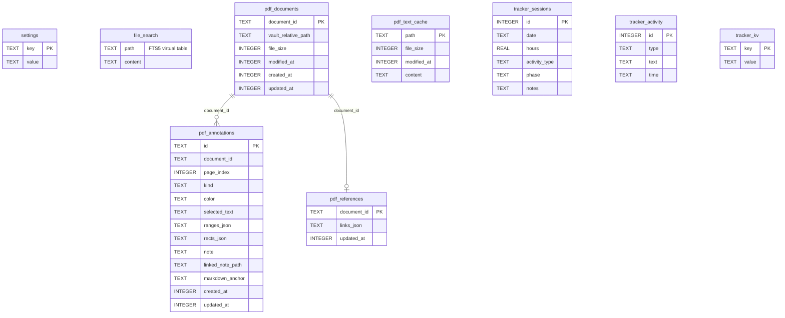
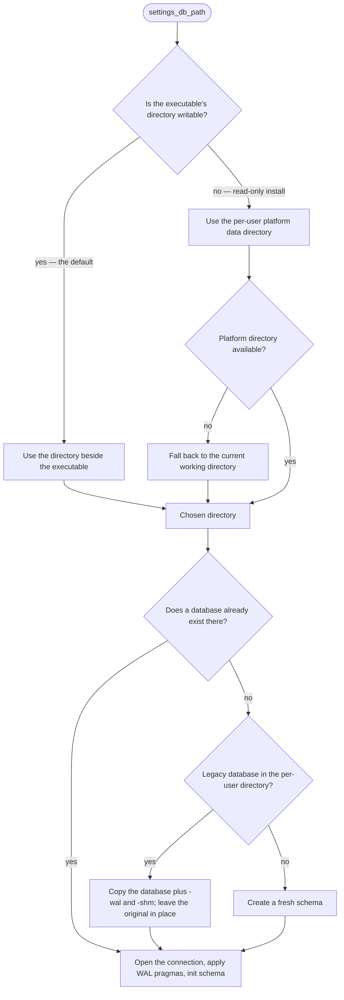
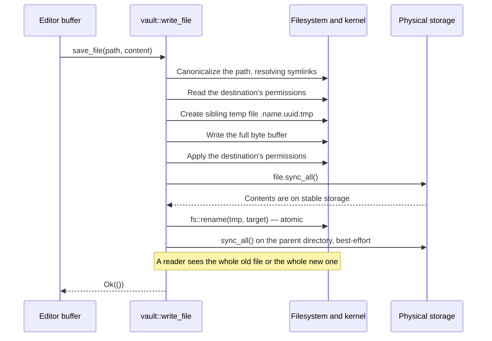

# Core Services (`md-editor-core`)

`md-editor-core` is the foundation of MD Editor: completely headless, it encapsulates
filesystem access, relational persistence, full-text indexing, the wikilink graph, PDFium
rendering, and the study tracker's storage. It compiles and tests without a display server.

---

## 1. Application State & Concurrency (`state.rs`)

```rust
pub struct AppState {
    pub vault_root: Mutex<Option<PathBuf>>,
    pub file_index: Mutex<FileIndex>,
    pub db: Mutex<Connection>,
    pub pdf_renderer: Option<PdfRenderer>,
}
```

- Shared across threads as `Arc<AppState>`.
- Fields use `std::sync::Mutex` with short-lived locks. Slow work — reading files, PDFium
  text extraction — is deliberately performed *before* any lock is taken; see the two-phase
  structure of `set_vault_root` below.
- `AppState::new()` opens the on-disk database; `AppState::new_in_memory()` opens an
  in-memory one with no PDF renderer, which is what the test suite uses.

---

## 2. Relational Database Engine (`state.rs`, `config.rs`)

### Pragmas

```sql
PRAGMA journal_mode = WAL;
PRAGMA synchronous  = NORMAL;
```

Both are applied best-effort at connection time and fall back silently if unsupported.
WAL keeps writes fast and never blocks a reader behind a writer; `synchronous = NORMAL` is
the recommended pairing with WAL, safe against application crashes.

### Database Schema



1. **`settings`** — key/value application state. The keys actually written are:

   | Key | Written by | Meaning |
   | :--- | :--- | :--- |
   | `window_size` | `persist_window_size` | `"<width>x<height>"`, re-read before the window exists |
   | `last_vault` | vault open | Absolute path of the vault to restore |
   | `last_file` | file open | Vault-relative path of the document to restore |
   | `scroll:<path>` | `persist_document_position` | Editor scroll offset for that document |
   | `cursor:<path>` | `persist_document_position` | Cursor character offset for that document |
   | `tracker_config` | tracker Config tab | The tracker's JSON curriculum |

2. **`file_search`** — an FTS5 virtual table over `(path, content)`, holding both Markdown
   note text and extracted PDF text. Rebuilt wholesale inside one transaction whenever a
   vault is opened.
3. **`pdf_documents`** — known PDFs by content id, with their vault-relative path, size, and
   timestamps. When a PDF is copied or restored and its id changes, rows recorded for the
   same path *and the same size* are adopted under the new id so annotations are not orphaned.
4. **`pdf_annotations`** — sidecar highlights and notes.
   `ranges_json` holds character-index intervals on the page text layer; `rects_json` holds
   bounding boxes in PDF points; `linked_note_path` points at a Markdown note in the vault.
   Three partial indexes support page lookups and linked-note backlinks.
5. **`pdf_text_cache`** — extracted document text keyed by vault-relative path, invalidated
   by size and mtime, so reopening a vault does not re-run PDFium extraction. Empty results
   are cached too, so scanned PDFs are not retried on every open.
6. **`pdf_references`** — the resolved cross-reference list per document, stored as
   `(RESOLVER_VERSION, links)` JSON so a resolver change transparently invalidates it.
7. **`tracker_sessions` / `tracker_activity` / `tracker_kv`** — logged study sessions, an
   activity log table, and the tracker's checkbox/status key-values.

### Schema Migrations

Versioning uses SQLite's built-in `PRAGMA user_version`. `init_schema()` runs the full
idempotent DDL (`CREATE TABLE IF NOT EXISTS`) and then `apply_migrations()`, which is where
additive steps belong — each bumping `user_version` — rather than editing the base DDL,
since that only runs for fresh databases.

---

## 3. Zero-Configuration Portability (`state.rs`)



- **Default portable location** — `current_exe().parent()`, tested for writability by
  `is_writable_dir`.
- **Read-only fallback** —
  Linux `$XDG_DATA_HOME/md-editor/` or `~/.local/share/md-editor/`;
  Windows `%APPDATA%\md-editor\`;
  macOS `~/Library/Application Support/md-editor/`;
  then the current working directory.
- **One-time upstream migration** — the legacy file is *copied*, not moved, so an
  interrupted migration cannot lose data. Its `-wal` and `-shm` sidecars come along so
  not-yet-checkpointed writes survive.

---

## 4. Vault Filesystem & Atomic Save Engine (`vault.rs`)

### Traversal Bounds

- **Excluded directories** — `node_modules`, `target`, `build`, `dist`, `__pycache__`,
  `.trash`, plus *every* dotfolder (so `.git`, `.obsidian`, and friends are skipped by the
  `starts_with('.')` check in the walkers).
- **Depth cap** — `MAX_WALK_DEPTH = 32`, which together with a symlink check guards against
  pathological or circular trees without affecting any realistic vault.

### Path Jailing

Every path arriving from a user action or a wikilink passes through
`resolve_vault_path_checked()`, which canonicalizes the candidate and verifies it lies
strictly inside the active `vault_root`. A `../` escape returns an error rather than
touching the file.

### Vault Indexing (`set_vault_root`)

Deliberately two-phase, so the UI thread is never blocked behind disk or PDFium work:

1. **Phase 1 (no locks held)** — walk every Markdown file, read it, build a fresh
   `FileIndex` with its two-pass rebuild, and collect `(relative path, content)` rows.
2. **Phase 1b (no locks held)** — for each PDF, reuse `pdf_text_cache` when size and mtime
   match, otherwise run PDFium extraction and cache the result. Skipped entirely when no
   renderer is available.
3. **Phase 2 (short-lived locks)** — publish the vault root, replace the whole `file_search`
   table inside one transaction, and swap in the new `FileIndex`.

### Atomic Write Protocol



Details worth preserving:

1. **Write through symlinks, not over them.** The path is canonicalized first, so a
   symlinked note updates its target instead of being replaced by a regular file.
2. **Sibling temporary file.** `.{filename}.{uuid}.tmp` lives in the destination's own
   directory, so the rename can never cross a mount point, and the UUID means concurrent
   saves cannot collide.
3. **Permission inheritance.** A note kept at `0600` does not come back world-readable.
4. **Kernel flush before rename.** `sync_all()` on the file, then the rename, then a
   best-effort `sync_all()` on the parent directory so the *directory entry* survives power
   loss too.
5. **Cleanup on failure.** A failed write or rename removes the temporary file and returns
   an error; nothing is left behind and the destination is untouched.

Four unit tests in `vault.rs` cover this directly: content replacement leaving no temp
files, permission preservation, writing through a symlink, and never leaving a truncated
file.

---

## 5. Wikilinks & Backlinks Graph (`file_index.rs`)

### Parsing

```rust
static WIKILINK_RE: LazyLock<Regex> =
    LazyLock::new(|| Regex::new(r"\[\[([^\]|]+)(?:\|[^\]]+)?\]\]").unwrap());
```

Compiled once and reused for every file during indexing. It matches both bare
(`[[Note Name]]`) and aliased (`[[Note Name|Display Text]]`) links; only the target is
captured, since the alias affects display, not resolution.

### Resolution Algorithm

`resolve_link(target, from_file)` proceeds in order:

1. **Exact path match** — handles `[[subfolder/Note]]` and root-level `[[Note]]`.
2. **Shortest basename match** — for a bare name, look up all known files whose lowercased
   stem matches. `names: HashMap<String, BTreeSet<PathBuf>>` keeps candidates ordered, so
   the shortest path wins deterministically and the link, the click-through, and the
   backlink all agree.
3. **Optimistic forward reference** — when no file with that basename is known yet (a
   dangling link, or a file that has not been indexed), the path-based candidate is kept
   anyway, so creating the note later immediately reveals the incoming backlink.

### Bidirectional Index

```rust
pub struct FileIndex {
    pub outgoing: HashMap<PathBuf, HashSet<PathBuf>>, // file → files it links to
    pub incoming: HashMap<PathBuf, HashSet<PathBuf>>, // file → files that link to it
    vault_root: PathBuf,
    names: HashMap<String, BTreeSet<PathBuf>>,        // lowercased stem → candidate paths
}
```

`incoming` is maintained explicitly rather than derived on demand, so the Backlinks panel is
a map lookup. `rebuild()` runs in two passes — register every filename first, then resolve
links — because a bare `[[Name]]` must be able to reach a file that appears later in the
listing or in another subfolder. `update_file()` does the same incrementally for a single
edit, first removing the file's previous outgoing edges from every target's `incoming` set.

---

## 6. Full-Text Search (`vault.rs::search_vault`)

The query is wrapped in double quotes (with embedded quotes doubled) so it is treated as an
FTS5 phrase rather than as query syntax:

```sql
SELECT path, snippet(file_search, 1, '<b>', '</b>', '...', 15)
FROM file_search
WHERE content MATCH ?1
ORDER BY rank
LIMIT 100;
```

Results carry the path and a highlighted snippet. Because both Markdown notes and extracted
PDF text are indexed into the same table, one global search covers both.

---

## 7. Backlinks Beyond Markdown (`vault.rs::get_mixed_backlinks`)

Backlinks are not limited to note-to-note wikilinks. `get_mixed_backlinks(state, path)`
branches on the active document's type and returns `BacklinkItem`s whose `source` is a
`BacklinkTarget`:

**When the active document is a Markdown note:**

- `MarkdownFile { path }` — every note whose `[[wikilink]]` resolves to this one, taken
  from `FileIndex::get_backlinks`;
- `PdfAnnotation { document_path, annotation_id, page }` — every sidecar highlight whose
  `linked_note_path` equals this note, joined from `pdf_annotations` to `pdf_documents`.
  Activating one opens that PDF at the exact page and focuses the highlight.

**When the active document is a PDF:**

- `MarkdownFile { path }` — notes that wikilink to the PDF itself;
- `MarkdownFile { path }` with the highlight's `selected_text` as context — notes reached
  through this PDF's own annotations, so the panel shows which passage produced the link.

The `BacklinkTarget::PdfDocument { path }` variant is defined in `core/src/types.rs` and
rendered by `views/backlinks.rs`, but no query currently emits it.
