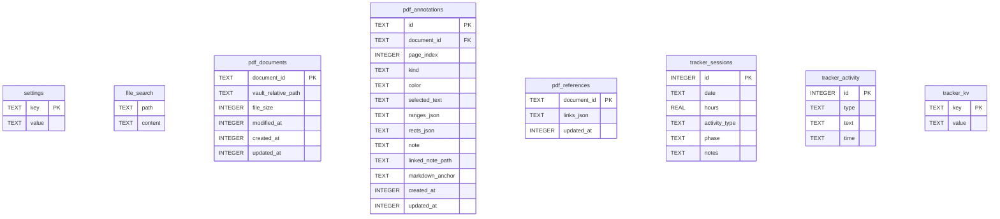
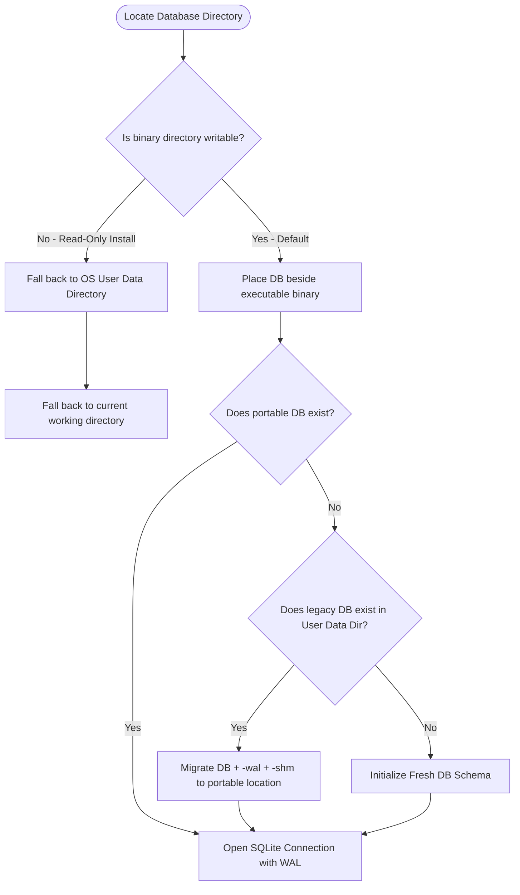
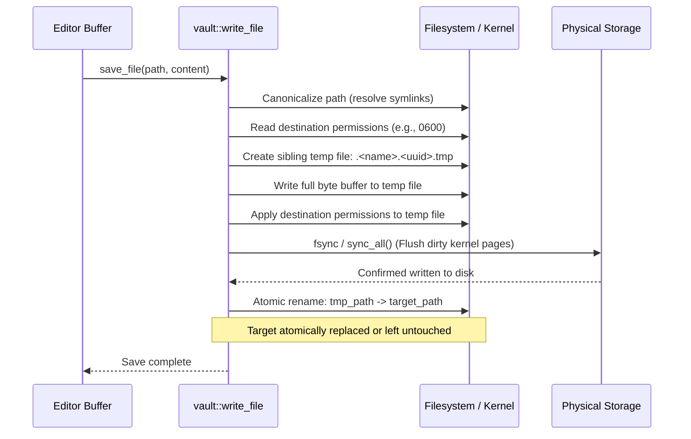

# Core Services (`md-editor-core`)

The `md-editor-core` crate provides the foundation of MD Editor. It is completely headless and encapsulates all filesystem interactions, relational database persistence, full-text search indexing, wikilink graph resolution, and PDFium rendering.

---

## 1. Application State & Concurrency (`state.rs`)

The core context is represented by the [`AppState`](file:///home/sur/repo/md-editor/core/src/state.rs#L13-L18) struct:

```rust
pub struct AppState {
    pub vault_root: Mutex<Option<PathBuf>>,
    pub file_index: Mutex<FileIndex>,
    pub db: Mutex<rusqlite::Connection>,
    pub pdf_renderer: Option<PdfRenderer>,
}
```

- When shared between threads or passed to asynchronous tasks, it is wrapped in an `Arc<AppState>`.
- Internal fields use `std::sync::Mutex` with fine-grained, short-lived locks to prevent lock contention between UI rendering and disk writes.

---

## 2. Relational Database Engine (`state.rs`, `config.rs`)

MD Editor uses an embedded SQLite database (`md_editor_settings.sqlite`).

### SQLite Configuration & Pragma Settings

On startup, the connection is configured with:
```sql
PRAGMA journal_mode = WAL;
PRAGMA synchronous = NORMAL;
```

- **WAL (Write-Ahead Logging)**: Delivers fast disk writes and prevents concurrent readers from being blocked by active write transactions.
- **`synchronous = NORMAL`**: The recommended durability mode for WAL, eliminating excessive disk flushes while maintaining full ACID guarantees against application crashes.

### Database Schema



1. **`settings`**: Key-value configuration for user preferences, window geometry (`window_width`, `window_height`, `window_x`, `window_y`), recent vaults, and open panels.
2. **`file_search`**: SQLite `fts5` virtual table indexing plain text from all Markdown notes and extracted PDF text in the vault.
3. **`pdf_documents`**: Records known PDF files with content hashes (`document_id`), relative vault paths, file sizes, and timestamps.
4. **`pdf_annotations`**: Stores external sidecar highlights and annotations:
   - `ranges_json`: Serialized character offset ranges on the PDF text layer.
   - `rects_json`: Normalized bounding boxes (`[x, y, w, h]` relative to page size).
   - `linked_note_path`: Relative path to any markdown note linked to this passage.
5. **`pdf_references`**: Serialized list of detected in-text cross-references (equations, figures, tables).
6. **`tracker_sessions`, `tracker_activity`, `tracker_kv`**: Deep study durations, pomodoro logs, milestone targets, and daily progress records.

### Schema Migrations

Database schema versioning is tracked using SQLite's built-in `PRAGMA user_version`. Additive migrations are executed sequentially in `apply_migrations()` during initialization.

---

## 3. Zero-Configuration Portability (`config.rs`, `state.rs`)

MD Editor implements a deterministic path resolution algorithm for `md_editor_settings.sqlite`:



- **Default Portable Location**: Beside the executable binary (`current_exe().parent()`).
- **Read-Only Fallback**: If the executable directory cannot be written to (e.g., packaged in system read-only directories):
  - Linux: `$XDG_DATA_HOME/md-editor/` or `~/.local/share/md-editor/`
  - Windows: `%APPDATA%\md-editor\`
  - macOS: `~/Library/Application Support/md-editor/`
- **Automatic Upstream Migration**: If an existing database is found in the legacy user data directory while running from a writable portable location, the file and its associated WAL/SHM sidecars (`-wal`, `-shm`) are copied to the portable folder, preserving user data seamlessly.

---

## 4. Vault Filesystem & Atomic Save Engine (`vault.rs`)

### Path Sanitization & Traversal Bounds

All file requests originating from user actions or wikilinks must pass through [`resolve_vault_path_checked()`](file:///home/sur/repo/md-editor/core/src/vault.rs):
- **Traversal Limits**: Directory scans ignore `.git`, `node_modules`, `target`, `build`, and `.trash`. Traversal is capped at depth 32 (`MAX_WALK_DEPTH`) to prevent infinite recursion on circular symlinks.
- **Jail Protection**: Validates that the canonicalized path resides strictly within the active `vault_root`. Any attempt to traverse upward via `../` outside the vault boundary returns a security error.

### Atomic Write Protocol

To prevent file truncation, data loss, or permission leakage during sudden process termination, [`write_file()`](file:///home/sur/repo/md-editor/core/src/vault.rs#L696-L745) strictly adheres to the following sequence:



1. **Write Through Symlinks**: Symlinks are resolved first, ensuring the link target is updated rather than replacing the symlink with a regular file.
2. **Sibling Temporary File**: The temporary file (`.<name>.<uuid>.tmp`) is created in the **same parent directory** as the target file. This guarantees that the subsequent rename operation will never fail due to crossing filesystem or mount-point boundaries.
3. **Permission Inheritance**: Existing file permissions are copied to the replacement file, preserving restrictive permissions (such as `0600`).
4. **Kernel Page Flush**: `file.sync_all()` is invoked, forcing the OS cache to flush all dirty blocks to physical storage before replacing the original file.
5. **Atomic Rename**: `fs::rename()` atomically swaps the newly flushed file into place.

---

## 5. Wikilinks & Backlinks Graph (`file_index.rs`)

The [`FileIndex`](file:///home/sur/repo/md-editor/core/src/file_index.rs) maintains an in-memory graph of notes and their interconnections:

### Wikilink Parsing

Wikilinks are extracted using the compiled regular expression:
```rust
r"\[\[([^\|\]]+)(?:\|([^\]]+))?\]\]"
```
Matches both bare links (`[[Note Name]]`) and aliased links (`[[Note Name|Display Text]]`).

### Resolution Algorithm

When a link target `target` is resolved from file `file_path`:
1. **Exact Path Match**: Resolves relative directory paths (e.g., `[[subfolder/Note]]`) or root-level matches.
2. **Shortest Basename Match**: If `target` is a bare note name without directory prefixes (e.g., `[[Lecture 4]]`), the index looks up all known notes with matching lowercase stems. If multiple notes match, the one with the **shortest path** wins deterministically.
3. **Optimistic Forward Reference**: If no file with that basename exists yet, a path candidate is created anyway. When the user later creates that note, incoming backlinks are immediately available without rescanning.

### Bidirectional Backlink Index

`FileIndex` maintains:
- `links: HashMap<PathBuf, HashSet<PathBuf>>`: Outgoing links for each note.
- Reverse lookup across `links` dynamically computes incoming references, powering the **Backlinks Panel** in the UI.
