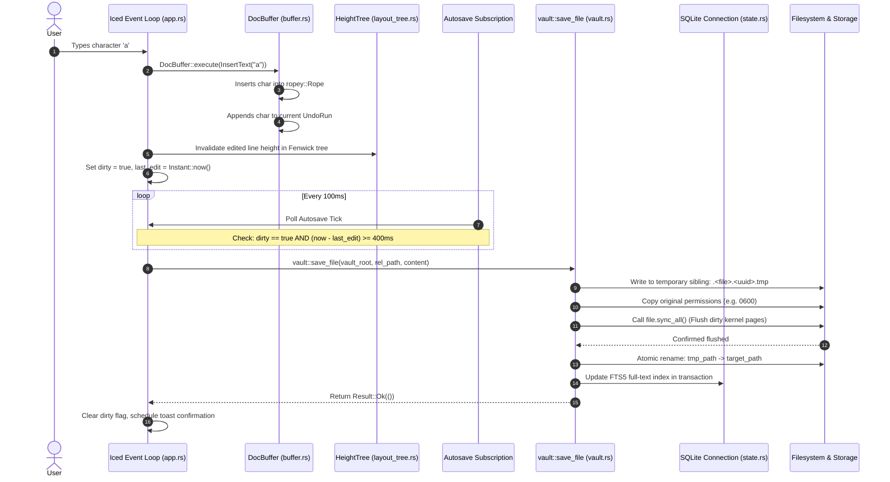
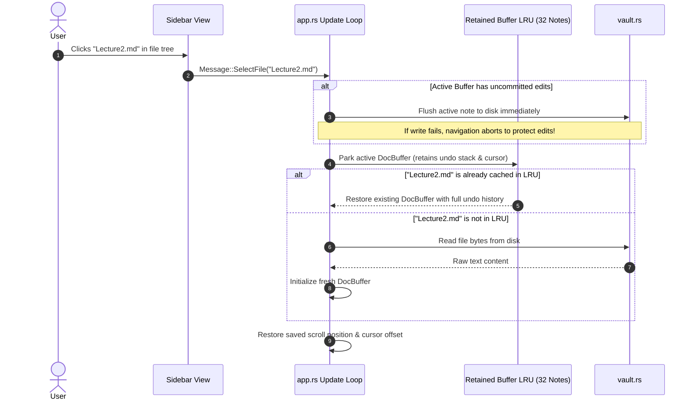

# Data Flows & Durability Invariants

MD Editor is engineered around strict reliability guarantees. This document details the end-to-end data flows and the five non-negotiable durability invariants that every build must satisfy.

---

## 1. End-to-End Data Flows

### Flow 1: Keystroke to Atomic Save



### Flow 2: Note Navigation & Undo Retention (32-Buffer LRU)



### Flow 3: PDF Selection to Sidecar Highlight & Linked Note

```mermaid
sequenceDiagram
    autonumber
    actor User
    participant Canvas as Interactive PDF Canvas
    participant App as app.rs Update
    participant Core as core::state::AppState
    participant DB as SQLite (pdf_annotations)
    participant Modal as Link Note Picker Modal

    User->>Canvas: Drags mouse over text on Page 7
    Canvas->>Canvas: Hit-test text layer; compute normalized [x,y,w,h]
    User->>Canvas: Releases mouse; clicks "Highlight"
    Canvas->>App: Message::AddPdfHighlight(page=7, rects, text)
    App->>App: Cycle color token (yellow -> green -> blue -> pink -> orange)
    App->>Core: AppState::save_pdf_annotation(annotation)
    Core->>DB: INSERT INTO pdf_annotations (...)
    App->>Canvas: Redraw highlight polygon overlay
    
    opt User chooses "Link to Note"
        App->>Modal: Open Link Note Picker
        User->>Modal: Selects existing "ResearchNotes.md" (or new note)
        Modal->>App: Append highlight block with pdf:// URL
        App->>Core: Update annotation linked_note_path in SQLite
    end
```

---

## 2. The Five Non-Negotiable Durability Invariants

These invariants are pass/fail engineering requirements. If any invariant fails, a release build is blocked regardless of what other features are functioning:

### Invariant 1: Kill It Mid-Edit
- **Scenario**: A user types paragraphs into a note. The application process is abruptly terminated with `kill -9` without pressing `Ctrl+S`.
- **Guarantee**: When the vault is reopened, no characters are corrupted, and no truncated or empty files exist on disk. Atomic sibling temporary files (`.<file>.<uuid>.tmp`) ensure either the pristine previous version or the complete newly flushed version is present on disk.

### Invariant 2: Switch With Unsaved Edits
- **Scenario**: A user edits a document, and immediately clicks another file in the sidebar before the 400ms autosave timer fires.
- **Guarantee**: The navigation handler synchronously flushes the uncommitted buffer to disk **before** switching the active document. If writing to disk fails (e.g. disk full, permission revoked), navigation is refused and an error alert is presented, ensuring unsaved edits are never abandoned.

### Invariant 3: Word-Sized Undo
- **Scenario**: A user types a multi-word sentence and presses `Ctrl+Z`.
- **Guarantee**: Undo does not step backward one character at a time. The editor groups consecutive typing into an `UndoRun`, reversing a coherent word or phrase per undo command.

### Invariant 4: Navigation Undo Preservation
- **Scenario**: A user edits `FileA.md`, navigates to `FileB.md`, edits `FileB.md`, and then navigates back to `FileA.md`.
- **Guarantee**: Pressing `Ctrl+Z` in `FileA.md` steps back through the editing actions taken before navigating away. Up to 32 active document buffers are retained in an in-memory LRU cache.

### Invariant 5: Zero Idle CPU
- **Scenario**: The application is left open on the desktop with no active user typing, mouse movement, or animated panel transitions.
- **Guarantee**: The application process consumes **0.0% CPU**. The Iced window frame subscription is completely disarmed (`iced::Subscription::none()`) whenever UI animations have settled.
