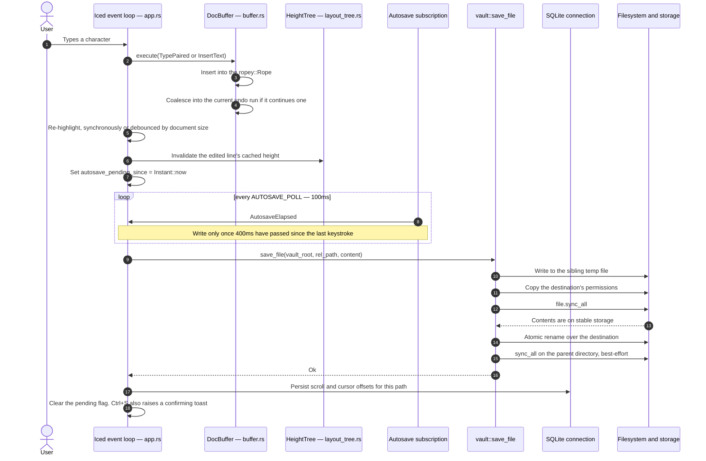
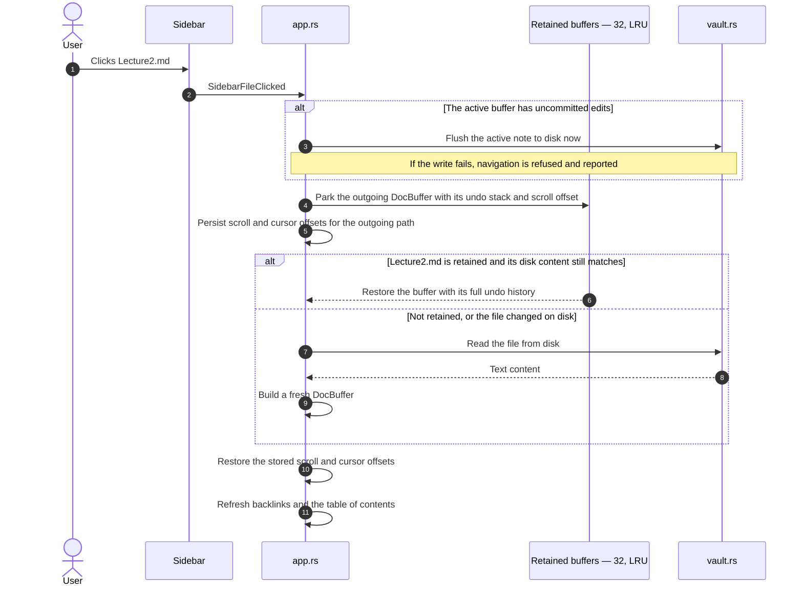
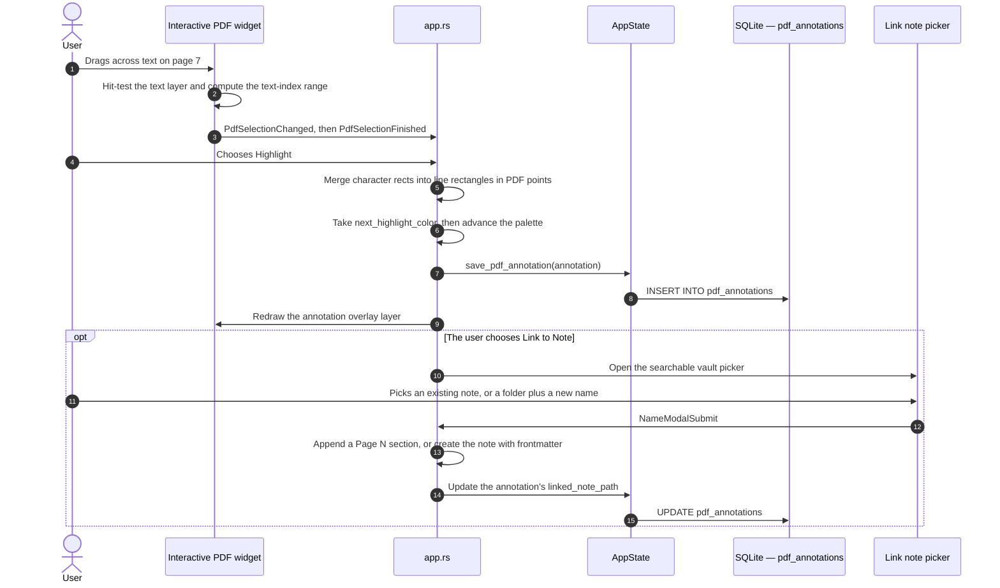

# Data Flows & Durability Invariants

MD Editor is built around reliability guarantees that are checked, not assumed. This page
traces the end-to-end flows and states the five invariants every build must satisfy.

---

## 1. End-to-End Data Flows

### Flow 1: Keystroke to Atomic Save

An explicit `Ctrl+S` takes the same path but always answers, even when autosave had already
committed. A **failed** autosave raises a toast the first time it happens in a run of
failures — a failing write is exactly when the user needs to know — and the title keeps its
unsaved marker while the debounce restarts.

### Flow 2: Note Navigation & Undo Retention

The retained registry holds `MAX_RETAINED_BUFFERS = 32` documents, evicting the least
recently used. `take_retained_matching(path, disk_text)` only returns a parked buffer when
the file on disk still matches what the buffer was based on — otherwise the stale buffer is
dropped, so an external edit is never silently overwritten by a resurrected undo stack.

### Flow 3: PDF Selection to Sidecar Highlight & Linked Note

---

## 2. The Five Non-Negotiable Durability Invariants

These are pass/fail engineering requirements, not judgement calls. **If any one fails, the
build does not ship, regardless of what else works.**

### Invariant 1: Kill it mid-edit

- **Scenario** — type paragraphs into a note, then `kill -9` the process without pressing
  `Ctrl+S`.
- **Guarantee** — reopening the vault shows no corrupted characters and no truncated or
  empty file. The sibling-temp-file protocol means the destination holds either the complete
  previous version or the complete new one, never a mix.
- **Mechanism** — `vault::write_file`, plus a unit test
  (`write_file_never_leaves_a_truncated_file`) that asserts it directly.

### Invariant 2: Switch with unsaved edits

- **Scenario** — edit a note and immediately click another file, an image, or close the
  window, before the 400ms debounce fires.
- **Guarantee** — the buffer is flushed **before** the view changes. If the write fails —
  disk full, permission revoked — navigation is refused and the error is surfaced, so
  unsaved edits are never abandoned. Window close is the one deliberate exception: it flushes
  best-effort and does not block, because an app that refuses to quit is a worse outcome.

### Invariant 3: Undo is word-sized

- **Scenario** — type a multi-word sentence, press `Ctrl+Z` once.
- **Guarantee** — a run of typing disappears, not a single character.
- **Mechanism** — `UNDO_COALESCE_WINDOW = 300ms` plus `can_coalesce`, which breaks a run at a
  pause, a newline, a cursor jump, a direction change, or a selection edit.

### Invariant 4: Navigation preserves undo

- **Scenario** — edit `FileA.md`, go to `FileB.md`, edit it, come back to `FileA.md`, press
  `Ctrl+Z`.
- **Guarantee** — undo walks back through the edits made before navigating away, and the
  cursor and scroll position are where you left them.
- **Mechanism** — the 32-document retained registry, invalidated when the file changed on
  disk in the meantime.

### Invariant 5: Zero idle CPU

- **Scenario** — leave the app open with no typing, no mouse movement, and no animation in
  flight.
- **Guarantee** — the process consumes **0.0% CPU**.
- **Mechanism** — the per-frame subscription is armed only while `motion.is_animating()`
  holds; every other subscription (toast, autosave, highlight, search) is likewise armed only
  when it has pending work. A settled window has no live timers at all.

Each invariant has a manual verification step in the
[Release Checklist](Release-Checklist.md).
