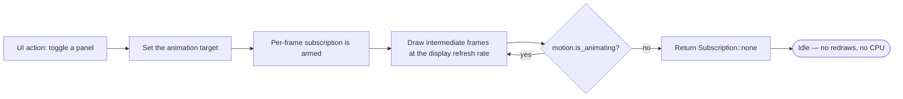

# Design Tokens, Motion & Command Palette

MD Editor gets its polish from three small, strict systems: a token set that leaves no room
for arbitrary numbers, a motion vocabulary of one curve and three durations, and a fuzzy
matcher whose scores are comparable across commands and files.

---

## 1. Design Tokens (`native/src/theme.rs`)

Everything the chrome draws — sidebar, toolbar, panels, modals, tracker — takes its colour,
size, spacing, and radius from this one module. The module's own comment records why: the
app had *eleven* distinct font sizes and *seventeen* distinct spacing values before the
scales existed, and that is the visual noise that reads as "unpolished" without ever being
nameable.

Document typography — heading sizes and code/math scale *inside* a note — is a separate
concern owned by the markdown renderer.

### The six-step type scale

| Token | Size | Intended use |
| :--- | :--- | :--- |
| `TEXT_XS` | 10.0 | Fine print: badges, counters, gutter numbers |
| `TEXT_SM` | 12.0 | Secondary text: captions, metadata, tree affordances |
| `TEXT_BASE` | 14.0 | Default UI text: controls, button labels, palette rows |
| `TEXT_MD` | 16.0 | Emphasised UI text and section headings |
| `TEXT_LG` | 18.0 | Panel and dialog titles |
| `TEXT_DISPLAY` | 42.0 | The welcome-screen wordmark — deliberately the only display size |

### The seven-step spacing scale

A 2px grid, growing roughly geometrically so adjacent steps stay visibly distinct.

```
SPACE_0  (0px)  ─── flush, no gap
SPACE_1  (2px)  ─── hairline separation between tightly related items
SPACE_2  (4px)  ─── within a control: icon to label
SPACE_3  (8px)  ─── default gap between siblings; default control padding
SPACE_4 (12px)  ─── between grouped rows; comfortable control padding
SPACE_5 (16px)  ─── between groups within a panel
SPACE_6 (24px)  ─── between major regions
```

### Corner radii

- `RADIUS_SM` (3.0) — chips, badges, inline markers.
- `RADIUS_MD` (6.0) — buttons, inputs, list rows.
- `RADIUS_LG` (10.0) — panels, cards, modals.

### Colour palette

The app ships one theme, a dark palette registered with iced as *"MD Editor Premium Dark"*.

| Token | Hex | Role |
| :--- | :--- | :--- |
| `BG_PRIMARY` | `#0d0e10` | Window and panel ground |
| `BG_SECONDARY` | `#181a1d` | Raised surfaces |
| `BG_TERTIARY` | `#23262b` | Inputs, hovered rows |
| `BG_SURFACE` | `#334b47` | Selected/active surface |
| `BORDER` | `#45484e` | Standard borders |
| `BORDER_SUBTLE` | `#1d2024` | Hairline dividers |
| `TEXT_PRIMARY` | `#e3e5ed` | Body and default UI text |
| `TEXT_SECONDARY` | `#a9abb2` | Secondary text |
| `TEXT_MUTED` | `#9d9ea3` | Captions, placeholders, disabled |
| `ACCENT` | `#b1ccc6` | Primary accent, active state |
| `ACCENT_SECONDARY` | `#cde8e2` | Lighter accent |
| `ACCENT_GLOW` | `#b1ccc6` @ 50% | Focus rings, rules |
| `ACCENT_DIM` | `#b1ccc6` @ 20% | Subtle accent fills |
| `DANGER` | `#ee7d77` | Destructive actions, errors |
| `SUCCESS` | `#d9f2d2` | Confirmations |
| `WARNING` | `#bfdad4` | Cautions |

`fade(color, opacity)` scales a colour's own alpha. Fading a whole overlay means scaling
every colour it draws by the same factor, and routing that through one helper is what keeps
a half-faded panel internally consistent instead of some parts leading others.

---

## 2. Motion (`native/src/motion.rs`)

Before this module the app had no motion at all: panels appeared and vanished between one
frame and the next. Nothing is *missing* from a snapshot of an instant UI — it just feels
abrupt, because the eye gets no continuity between the two states.

The vocabulary is deliberately small, for the same reason the type and spacing scales are.

### One easing curve

```rust
pub const EASE: Easing = Easing::EaseOutQuad;
```

Decelerating motion reads as a thing coming to rest, which is what opening a panel or
landing a toast is. Symmetric or accelerating curves read as mechanical by comparison.

### Three durations

```
FAST    (120ms) ─── small, frequent transitions: a toast arriving, a chip changing state
OVERLAY (140ms) ─── overlays that cover the workspace: the command palette, modals
PANEL   (180ms) ─── layout-level transitions: a side panel opening or closing
```

### Panel widths

A panel's open width must match the width it actually lays out at, or the clip that produces
the slide crops it permanently:

```
SIDEBAR_WIDTH   260.0   (views::sidebar)
TOC_WIDTH       250.0   (views::toc)
BACKLINKS_WIDTH 220.0   (views::backlinks)
```

### The `Motion` struct

`Motion` holds an `iced::Animation<bool>` mirroring each visibility flag — `sidebar`, `toc`,
`backlinks`, `toast`, `palette` — plus:

- `now: Instant`, the timestamp the current frame is drawn for. `view` reads *this* rather
  than calling `Instant::now()` itself, so every animation in a frame is sampled at the same
  instant;
- `toast_text: String`, retained after `ui.toast` clears so the toast has something to draw
  while it fades out.

The booleans themselves stay where they live (sidebar visibility on the vault state, TOC on
the editor pane); `Motion` only tracks how far each has travelled.

### Zero idle CPU



The per-frame redraw subscription is armed **strictly** while `motion.is_animating()` holds.
The moment every transition settles it returns `Subscription::none()`, and the process goes
back to sleep until the next user event. This is one of the five
[durability invariants](Data-Flows-and-Durability-Invariants.md) and is verified before every
release.

---

## 3. Fuzzy Matcher & Command Palette

`Ctrl+P` opens a palette that searches commands and vault files **together**. The query field
takes focus the moment it opens, so the palette is reachable without the mouse.

### Ranking heuristics (`native/src/fuzzy.rs`)

```rust
pub fn score(haystack: &str, query: &str) -> Option<i32>
pub fn score_path(path: &str, query: &str) -> Option<i32>
```

`score` walks the query left to right, advancing through the haystack to each next matching
character (case-insensitively). `None` means the query does not appear in order at all.

| Rule | Effect |
| :--- | :--- |
| Base | `+10` per matched character |
| **Word start** | `+18` when the character is at index 0 or follows a boundary — `space / \ - _ . ( [` |
| **CamelCase** | `+10` when it is an uppercase letter inside a word (mutually exclusive with the word-start bonus) |
| **Adjacency** | `+12` when it directly follows the previous match, rewarding runs |
| **Distance penalty** | `-min(gap, 8)` for the characters skipped since the previous match |
| **Length normalization** | `-(haystack.len() / 12)` overall, preferring the tighter of two otherwise-equal matches |

`score_path` scores the whole path *and* the filename alone — the latter with a **`+24`**
bonus — and takes the better of the two. Typing `note` surfaces `note.md` before
`notes/archive/something-else.md`.

Concretely: `tocfg` finds *Tracker Configuration*, and `sv` ranks *Split View* first on
initials alone.

### The command registry (`views/command_palette.rs`)

Every action the palette can run is declared in **one** registry, so a command exists in
exactly one place and the palette and the shortcut list cannot drift apart:

| Command | `Shortcut` |
| :--- | :--- |
| New File | `NewFile` |
| Open Vault | `OpenVault` |
| Save File | `Save` |
| Search Vault | `Search` |
| Toggle Sidebar | `ToggleSidebar` |
| Toggle Backlinks | `ToggleBacklinks` |
| Table of Contents | `TableOfContents` |
| Study Tracker | `StudyTracker` |
| Split View | `SplitView` |
| Focus Mode | `FocusMode` |

*Toggle Backlinks*, *Study Tracker*, *Split View*, and *Focus Mode* have **no direct key
binding** — the palette is how you reach them.

### Ranking and interleaving

- With an **empty query** the palette is a menu of what the app can do: commands only, since
  files would just be an arbitrary slice of the vault.
- With a query, commands are scored with `fuzzy::score` and files with `fuzzy::score_path`,
  on the same numeric scale, then **interleaved by relevance** rather than split into fixed
  sections.
- Commands get **`+8`** at equal relevance: the palette is primarily a way to *act*, and a
  file is one keystroke away in the sidebar anyway.
- Directories are never offered as results.
- The list is capped at `MAX_RESULTS = 40` — past that the answer is a longer query, not more
  scrolling.
- `Up`/`Down` move the highlighted row, `Enter` activates it, `Escape` closes. A file opens
  in the right viewer for its type; changing the query resets the highlight to the first row,
  since keeping the old index would leave it on an unrelated result.

The palette's ranking is covered by eight unit tests, including that `Enter` activates
exactly the highlighted row and that `result_count` matches what is rendered.
