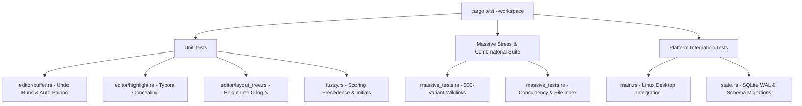

# Developer Guide & Testing

This guide provides instructions for setting up the development environment, compiling the workspace, running test suites, configuring PDFium binaries, and packaging releases.

---

## 1. Prerequisites & Toolchain Setup

MD Editor targets the Rust 2024 edition.

### System Requirements
- **Rust Toolchain**: Stable Rust (version 1.85+ / 2024 edition).
- **C Compiler**: `gcc` or `clang` (required for compiling the bundled SQLite dependency).
- **Internet Connection**: Required on the initial build so `core/build_pdfium.rs` can fetch Google's precompiled PDFium shared library for your operating system and architecture.

### Platform Dependencies (Linux)

On Debian / Ubuntu systems:
```bash
sudo apt update
sudo apt install -y build-essential pkg-config libxkbcommon-dev libfontconfig1-dev
```

For Wayland / X11 windowing support:
```bash
sudo apt install -y libwayland-dev libx11-dev
```

---

## 2. Build Commands

Run all commands from the repository root:

```bash
# Verify code formatting
cargo fmt --check

# Fast typecheck across all crates
cargo check --workspace

# Run the complete test suite
cargo test --workspace

# Launch the application in debug mode
cargo run

# Compile an optimized production release binary
cargo build --release
```

Production binaries are placed in:
- Linux / macOS: `target/release/md-editor`
- Windows: `target/release/md-editor.exe`

---

## 3. PDFium Dynamic Library Resolution

PDFium is linked dynamically. During `cargo build`, [`core/build_pdfium.rs`](file:///home/sur/repo/md-editor/core/build_pdfium.rs) downloads the appropriate precompiled release artifact for your host target and verifies its SHA-256 checksum:

| Platform | Target Architecture | Library File Name |
| :--- | :--- | :--- |
| **Linux** | `x86_64` / `aarch64` | `libpdfium.so` |
| **Windows** | `x86_64` / `aarch64` | `pdfium.dll` |
| **macOS** | Intel (`x86_64`) / Apple Silicon (`aarch64`) | `libpdfium.dylib` |

### Runtime Search Paths
When launching `md-editor`, the engine locates the PDFium library in either:
1. Directly in the same folder as the `md-editor` executable.
2. In a `resources/` subfolder located beside the executable.

*Note: The release build script automatically copies the shared library next to the generated binary.*

---

## 4. Automated Testing Strategy

The test suite covers unit logic, rendering math, combinatorial parsing, and multi-threaded stress tests:



### Key Test Suites

1. **Buffer Stress & Auto-Pairing** ([`native/src/editor/buffer.rs`](file:///home/sur/repo/md-editor/native/src/editor/buffer.rs)):
   - Verifies undo/redo runs under rapid multi-line deletions and pastes.
   - Tests bracket wrapping, skip-over logic, and contraction apostrophe suppression (`don't`).
2. **Highlighter Permutations** ([`native/src/editor/highlight.rs`](file:///home/sur/repo/md-editor/native/src/editor/highlight.rs)):
   - Verifies that syntax concealing correctly handles nested markdown, unclosed code fences, inline math, and CRLF line breaks.
3. **Fenwick Tree Invariants** ([`native/src/editor/layout_tree.rs`](file:///home/sur/repo/md-editor/native/src/editor/layout_tree.rs)):
   - Verifies that prefix sums match brute-force sums across arbitrary line height updates.
   - Tests that binary searches in `find_line_at_y()` are strictly monotonic and handle boundary conditions (e.g. empty lines, zero-height lines).
4. **Fuzzy Scoring Precedence** ([`native/src/fuzzy.rs`](file:///home/sur/repo/md-editor/native/src/fuzzy.rs)):
   - Validates that word boundary matches and CamelCase initials outrank scattered mid-word matches.
5. **Combinatorial Stress Suite** ([`core/src/massive_tests.rs`](file:///home/sur/repo/md-editor/core/src/massive_tests.rs)):
   - Generates 500 distinct wikilink variants with aliases, subpaths, and special characters.
   - Verifies that concurrent reader threads do not encounter lock poison or race conditions.

---

## 5. Linux Desktop Integration

On Linux, MD Editor provides native desktop environment integration (application menu launcher, window manager association, and scalable icons).

### Installing Desktop Entry & Icons
```bash
cargo run -- --install-desktop
# or
./target/release/md-editor --install
```
This command:
1. Copies `md-editor.png` to `~/.local/share/icons/hicolor/1024x1024/apps/md-editor.png`.
2. Generates a valid freedesktop `.desktop` file in `~/.local/share/applications/md-editor.desktop`.
3. Runs `update-desktop-database` to register the launcher with GNOME, KDE, or XFCE menus.

### Uninstalling
```bash
cargo run -- --uninstall-desktop
# or
./target/release/md-editor --uninstall
```
Removes all registered desktop shortcuts and icon files.

---

## 6. Pre-Release Durability Verification Checklist

Before shipping a binary build, manually verify the [durability invariants](Data-Flows-and-Durability-Invariants.md):
- [ ] **Kill it mid-edit**: Type content, run `killall -9 md-editor`, reopen vault: zero characters lost.
- [ ] **Switch with unsaved edits**: Edit a file, immediately click another note in the sidebar: changes flush to disk before navigating.
- [ ] **Undo is word-sized**: Type a sentence, press `Ctrl+Z` once: reverses the phrase, not single characters.
- [ ] **Navigation undo preserved**: Navigate between three notes; press `Ctrl+Z` on return: previous undo history is restored.
- [ ] **Zero idle CPU**: Check `top` or `htop`: settled application uses 0.0% CPU.
