# Developer Guide & Testing

Setting up the toolchain, building the workspace, resolving PDFium, running the tests, and
installing the Linux desktop entry.

---

## 1. Prerequisites

MD Editor targets the **Rust 2024 edition**.

- **Rust toolchain** — stable Rust 1.85 or newer (2024 edition), with Cargo.
- **C compiler** — `gcc` or `clang`, needed to build the bundled SQLite that `rusqlite`
  compiles from source.
- **A desktop environment** capable of creating native windows, to *run* the app. The core
  crate's tests need none.
- **Network access on the first build**, so `core/build_pdfium.rs` can fetch PDFium. Later
  builds reuse the cache under `target/pdfium/`.

### Linux packages

Debian / Ubuntu:

```bash
sudo apt update
sudo apt install -y build-essential pkg-config libxkbcommon-dev libfontconfig1-dev
# Wayland / X11 windowing
sudo apt install -y libwayland-dev libx11-dev
```

Arch:

```bash
sudo pacman -S --needed base-devel pkgconf libxkbcommon fontconfig
```

---

## 2. Build & Run

All commands run from the repository root.

```bash
cargo fmt --check            # formatting
cargo check --workspace      # fast typecheck
cargo clippy --workspace     # lints — see the note below
cargo test --workspace       # full test suite
cargo run                    # launch in debug
cargo build --release        # optimized binary
```

> `cargo fmt --check` and `cargo test --workspace` pass cleanly on `main`. Clippy does not
> yet: the tree carries 34 warnings, so `-D warnings` fails on a fresh checkout. Treat the
> current count as the baseline and do not add to it.

Release output:

| Platform | Executable |
| :--- | :--- |
| Linux / macOS | `target/release/md-editor` |
| Windows | `target\release\md-editor.exe` |

The PDFium shared library is copied next to the binary, into the same Cargo profile
directory, by the build script.

### Running with a file

The binary accepts a single path argument — a file or a directory — which is how the Linux
desktop entry's `Exec=... %F` hands documents to the app:

```bash
./target/release/md-editor ~/vault/Summary.md
```

---

## 3. PDFium Resolution

### Build time (`core/build_pdfium.rs`)

The script picks a platform slug from `CARGO_CFG_TARGET_OS` and `CARGO_CFG_TARGET_ARCH`,
downloads the matching archive from
[`bblanchon/pdfium-binaries`](https://github.com/bblanchon/pdfium-binaries), extracts it, and
copies the library both into `core/pdfium/` and into the Cargo profile output directory.

| Platform | Architecture | Slug | Library |
| :--- | :--- | :--- | :--- |
| Linux | `x86_64` / `aarch64` | `linux-x64` / `linux-arm64` | `libpdfium.so` |
| Windows | `x86_64` / `aarch64` | `win-x64` / `win-arm64` | `pdfium.dll` |
| macOS | `x86_64` / `aarch64` | `mac-x64` / `mac-arm64` | `libpdfium.dylib` |

An unsupported platform prints a warning and skips the download; PDF support is then simply
unavailable and the rest of the app still builds.

Two environment variables control the download, and **both are opt-in**:

| Variable | Effect |
| :--- | :--- |
| `PDFIUM_RELEASE` | Pin a release tag, for example `chromium/6996`. Defaults to `latest`. |
| `PDFIUM_SHA256` | Expected hex digest of the platform `.tgz`. When set, a mismatch **panics** the build. When unset, the script warns that the archive is unverified. |

> For a reproducible, verified build, set both. Leaving them unset trusts whatever bytes the
> network returned.

The archive is cached at `target/pdfium/<slug>/`, so a rebuild with the library already
present skips the network entirely.

### Runtime (`core/src/pdf.rs::bind_pdfium`)

The binding is created **once per process** behind a `OnceLock`, and candidates are tried in
this order:

1. `<executable directory>/resources/<library>`
2. `<executable directory>/<library>`
3. `<CARGO_MANIFEST_DIR>/pdfium/<library>` — the development path
4. the plain library name, leaving resolution to the system loader

For packaged or portable builds, ship the library in a `resources/` folder beside the
executable, or directly beside it.

---

## 4. Testing

```bash
cargo test --workspace
```

The suite is **158 tests**: 56 in `md-editor-core` and 102 in `md-editor-native`. They run in
a few seconds and need no display server.

```mermaid
graph TD
    Runner["cargo test --workspace"] --> CoreTests["md-editor-core — 56 tests"]
    Runner --> NativeTests["md-editor-native — 102 tests"]

    CoreTests --> VaultT["vault.rs — atomic writes, symlinks, permissions, exclusions"]
    CoreTests --> PdfT["pdf.rs — page count, text, search, TOC recovery"]
    CoreTests --> RefsT["references.rs — target maps, call-sites, precision rules"]
    CoreTests --> IndexT["file_index.rs — wikilink resolution and backlinks"]
    CoreTests --> Massive["massive_tests.rs — 8 combinatorial and stress suites"]

    NativeTests --> BufferT["editor/buffer.rs — undo runs, auto-pairing, list continuation"]
    NativeTests --> HighlightT["editor/highlight.rs — concealing, fences, permutations"]
    NativeTests --> RendererT["editor/renderer.rs — heights, visual movement, extremes"]
    NativeTests --> TreeT["editor/layout_tree.rs — prefix sums and find_line_at_y"]
    NativeTests --> FuzzyT["fuzzy.rs — ordering, word starts, initials"]
    NativeTests --> PaletteT["views/command_palette.rs — ranking, caps, activation"]
    NativeTests --> AppT["app.rs — PDF page slots, offsets, note paths"]
    NativeTests --> MainT["main.rs — CLI parsing, window size, desktop install"]
```



### Notable suites

1. **Atomic write guarantees** (`core/src/vault.rs`) — content replacement leaves no `.tmp`
   files behind, permissions are preserved, a symlink is written *through*, and a truncated
   file is never left on disk.
2. **Combinatorial and stress** (`core/src/massive_tests.rs`) — eight suites covering
   wikilink variants, graph topologies, dynamic index fuzzing, settings upserts at volume,
   tracker session volume, recursive vault operations, FTS5 indexing and search, and the
   file rename/delete lifecycle.
3. **Buffer semantics** (`native/src/editor/buffer.rs`) — undo-run coalescing, bracket
   wrapping and skip-over, contraction apostrophes, list continuation including ordered-list
   increment and multibyte markers, and a deterministic editing stress test that asserts the
   cursor and selection stay valid.
4. **Highlighter permutations** (`native/src/editor/highlight.rs`) — nested markdown,
   unclosed fences, inline math, and the invariant that code highlighting preserves the full
   source text.
5. **Fenwick invariants** (`native/src/editor/layout_tree.rs`) — prefix sums match brute-force
   sums, and `find_line_at_y` is monotonic and correct at boundaries.
6. **Renderer geometry** (`native/src/editor/renderer.rs`) — line-height permutations, total
   height accumulation, visual down-movement through empty and wrapped lines, and extreme
   dimensions.
7. **PDF page geometry** (`native/src/app.rs`) — target offsets map back to the same page,
   blank pages reserve space, and placeholder slots scale with zoom.
8. **Platform integration** (`native/src/main.rs`) — CLI argument parsing, window-size
   round-tripping and rejection of nonsense values, and a full Linux desktop install and
   uninstall round-trip against a temporary `$HOME`.

### Reference-resolver tools

```bash
cargo run --example dump_refs -- path/to/paper.pdf    # precision spot-check
cargo run --example bench_refs -- path/to/paper.pdf   # text-scan cost
```

---

## 5. Linux Desktop Integration

Linux builds are portable by default; desktop integration is explicitly opt-in.

```bash
./target/release/md-editor --install     # or --install-desktop
./target/release/md-editor --uninstall   # or --uninstall-desktop
```

`--install` (`native/src/main.rs`):

1. writes the icon to `~/.local/share/icons/md-editor.png` and
   `~/.local/share/icons/hicolor/scalable/apps/md-editor.png`;
2. resizes it into `hicolor/{16,32,48,64,128,256,512}x…/apps/md-editor.png` with Lanczos3;
3. copies the system `hicolor/index.theme` if the local hicolor tree lacks one;
4. writes `~/.local/share/applications/md-editor.desktop` with an absolute `Exec=<path> %F`,
   `MimeType=text/markdown;application/pdf;`, and `StartupWMClass=md-editor` so the window
   associates with the launcher;
5. runs `update-desktop-database` and `gtk-update-icon-cache -f` where available.

`--uninstall` removes the desktop entry and the installed icons and refreshes the caches
again. Both flags exit non-zero and print a message on non-Linux platforms.

The whole round-trip is covered by `tests::test_linux_desktop_installation_roundtrip`.

---

## 6. Continuous Integration & Release Packaging

`.github/workflows/windows-build.yml` — named for its original scope, it now covers the whole
release pipeline. It runs on pushes to `main`, on `v*` tags, and on manual dispatch, with
three jobs:

| Job | Runner | What it produces |
| :--- | :--- | :--- |
| `build-windows` | `windows-latest` | `cargo build --release`, then a package of `md-editor.exe` plus `resources/pdfium.dll` (downloaded separately from `bblanchon/pdfium-binaries`), zipped as `md-editor-windows-x64.zip` |
| `build-linux` | `ubuntu-latest` | The same layout using the `libpdfium.so` the build script already placed in `target/release/`, as both `.tar.gz` (which keeps the executable bit) and `.zip` |
| `publish-release` | `ubuntu-latest` | Downloads both artifacts and publishes a GitHub Release — tagged `v*` builds are final, everything else publishes as `latest` and is marked pre-release |

Both packages use the **`resources/` layout**, which is the first path
[`bind_pdfium`](#3-pdfium-resolution) checks at runtime.

Note that CI does **not** currently run `cargo test`, `cargo fmt --check`, or `cargo clippy` —
those are the contributor's responsibility before opening a pull request, per
[Contributor Guidelines](Contributor-Guidelines.md).

Give a first-time build on either runner extra time: `rusqlite`'s bundled SQLite compiles
from source and the PDFium archive downloads, both exactly once per cache.
