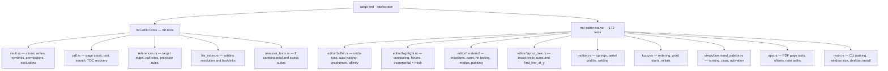

# Developer Guide & Testing

Setting up the toolchain, building the workspace, resolving PDFium, running the tests, and
installing the Linux desktop entry.

---

## 1. Prerequisites

MD Editor targets the **Rust 2024 edition**.

- **Rust toolchain** — stable Rust 1.85 or newer (2024 edition), with Cargo.
- **C compiler** — `gcc` or `clang`, needed to build the bundled SQLite that `rusqlite`
  compiles from source.
- **A desktop environment** capable of creating native windows, to *run* the app. The core
  crate's tests need none.
- **Network access on the first build**, so `core/build_pdfium.rs` can fetch PDFium. Later
  builds reuse the cache under `target/pdfium/`.

### Linux packages

Debian / Ubuntu:

```bash
sudo apt update
sudo apt install -y build-essential pkg-config libxkbcommon-dev libfontconfig1-dev
# Wayland / X11 windowing
sudo apt install -y libwayland-dev libx11-dev
```

Arch:

```bash
sudo pacman -S --needed base-devel pkgconf libxkbcommon fontconfig
```

---

## 2. Build & Run

All commands run from the repository root.

```bash
cargo fmt --check            # formatting
cargo check --workspace      # fast typecheck
cargo clippy --workspace     # lints — see the note below
cargo test --workspace       # full test suite
cargo run                    # launch in debug
cargo build --release        # optimized binary
```

> `cargo fmt --check` and `cargo test --workspace` pass cleanly on `main`. Clippy does not
> yet: the tree carries 10 warnings (2 in core, 8 in native, none in the editor), so
> `-D warnings` fails on a fresh checkout. Treat the current count as the baseline and do
> not add to it.

Release output:

| Platform | Executable |
| :--- | :--- |
| Linux / macOS | `target/release/md-editor` |
| Windows | `target\release\md-editor.exe` |

The PDFium shared library is copied next to the binary, into the same Cargo profile
directory, by the build script.

### Running with a file

The binary accepts a single path argument — a file or a directory — which is how the Linux
desktop entry's `Exec=... %F` hands documents to the app:

```bash
./target/release/md-editor ~/vault/Summary.md
```

---

## 3. PDFium Resolution

### Build time (`core/build_pdfium.rs`)

The script picks a platform slug from `CARGO_CFG_TARGET_OS` and `CARGO_CFG_TARGET_ARCH`,
downloads the matching archive from
[`bblanchon/pdfium-binaries`](https://github.com/bblanchon/pdfium-binaries), extracts it, and
copies the library both into `core/pdfium/` and into the Cargo profile output directory.

| Platform | Architecture | Slug | Library |
| :--- | :--- | :--- | :--- |
| Linux | `x86_64` / `aarch64` | `linux-x64` / `linux-arm64` | `libpdfium.so` |
| Windows | `x86_64` / `aarch64` | `win-x64` / `win-arm64` | `pdfium.dll` |
| macOS | `x86_64` / `aarch64` | `mac-x64` / `mac-arm64` | `libpdfium.dylib` |

An unsupported platform prints a warning and skips the download; PDF support is then simply
unavailable and the rest of the app still builds.

Two environment variables control the download, and **both are opt-in**:

| Variable | Effect |
| :--- | :--- |
| `PDFIUM_RELEASE` | Pin a release tag, for example `chromium/6996`. Defaults to `latest`. |
| `PDFIUM_SHA256` | Expected hex digest of the platform `.tgz`. When set, a mismatch **panics** the build. When unset, the script warns that the archive is unverified. |

> For a reproducible, verified build, set both. Leaving them unset trusts whatever bytes the
> network returned.

The archive is cached at `target/pdfium/<slug>/`, so a rebuild with the library already
present skips the network entirely.

### Runtime (`core/src/pdf.rs::bind_pdfium`)

The binding is created **once per process** behind a `OnceLock`, and candidates are tried in
this order:

1. `<executable directory>/resources/<library>`
2. `<executable directory>/<library>`
3. `<CARGO_MANIFEST_DIR>/pdfium/<library>` — the development path
4. the plain library name, leaving resolution to the system loader

For packaged or portable builds, ship the library in a `resources/` folder beside the
executable, or directly beside it.

---

## 4. Testing

```bash
cargo test --workspace
```

The suite is **241 tests**: 68 in `md-editor-core` and 173 in `md-editor-native`, plus
three opt-in renderer tools that are ignored by default (below). They run in a few seconds
and need no display server.


```mermaid
graph TD
    Runner["cargo test --workspace"] --> CoreTests["md-editor-core — 68 tests"]
    Runner --> NativeTests["md-editor-native — 173 tests"]

    CoreTests --> VaultT["vault.rs — atomic writes, symlinks, permissions, exclusions"]
    CoreTests --> PdfT["pdf.rs — page count, text, search, TOC recovery"]
    CoreTests --> RefsT["references.rs — target maps, call-sites, precision rules"]
    CoreTests --> IndexT["file_index.rs — wikilink resolution and backlinks"]
    CoreTests --> Massive["massive_tests.rs — 8 combinatorial and stress suites"]

    NativeTests --> BufferT["editor/buffer.rs — undo runs, auto-pairing, graphemes, affinity"]
    NativeTests --> HighlightT["editor/highlight.rs — concealing, fences, incremental = fresh"]
    NativeTests --> RendererT["editor/renderer/ — invariants, caret, hit testing, motion, painting"]
    NativeTests --> TreeT["editor/layout_tree.rs — exact prefix sums and find_line_at_y"]
    NativeTests --> MotionT["motion.rs — springs, panel widths, settling"]
    NativeTests --> FuzzyT["fuzzy.rs — ordering, word starts, initials"]
    NativeTests --> PaletteT["views/command_palette.rs — ranking, caps, activation"]
    NativeTests --> AppT["app.rs — PDF page slots, offsets, note paths"]
    NativeTests --> MainT["main.rs — CLI parsing, window size, desktop install"]
```

### Notable suites

1. **Atomic write guarantees** (`core/src/vault.rs`) — content replacement leaves no `.tmp`
   files behind, permissions are preserved, a symlink is written *through*, and a truncated
   file is never left on disk.
2. **Combinatorial and stress** (`core/src/massive_tests.rs`) — eight suites covering
   wikilink variants, graph topologies, dynamic index fuzzing, settings upserts at volume,
   tracker session volume, recursive vault operations, FTS5 indexing and search, and the
   file rename/delete lifecycle.
3. **Buffer semantics** (`native/src/editor/buffer.rs`) — undo-run coalescing, bracket
   wrapping and skip-over, contraction apostrophes, list continuation including ordered-list
   increment and multibyte markers, grapheme-cluster movement and deletion (CRLF as one
   stop), caret affinity that lasts only until the next change, and a deterministic editing
   stress test that asserts the cursor and selection stay valid.
4. **Highlighter** (`native/src/editor/highlight.rs`) — nested markdown, unclosed fences,
   inline math, code highlighting preserving the full source text, equivalence with a
   reference implementation, and seeded edit scripts proving incremental highlighting equals
   highlighting from scratch.
5. **Fenwick invariants** (`native/src/editor/layout_tree.rs`) — prefix sums match brute-force
   sums exactly, and `find_line_at_y` is monotonic and correct at boundaries.
6. **Renderer geometry** (`native/src/editor/renderer/`) — line heights, margins and table
   gutters (`layout.rs`), visual down-movement through empty and wrapped lines (`caret.rs`),
   selection extraction (`selection.rs`), inline reveal rules (`spans.rs`), caption numbering
   (`draw/captions.rs`), the reveal policy (`reveal.rs`), and the caret's glide and blink
   schedule (`glide.rs`).
7. **Renderer behaviour** (`native/src/editor/renderer/tests.rs`) — driven only through the
   `Widget` API and checked against the draw calls and messages that come out: the caret sits
   on painted text at every column of wrapped lines, clicking where the caret is drawn puts it
   back there, clicking past a row's end keeps the caret on that row, a multi-line selection
   is one continuous shape that covers images, tables and equations whole, painting over them
   and under text, wide code, tables and equations show nothing outside their viewports at
   any scroll position, an equation rendering late reflows the layout, a reveal request is
   answered once with the caret's drawn place,
   short caret moves glide and long ones cut, layout is skipped exactly while its inputs are
   unchanged, links on wrapped rows are clickable, table headers and stripes, scrollbar thumbs
   follow the pointer with no dead zone, clicks in scrolled code hit the character under the
   pointer, and no widths from 40 to 260px panic.
8. **Renderer invariants** (`native/src/editor/renderer/properties.rs`) — see
   [Property suites](#property-suites).
9. **PDF page geometry** (`native/src/app.rs`) — target offsets map back to the same page,
   blank pages reserve space, and placeholder slots scale with zoom.
10. **Platform integration** (`native/src/main.rs`) — CLI argument parsing, window-size
   round-tripping and rejection of nonsense values, and a full Linux desktop install and
   uninstall round-trip against a temporary `$HOME`.

### Property suites

The editor's geometry is pinned by invariants rather than by examples alone.
`native/src/editor/renderer/properties.rs` generates documents from a seed — every block
and inline kind, pathological nesting, CRLF, widths from 40 to 1400px — using the generator
shared with the highlighter's suite (`native/src/editor/test_docs.rs`). A failing case is
shrunk line by line and reported with its seed and a minimal document.

| Invariant | Test |
| :--- | :--- |
| I1 — the caret lies on painted glyphs of its row, on either side of a row break | `caret_lies_on_painted_glyphs` |
| I2 — hitting where the caret is drawn yields a position drawn at exactly the same place | `hit_testing_inverts_caret_placement` |
| I3 — caret positions advance in reading order | `caret_order_follows_logical_order` |
| I5 — rows tile a line; painted content stays inside its line box | `rows_tile_their_line_and_contain_their_items`, `painted_content_stays_inside_line_boxes` |
| I6 — cached and early-out layouts equal a cold layout through edits and caret moves | `cached_layout_equals_cold_layout` |
| I8 — the height tree, the widget height and the uncached model agree | `height_tree_agrees_with_line_visual_y` |
| I9 — up and down move exactly one visual row | `vertical_moves_step_one_visual_row` |
| I10 — no input panics | `arbitrary_input_never_panics` |
| I11 — scroll offsets stay in range and thumbs follow drags | `scrollbars_stay_in_bounds_and_follow_drags` |
| I12 — drawing touches only visible lines | `drawing_visits_only_visible_lines` |

```bash
cargo test -p md-editor-native properties                          # default case counts
RENDER_PROPERTY_CASES=3000 cargo test -p md-editor-native properties # before a renderer change lands
RENDER_PROPERTY_SEED=<seed> cargo test -p md-editor-native properties # replay a reported failure
HIGHLIGHT_PROPERTY_CASES=3000 cargo test -p md-editor-native highlight
```

### Timing report

An ignored test prints what frames cost on a 37,000-line document — cold layout, a full walk
with warm caches, an unchanged frame, and drawing one screen. Run it in a release build;
debug numbers mean nothing:

```bash
cargo test -p md-editor-native --release layout_timing -- --ignored --nocapture
```

### Render transcript harness

`native/src/editor/render_snapshot_tests.rs` is an opt-in test (`#[ignore]`, so
`cargo test` skips it) for changes to the editor renderer. It drives the `Editor` widget
purely through its `Widget` API — layout, draw, update, and mouse interaction — against a
document that exercises every block and inline kind, at three widths. It records every
quad, text run, and image the widget draws, every message it publishes, clipboard writes,
and mouse-cursor shapes, into a plain-text transcript. Drawing goes to a recording renderer
that borrows the real renderer's text measurement, so no window or GPU is needed.

```bash
# Before the change: write a baseline transcript
RENDER_SNAPSHOT=/tmp/render.txt RENDER_SNAPSHOT_WRITE=1 \
  cargo test -p md-editor-native render_snapshot -- --ignored

# After the change: compare (writes /tmp/render.txt.actual on mismatch)
RENDER_SNAPSHOT=/tmp/render.txt cargo test -p md-editor-native render_snapshot -- --ignored
diff /tmp/render.txt /tmp/render.txt.actual | less
```

- **For a refactor**, the comparison must pass. That is how the split of `renderer.rs` into
  `renderer/` was verified to change nothing.
- **For a visual fix**, the diff should contain the draw calls you meant to change, and
  nothing else.

The transcript is large (tens of MB) and pins current behaviour, including known bugs, so
keep it out of the repository.

### Render previews

`native/src/editor/render_preview.rs` renders a sample document — wrapped styled and plain
paragraphs, tasks, a quote, inline and block math, a code block, a table, an image — to PNG files
using iced's tiny-skia software renderer, so rendering can be looked at without opening a
window. Scenes cover a caret mid-paragraph, a caret after a checkbox, a selection across
wrapped rows, a selection across lines, a selection across a table, an equation and an
image, a caret in equation source, and a wide unfocused view. Equations are rendered by the
app's own `render_latex_task`, and the image is the repository's `md-editor.png`, so what
the previews show is what the app draws.

```bash
RENDER_PREVIEW_DIR=/tmp/previews cargo test -p md-editor-native render_preview -- --ignored
```

It uses only the widget's public API, so the same file can be dropped into an older
checkout to render a before/after pair. Text is shaped with system fonts, so glyphs the
software renderer's fonts lack (the task checkmark, for one) may show as boxes.

### Slide previews

`native/src/slides/preview.rs` renders the slides of any `.pptx` to PNG files through the
viewer's own widgets (`views::pptx_viewer::slide_page`) and the tiny-skia software renderer.
Converting the same deck with `soffice --headless --convert-to pdf` and rasterising the
result with `pdftoppm` gives a reference to compare against.

```bash
PPTX_PREVIEW_FILE=/abs/path/deck.pptx PPTX_PREVIEW_DIR=/tmp/slides \
  cargo test -p md-editor-native slide_preview -- --ignored
```

Cargo runs the test from `native/`, so give absolute paths. `PPTX_PREVIEW_WIDTH` sets the
slide width in pixels (default 960) and `PPTX_PREVIEW_LIMIT` caps the number of slides.
Slide text is shaped with the fonts installed on the machine, through the substitutions the
app makes (`slides/fonts.rs`), so a deck set in fonts you lack breaks lines slightly
differently than it does in PowerPoint.

### Reference-resolver tools

```bash
cargo run --example dump_refs -- path/to/paper.pdf    # precision spot-check
cargo run --example bench_refs -- path/to/paper.pdf   # text-scan cost
```

---

## 5. Linux Desktop Integration

Linux builds are portable by default; desktop integration is explicitly opt-in.

```bash
./target/release/md-editor --install     # or --install-desktop
./target/release/md-editor --uninstall   # or --uninstall-desktop
```

`--install` (`native/src/main.rs`):

1. writes the icon to `~/.local/share/icons/md-editor.png` and
   `~/.local/share/icons/hicolor/scalable/apps/md-editor.png`;
2. resizes it into `hicolor/{16,32,48,64,128,256,512}x…/apps/md-editor.png` with Lanczos3;
3. copies the system `hicolor/index.theme` if the local hicolor tree lacks one;
4. writes `~/.local/share/applications/md-editor.desktop` with an absolute `Exec=<path> %F`,
   `MimeType=text/markdown;application/pdf;`, and `StartupWMClass=md-editor` so the window
   associates with the launcher;
5. runs `update-desktop-database` and `gtk-update-icon-cache -f` where available.

`--uninstall` removes the desktop entry and the installed icons and refreshes the caches
again. Both flags exit non-zero and print a message on non-Linux platforms.

The whole round-trip is covered by `tests::test_linux_desktop_installation_roundtrip`.

---

## 6. Continuous Integration & Release Packaging

`.github/workflows/windows-build.yml` — named for its original scope, it now covers the whole
release pipeline. It runs on pushes to `main`, on `v*` tags, and on manual dispatch, with
three jobs:

| Job | Runner | What it produces |
| :--- | :--- | :--- |
| `build-windows` | `windows-latest` | `cargo build --release`, then a package of `md-editor.exe` plus `resources/pdfium.dll` (downloaded separately from `bblanchon/pdfium-binaries`), zipped as `md-editor-windows-x64.zip` |
| `build-linux` | `ubuntu-latest` | The same layout using the `libpdfium.so` the build script already placed in `target/release/`, as both `.tar.gz` (which keeps the executable bit) and `.zip` |
| `publish-release` | `ubuntu-latest` | Downloads both artifacts and publishes a GitHub Release — tagged `v*` builds are final, everything else publishes as `latest` and is marked pre-release |

Both packages use the **`resources/` layout**, which is the first path
[`bind_pdfium`](#3-pdfium-resolution) checks at runtime.

Note that CI does **not** currently run `cargo test`, `cargo fmt --check`, or `cargo clippy` —
those are the contributor's responsibility before opening a pull request, per
[Contributor Guidelines](Contributor-Guidelines.md).

Give a first-time build on either runner extra time: `rusqlite`'s bundled SQLite compiles
from source and the PDFium archive downloads, both exactly once per cache.
