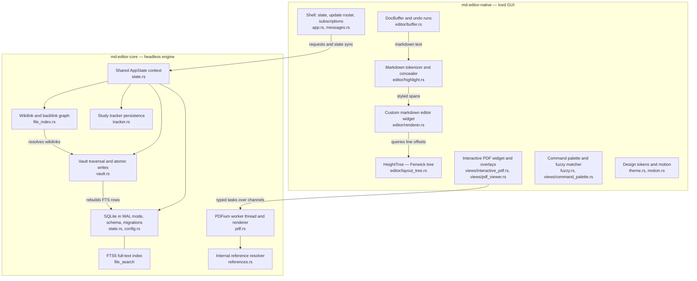

# MD Editor Wiki

Welcome to the **MD Editor** wiki — the single, authoritative documentation set for
the project. Everything that used to live under `docs/` has been folded into these
pages; there is no other documentation tree to keep in sync.

MD Editor is a calm, native, local-first desktop workspace for notes, PDFs, images,
search, backlinks, and study progress. It is written in Rust on top of the
[Iced](https://github.com/iced-rs/iced) GUI toolkit (0.14) and Google's
[PDFium](https://pdfium.googlesource.com/pdfium/) rendering engine.

---

## System Architecture at a Glance

The workspace is two crates: a headless engine (`md-editor-core`) and a native
desktop interface (`md-editor-native`).

---

## Wiki Navigation Matrix

| Topic | Description | Link |
| :--- | :--- | :--- |
| **User Guide & Features** | Vaults, markdown editing, PDF reading, split view, search modes, tracker | [User Guide & Feature Manual](User-Guide-and-Feature-Manual.md) |
| **Keyboard Shortcuts** | Every binding, and which layer owns it | [Keyboard Shortcuts](Keyboard-Shortcuts.md) |
| **Architecture & Philosophy** | Local-first, portability, durability, non-destructive sidecars, threading | [Architecture & Philosophy](Architecture-and-Philosophy.md) |
| **Repository Structure** | Workspace layout, crate boundaries, per-file responsibilities | [Repository Structure](Repository-Structure.md) |
| **Core Services** | SQLite schema, portable paths, vault operations, atomic writes, wikilink graph | [Core Services](Core-Services.md) |
| **Native Desktop GUI** | Application lifecycle, message enum, sub-state split, subscriptions, views | [Native Desktop GUI](Native-Desktop-GUI.md) |
| **Markdown Pipeline** | Rope buffer, undo runs, auto-pairing, hybrid preview, Fenwick layout, draw pass | [Markdown Pipeline](Markdown-Pipeline.md) |
| **PDF Engine & Sidecars** | PDFium worker, TOC recovery, reference resolver, sidecar annotations, linked notes | [PDF Engine & Sidecars](PDF-Engine-and-Sidecars.md) |
| **PDF Viewer Internals** | Native PDF state, generation and pending invariants, navigation, scroll, zoom | [PDF Viewer Internals](PDF-Viewer-Internals.md) |
| **Design Tokens & Motion** | Type scale, 2px spacing grid, radii, colors, one easing curve, zero idle CPU | [Design Tokens, Motion & Palette](Design-Tokens-Motion-and-Palette.md) |
| **Study Tracker** | Timer, sessions, the configurable curriculum, gates, reading, storage | [Study Tracker](Study-Tracker.md) |
| **Data Flows & Invariants** | Keystroke to atomic save, navigation, highlight creation, durability invariants | [Data Flows & Durability Invariants](Data-Flows-and-Durability-Invariants.md) |
| **Developer Guide & Testing** | Toolchain, build commands, PDFium resolution, test suites, desktop integration | [Developer Guide & Testing](Developer-Guide-and-Testing.md) |
| **Release Checklist** | Pre-release verification, smoke test, packaging, known constraints | [Release Checklist](Release-Checklist.md) |
| **Contributor Guidelines** | Architectural rules, design token compliance, PR verification | [Contributor Guidelines](Contributor-Guidelines.md) |

---

## Finding What You Need

- **New user** — start with the [User Guide & Feature Manual](User-Guide-and-Feature-Manual.md)
  and keep [Keyboard Shortcuts](Keyboard-Shortcuts.md) open beside it.
- **New contributor** — read [Contributor Guidelines](Contributor-Guidelines.md), then
  [Developer Guide & Testing](Developer-Guide-and-Testing.md), then
  [Data Flows & Durability Invariants](Data-Flows-and-Durability-Invariants.md).
- **Reviewing the design** — the deep dives are [Markdown Pipeline](Markdown-Pipeline.md),
  [PDF Engine & Sidecars](PDF-Engine-and-Sidecars.md),
  [PDF Viewer Internals](PDF-Viewer-Internals.md), and [Core Services](Core-Services.md).
- **Preparing a build** — [Release Checklist](Release-Checklist.md).

---

## Documentation Conventions

- Every claim on these pages is meant to be checkable against the source file named
  beside it. If a page and the code disagree, the code is right and the page is a bug.
- Line-level details (exact constants, table columns, message variants) are quoted from
  the modules that define them, so a rename should break a search rather than rot quietly.
