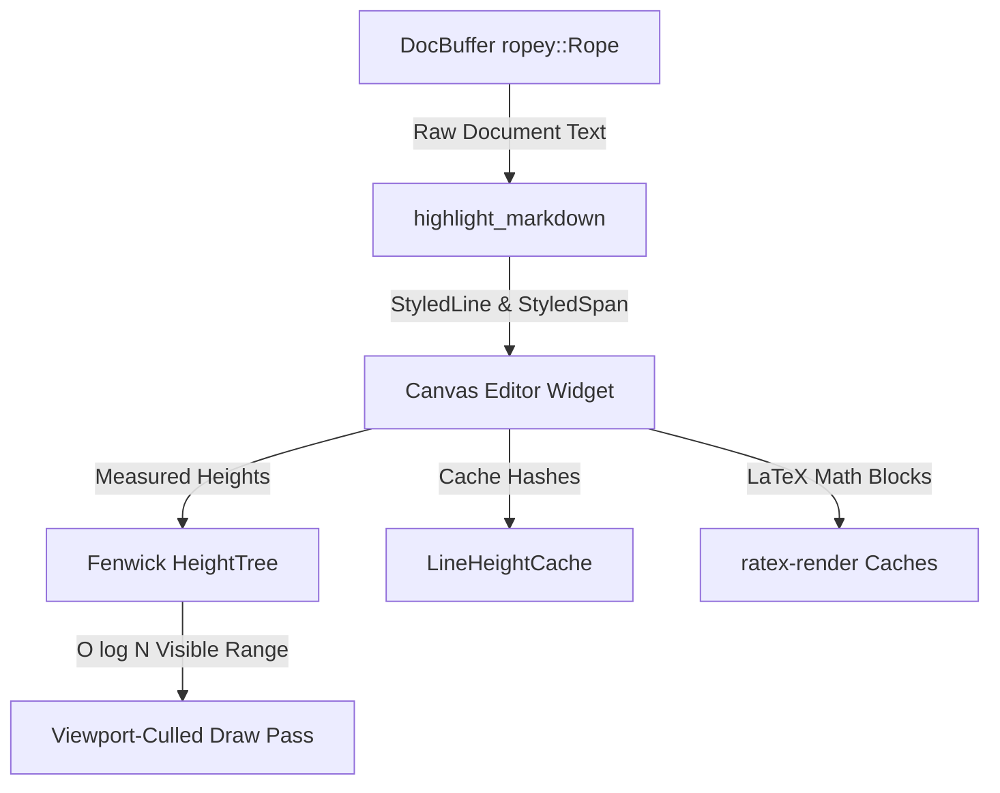
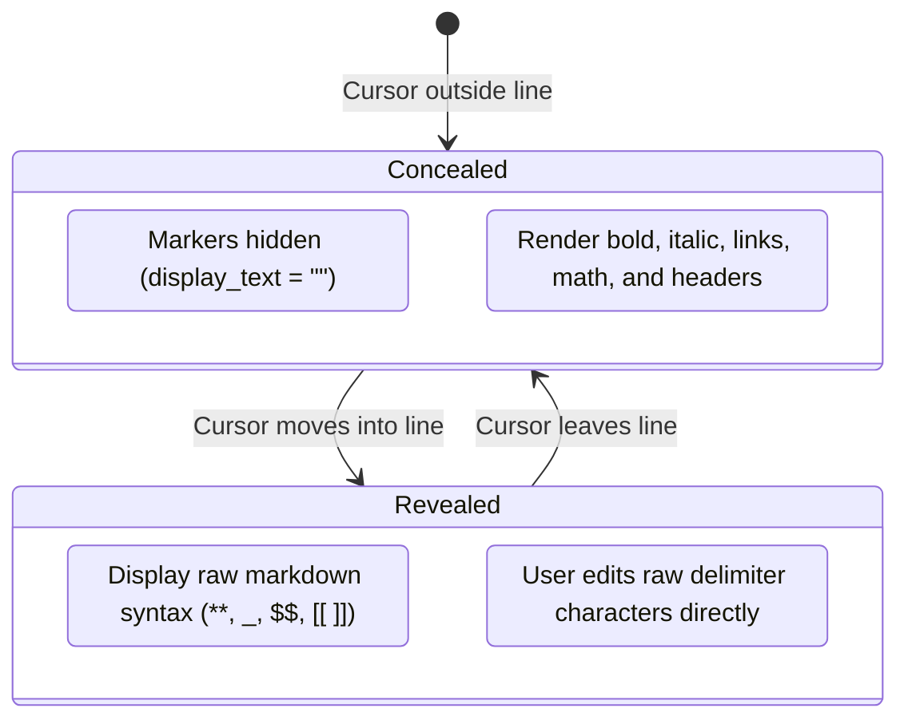

# Markdown Pipeline

The Markdown editing engine in `md-editor-native` is a custom-built canvas widget optimized for large technical notes, live Typora-style hybrid syntax preview, inline LaTeX math rendering, and high-performance scrolling.

---

## Architecture Overview



The pipeline spans four specialized modules under [`native/src/editor/`](file:///home/sur/repo/md-editor/native/src/editor/):
1. **`buffer.rs`**: High-performance rope text storage, transactions, undo/redo runs, auto-pairing, and list continuation.
2. **`highlight.rs`**: Markdown tokenization, syntax concealing, and syntect code styling.
3. **`layout_tree.rs` & `layout_cache.rs`**: Fenwick tree spatial index and line height memoization.
4. **`renderer.rs`**: Iced Canvas widget implementation (culling, LaTeX math rendering, selection painting).

---

## 1. Text Storage & Undo Architecture (`buffer.rs`)

The document is stored in [`DocBuffer`](file:///home/sur/repo/md-editor/native/src/editor/buffer.rs), backed by [`ropey::Rope`](https://docs.rs/ropey).

### Benefits of the Rope Data Structure
- **Logarithmic Complexity**: Insertions, deletions, and line lookups operate in $O(\log N)$ time.
- **Scalability**: Capable of editing documents exceeding 100,000 lines without freezing the UI thread or reallocating gigabytes of continuous memory.

### Human-Sized Undo/Redo Runs
Standard keystroke-by-keystroke undo stacks force users to press `Ctrl+Z` dozens of times to undo a single sentence. MD Editor collapses consecutive keystrokes into intuitive **Undo Runs**:
- Typing characters consecutively appends to an active `UndoRun`.
- An undo run breaks whenever:
  1. The user pauses typing for more than a brief duration.
  2. The Enter key (newline) is pressed.
  3. The cursor moves or jumps to a different location in the document.
- Pressing `Ctrl+Z` reverses an entire word or sentence at once.

### Smart Auto-Pairing
Typing delimiters routes through `type_paired`:
- **Brackets and Braces**: Typing `(`, `[`, or `{` automatically inserts the matching closer and positions the cursor between them.
- **Selection Wrapping**: If text is selected, typing `(`, `[`, `{`, `"`, or `` ` `` wraps the selected text inside the pair without replacing it.
- **Skip-Over Behavior**: If the cursor sits immediately before a closing delimiter (e.g. `)`) and the user types `)`, the cursor simply steps over the existing delimiter instead of inserting a duplicate.
- **Contraction Preservation**: Typing quotes (`"`, `'`, `` ` ``) auto-pairs by default. However, an apostrophe typed immediately after a word character (e.g., `don't`, `it's`, `users'`) is left as a single character, preventing spurious quote pairs in normal English prose.

### Intelligent List Continuation
- Pressing `Enter` on an unordered list (`- `, `* `), ordered list (`1. `), or task checkbox (`- [ ] `) automatically prepends the matching list marker onto the new line.
- If the user presses `Enter` on an **empty** list line, the marker is deleted and the cursor exits list mode.

---

## 2. Typora-Style Hybrid Syntax Highlighting (`highlight.rs`)

MD Editor uses a hybrid markdown live preview:



### Data Structures
[`highlight.rs`](file:///home/sur/repo/md-editor/native/src/editor/highlight.rs) parses text into structured models:
- **`StyledLine`**: Represents a physical line with block metadata (`is_code_block`, `is_math_block`, `is_table_row`, `is_blockquote`, `block_id`).
- **`StyledSpan`**: Inline segments with attributes:
  - Text styling: `is_bold`, `is_italic`, `is_code`, `is_link`, `is_math`.
  - Syntax concealing flags: `is_syntax = true` and `display_text = Some("")`.

### Hybrid Concealing Logic
- **Cursor Away**: When the text cursor is on a different line, syntax markers (e.g., `**`, `*`, `~~`, `$$`, ```) are marked as concealed (`display_text = Some("")`). The user sees clean, publication-quality typography.
- **Cursor Present**: When the cursor enters the line, all syntax markers on that line are immediately revealed in place. The user can edit the exact raw markdown characters without modal toggling.
- **Fenced Code Blocks**: Language-specific syntax highlighting is applied using the `syntect` library with customizable color themes.

---

## 3. Spatial Indexing with the Fenwick Height Tree (`layout_tree.rs`)

Rendering large documents requires calculating vertical scroll positions and determining which lines intersect the viewport. Scanning all lines every frame would be $O(N)$, causing severe lag on 10,000+ line documents.

MD Editor introduces a Binary Indexed Tree ([`HeightTree`](file:///home/sur/repo/md-editor/native/src/editor/layout_tree.rs)):

```
Tree Index:       1    2    3    4    5    6    7    8
Line Index:      [0]  [1]  [2]  [3]  [4]  [5]  [6]  [7]
Fenwick Sum:      h0  h0+h1 h2  h0..3 h4  h4+5 h6  h0..7
```

### Computational Complexity

| Operation | Brute Force Scan | Fenwick `HeightTree` |
| :--- | :--- | :--- |
| **Get total scroll height** | $O(N)$ | $O(1)$ |
| **Get Y offset of line $L$** | $O(L)$ | $O(\log N)$ |
| **Find line at Y coordinate** | $O(N)$ | $O(\log N)$ (binary search on prefix sums) |
| **Update line height** | $O(1)$ | $O(\log N)$ |

When a line is modified, only $\log_2(N)$ nodes in the Fenwick tree are updated.

---

## 4. Line Height Cache (`layout_cache.rs`)

Measuring text height using font metrics and glyph shaping is computationally expensive. [`LineHeightCache`](file:///home/sur/repo/md-editor/native/src/editor/layout_cache.rs) memoizes measured heights using a 64-bit cryptographic hash of:
1. Source line text.
2. Edit state (whether the cursor is currently inside this line).
3. Viewport width (detecting word wrap boundaries).
4. Image or LaTeX math dimensions.

If a line's hash has not changed, the renderer reuses its cached height without re-measuring glyphs.

---

## 5. Custom Canvas Widget & Viewport Culling (`renderer.rs`)

The editor widget implements Iced’s [`canvas::Program`](file:///home/sur/repo/md-editor/native/src/editor/renderer.rs).

### Viewport Culling
During each redraw:
1. The canvas calculates the top and bottom Y coordinates of the visible window.
2. It queries `HeightTree::find_line_at_y(top_y)` and `HeightTree::find_line_at_y(bottom_y)` in $O(\log N)$ time.
3. **Only the visible slice of lines is rendered.** 
4. Lines above and below the viewport are skipped entirely, keeping frame render times under 2ms even on 50,000-line documents.

### Inline & Display LaTeX Math Rendering
LaTeX equations (`$...$` and `$$...$$`) are rendered natively using `ratex-render`:
- Formulas are compiled into rasterized pixel buffers.
- Pixel buffers are cached by formula hash on `app.rs`.
- Display math blocks are centered horizontally with dedicated background padding.

### Wide Block Horizontal Scrolling
Wide elements (such as Markdown tables, code blocks, and wide mathematical proofs) do not break the editor layout or wrap awkwardly:
- Each wide block maintains its own horizontal scroll offset.
- The user can scroll tables and code blocks horizontally with mouse-wheel or touch gestures while vertical document scrolling continues unaffected.
