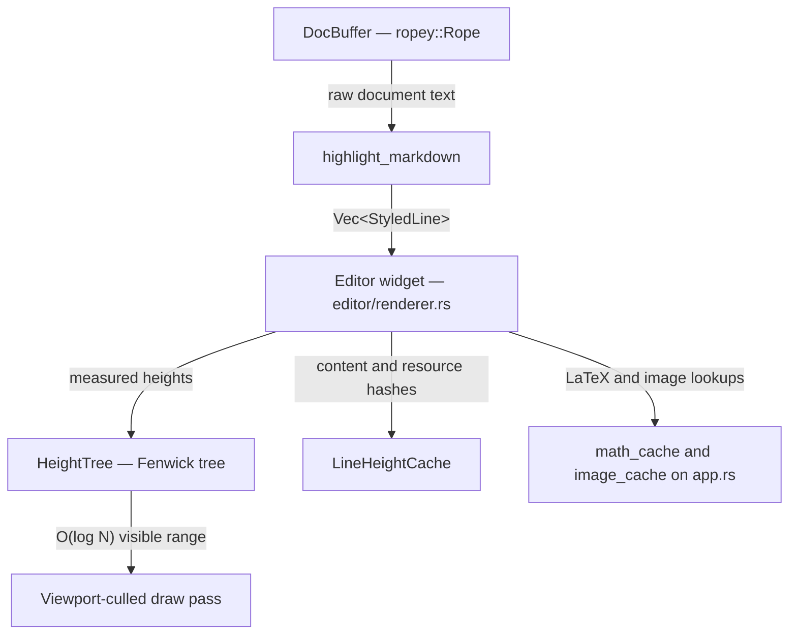
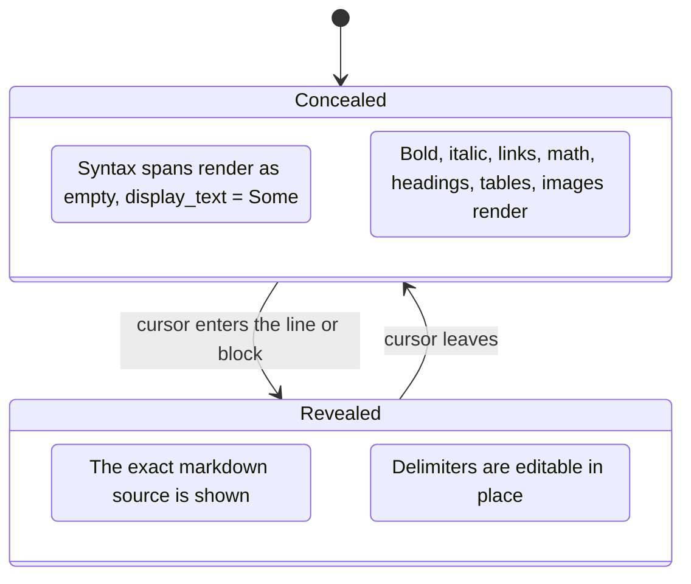

# Markdown Pipeline

The Markdown editor in `md-editor-native` is a custom `iced` widget built for large
technical notes: hybrid live preview, inline and display LaTeX, images, tables that scroll
on their own, and scrolling that stays smooth on documents far past the point where a naive
renderer stalls.

---

## Architecture Overview



Four modules under `native/src/editor/` plus the shell:

1. **`buffer.rs`** — rope text storage, transactions with inverse operations, undo runs,
   auto-pairing, list continuation, formatting commands, movement.
2. **`highlight.rs`** — markdown tokenization into `StyledLine`/`StyledSpan`, syntect code
   styling, and marker concealing.
3. **`layout_tree.rs` + `layout_cache.rs`** — the Fenwick spatial index and per-line
   measurement memoization.
4. **`renderer.rs`** — the `iced::advanced::Widget`: layout, drawing, hit testing, selection
   painting, and per-block horizontal scrolling.

`app.rs` coordinates the pipeline. It owns `highlighted_lines`, the image and math render
caches, scroll state, and the background highlight tasks.

---

## 1. Text Storage & Undo Architecture (`buffer.rs`)

`DocBuffer` is backed by [`ropey::Rope`](https://docs.rs/ropey), which keeps inserts,
deletes, line lookup, and character-offset conversion efficient on large files instead of
reallocating one contiguous buffer per edit.

Editor actions are expressed as `EditorCommand` values applied through `DocBuffer::execute()`:

```rust
pub enum EditorCommand {
    InsertText(String), DeleteSelection, DeleteBackward, DeleteForward,
    MoveCursor { movement: Movement, extend: bool },
    SetCursor { line: usize, col: usize },
    SetSelection { anchor_line: usize, anchor_col: usize, focus_line: usize, focus_col: usize },
    SelectAll, ToggleCheckbox { line: usize },
    FormatBold, FormatItalic, FormatInlineCode, InsertLink,
    TypePaired(char), Undo, Redo,
}
```

`execute()` returns a `CommandResult { text_changed, projection_changed, media_changed }`,
so the shell knows whether to re-parse, refresh media caches, or merely rescroll.

### Human-Sized Undo Runs

A keystroke-by-keystroke undo stack forces a dozen `Ctrl+Z` presses to take back one
sentence. `commit_transaction` instead *coalesces* consecutive edits:

```rust
const UNDO_COALESCE_WINDOW: Duration = Duration::from_millis(300);
```

`can_coalesce(prev, next)` merges only when every one of these holds:

- the new transaction is a single operation;
- it is the same kind as the previous one — insert continues inserts, delete continues
  deletes;
- neither text contains a newline, so a run always breaks at a line boundary at the latest;
- the new character lands exactly where the previous one ended, so a cursor jump breaks the run;
- there was no active selection, so a selection-replacing edit is always its own step;
- less than `UNDO_COALESCE_WINDOW` has passed, so a deliberate pause starts a new step.

The result: one `Ctrl+Z` takes back a word-sized burst of typing (or of backspaces).

### Smart Auto-Pairing (`type_paired`)

Bracket and quote characters route through `TypePaired`; everything else inserts verbatim.

- **Brackets** — `PAIRS = [('(', ')'), ('[', ']'), ('{', '}')]`. Typing an opener inserts
  the pair and places the cursor between them.
- **Selection wrapping** — with a selection active, typing `(`, `[`, `{`, `"`, `'`, or
  `` ` `` wraps the selection rather than replacing it.
- **Skip-over** — typing a closer that already sits at the cursor steps over it instead of
  inserting a duplicate. The same applies to an identical quote directly ahead.
- **Contraction preservation** — `"`, `'`, and `` ` `` pair by default, but a quote typed
  immediately after an alphanumeric character is left single, so `don't`, `it's`, and
  `users'` do not sprout stray closers.

### List Continuation

Pressing `Enter` inside a list item continues it:

| Source line | After `Enter` |
| :--- | :--- |
| `- Buy milk` | `- Buy milk\n- ` |
| `* [ ] Code task` | `* [ ] Code task\n* [ ] ` |
| `1. Step one` | `1. Step one\n2. ` — the number increments |

Pressing `Enter` on an *empty* list item removes the marker and exits list mode. The list
parser works on character offsets, not byte slices, so a multibyte character next to the
marker cannot panic (there is a regression test for exactly that).

---

## 2. Hybrid Live Preview (`highlight.rs`)



### Data Structures

```rust
pub struct StyledLine {
    pub spans: Vec<StyledSpan>,
    pub is_code_block: bool,
    pub is_math_block: bool,
    pub code_block_lang: Option<String>,
    pub is_blockquote: bool,
    pub block_id: usize,      // consecutive lines of one block share this
    pub is_block_fence: bool, // ``` or $$ — hidden in preview
    pub is_table_row: bool,
    pub table_cells: Vec<Vec<StyledSpan>>,
}

pub struct StyledSpan {
    pub text: String,                  // the raw markdown source for this span
    pub display_text: Option<String>,  // what preview shows; Some("") hides a marker
    pub color: Color,
    pub bold: bool, pub italic: bool, pub font_size: f32,
    pub is_code: bool,
    pub is_link: bool, pub link_target: Option<String>,
    pub is_heading: bool, pub heading_level: u8,
    pub is_checkbox: bool, pub is_checked: bool,
    pub is_rule: bool,
    pub is_image: bool, pub image_path: Option<String>, pub image_alt: Option<String>,
    pub is_math: bool,
    pub is_syntax: bool,               // this span is a marker like ** or $ or ```
    pub id: Option<String>,
}
```

The `text` field always holds the exact source, so nothing is lost by concealing: preview
just chooses `display_text` instead.

### Concealing Rules

- **Cursor away** — syntax markers (`**`, `*`, `~~`, `$`, `$$`, `` ``` ``, `[[`, `]]`) carry
  `is_syntax = true` and `display_text = Some("")`, so the reader sees clean typography.
- **Cursor present** — the markers on the active line, or throughout the active block for
  code, math, and tables, are revealed in place. There is no mode to toggle.
- **Fenced code** — `syntect` applies language-specific colouring, and a unit test asserts
  that highlighting preserves the full source text character for character.

### Highlight Scheduling (`app.rs`)

- Small documents are highlighted synchronously after a text change.
- Above `LARGE_DOC_LINE_THRESHOLD` (1,000 lines) highlighting is debounced by
  `HIGHLIGHT_DEBOUNCE` (80ms) while typing.
- Above `HUGE_DOC_LINE_THRESHOLD` (5,000 lines) a file opened from disk first gets plain
  placeholder lines, and a background task replaces them when ready — the document is
  editable immediately.
- Every highlight task carries a **generation id**. A result whose generation no longer
  matches is discarded, so a stale parse can never overwrite newer text.
- After highlighting completes, `app.rs` refreshes image discovery and queues LaTeX renders.

---

## 3. Spatial Indexing: the Fenwick Height Tree (`layout_tree.rs`)

Scanning every line each frame to find the visible range is `O(N)` and stalls on large
documents. `HeightTree` is a binary indexed tree over per-line visual heights:

```rust
pub struct HeightTree { tree: Vec<f32>, heights: Vec<f32> }

pub fn update_height(&mut self, idx: usize, new_height: f32); // O(log N)
pub fn prefix_sum(&self, idx: usize) -> f32;                  // O(log N)
pub fn find_line_at_y(&self, y: f32) -> usize;                // O(log N), binary lifting
pub fn get_height(&self, idx: usize) -> f32;                  // O(1)
```

| Operation | Brute-force scan | `HeightTree` |
| :--- | :--- | :--- |
| Total document height | O(N) | O(log N) — one `prefix_sum(n)` |
| Y offset of line *L* | O(L) | O(log N) |
| Line at a Y coordinate | O(N) | O(log N) binary lifting on prefix sums |
| Update one line's height | O(1) | O(log N) |

`update_height` short-circuits when the delta is below `1e-5`, so re-measuring a line to the
same height costs nothing. Each stored height is the sum of an optional block-top spacer
(24px before an inactive code or table block), the measured line height, and a table
scrollbar gutter when applicable.

---

## 4. Line Measurement Cache (`layout_cache.rs`)

Shaping glyphs to measure a line is the dominant cost in a layout pass, and it is
brutally slow in debug builds. `LineHeightCache` memoizes it per line:

```rust
pub struct LineHeightCache {
    pub hash: u64,               // line_hash ^ resource_hash
    pub is_editing: bool,
    pub active_col: Option<usize>,
    pub height: f32,
    pub valid: bool,
}
```

- `line_hash(line)` hashes the block flags, `block_id`, and every span's text,
  `display_text`, style flags, font size, link/image/math metadata, and id.
- `resource_hash(line, image_cache, math_cache)` folds in the *current dimensions* of any
  image or LaTeX render the line depends on — essential, because a late-arriving image or
  math bitmap changes the line's height after it was first measured.
- Layout width is handled separately: when `max_width` moves by more than 0.5px, every
  entry's `valid` flag is cleared, since word wrap changes everywhere at once.

A cached height is reused only when `valid`, the combined hash, `is_editing`, and
`active_col` all match. (The hash is a `DefaultHasher`, chosen for speed — it is a
collision-resistance-free hash for cache keying, not a cryptographic digest.)

---

## 5. The Widget: Layout, Draw, and Culling (`renderer.rs`)

`Editor` implements `iced::advanced::Widget`, not `canvas::Program` — it needs its own
layout, hit testing, and event handling, which the canvas abstraction does not provide.
Content is capped at `MAX_CONTENT_WIDTH = 880.0` so prose keeps a readable measure in a wide
window.

### Layout pass

Walks all lines once, but each line is a cache hit unless something about it actually
changed, and the walk maintains `block_ranges` for O(1) block lookups. Total height is
`TOP_PAD + prefix_sum(n) + 80.0`.

### Draw pass — the culled one

1. `find_line_at_y(viewport.y - bounds.y - TOP_PAD)` gives `visible_start`;
   the same call at the viewport's bottom edge gives `visible_end`.
2. Block backgrounds are built only for blocks intersecting that range.
3. Lines are drawn starting at `prefix_sum(visible_start)` and stop once the y position
   passes the viewport bottom.

**Full-document work in the draw pass is a performance regression**, and the rule is called
out again in [Contributor Guidelines](Contributor-Guidelines.md).

### Inline & Display LaTeX

`$...$` and `$$...$$` are rendered by `ratex-render` into bitmaps, cached on `app.rs` by
`(tex, scale_factor)` and delivered back through `Message::MathRendered`. Display math is
centred with its own background padding; inline math sits on the text baseline. Because the
render is asynchronous, its arrival changes `resource_hash` and the affected lines are
re-measured.

### Wide Blocks Scroll Independently

Tables, code blocks, and wide equations do not wrap awkwardly or stretch the layout: each
block keeps its own horizontal scroll offset, clamped to its own content width, so a wide
table scrolls sideways under the mouse wheel while vertical document scrolling is
unaffected.

### Hit Testing & Visual Movement

- Click and drag y positions map to line indices through `HeightTree`.
- Horizontal wheel and scrollbar interaction resolve the target block via `block_ranges`
  plus prefix sums.
- Visual up/down computes the current visual y from the tree, then hit-tests the target y,
  and preserves a `desired_visual_x` across consecutive arrow presses so the caret does not
  drift while moving through short lines.
- Horizontal placement still walks the visible spans, because column mapping depends on
  inline wrapping, font metrics, math and image widths, and hidden markers. The renderer
  caches single-character width measurements by character, font, and size to make that
  affordable.

---

## 6. Maintenance Notes

- Keep parsing in `highlight.rs`; do not add markdown rules to the renderer.
- Keep height and invalidation logic in `layout_tree.rs` and `layout_cache.rs`.
- Keep the draw pass proportional to visible content, never to document length.
- When adding media that can affect layout height, include its dimensions in
  `resource_hash`.
- When adding a block type, update block-range tracking, height measurement, draw metadata,
  and hit testing together — they are one contract split across four call sites.
