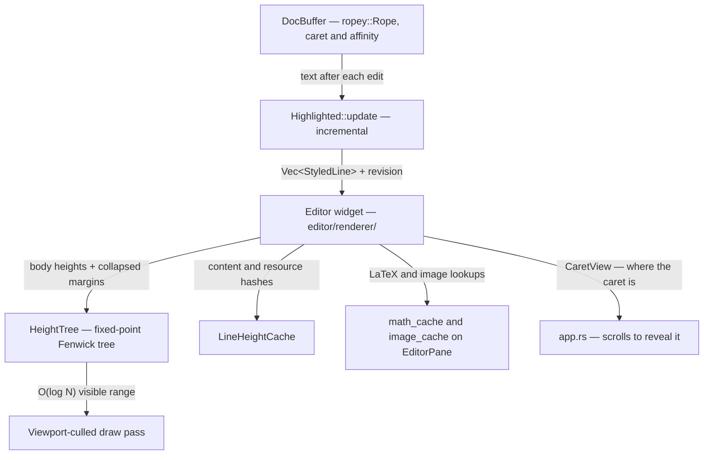
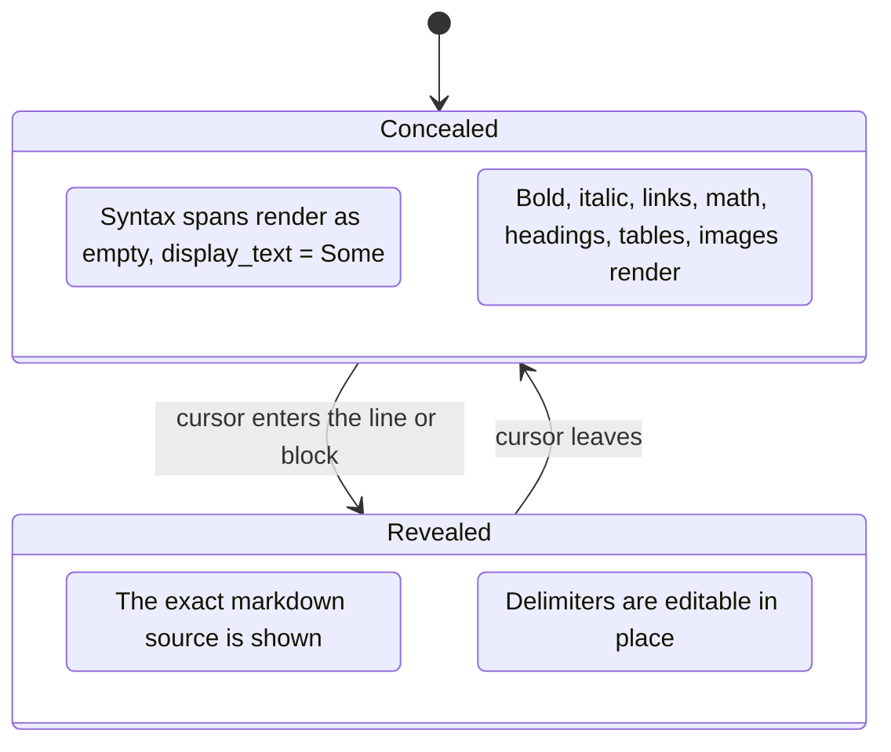
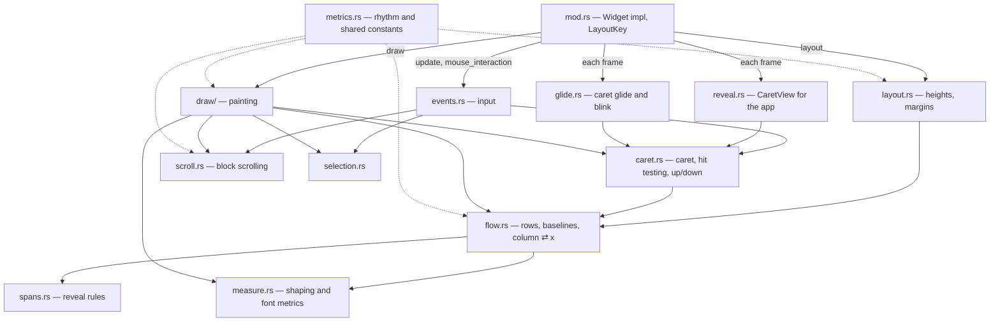

# Markdown Pipeline

The Markdown editor in `md-editor-native` is a custom `iced` widget built for large
technical notes: hybrid live preview, inline and display LaTeX, images, tables that scroll
on their own, typographic rhythm, and motion that follows the caret — on documents far past
the point where a naive renderer stalls.

Its design rests on four principles:

1. **One source of truth per fact.** Row breaks, baselines, margins, scroll extents and
   the caret's position are each computed in exactly one place; everything else asks.
2. **Layout is a pure function** of the lines, the width, the caret and the loaded
   resources. Every cache is checked against a cold recomputation by a property test.
3. **Invariants before code.** Behaviour is pinned by seeded property suites
   ([Developer Guide & Testing](Developer-Guide-and-Testing.md#property-suites)) as well as
   examples.
4. **Exact over estimated.** Positions come from the shaper and the font's own metrics;
   motion comes from closed-form springs, not frame-by-frame integration.

---

## Architecture Overview


```mermaid
graph TD
    A["DocBuffer — ropey::Rope, caret and affinity"] -->|"text after each edit"| B["Highlighted::update — incremental"]
    B -->|"Vec&lt;StyledLine&gt; + revision"| C["Editor widget — editor/renderer/"]
    C -->|"body heights + collapsed margins"| D["HeightTree — fixed-point Fenwick tree"]
    C -->|"content and resource hashes"| E["LineHeightCache"]
    D -->|"O(log N) visible range"| F["Viewport-culled draw pass"]
    C -->|"LaTeX and image lookups"| G["math_cache and image_cache on EditorPane"]
    C -->|"CaretView — where the caret is"| H["app.rs — scrolls to reveal it"]
```

Modules under `native/src/editor/`:

1. **`buffer.rs`** — rope text storage, transactions with inverse operations, undo runs,
   auto-pairing, list continuation, formatting commands, grapheme-aware movement, and the
   caret with its affinity.
2. **`highlight.rs`** — markdown tokenization into `StyledLine`/`StyledSpan`, syntect code
   styling, marker concealing, and `Highlighted`, which keeps the lines in step with the
   text incrementally.
3. **`layout_tree.rs` + `layout_cache.rs`** — the Fenwick spatial index and per-line body
   measurement memoization.
4. **`renderer/`** — the `iced::advanced::Widget`: layout, drawing, hit testing, selection,
   caret motion, and per-block horizontal scrolling, split into one module per concern (see
   [§5](#5-the-widget-renderer)).

`EditorPane` (`editor_state.rs`) owns the buffer, the `Highlighted` lines, and the image
and math caches; `app.rs` routes commands to it, asks the widget to reveal the caret, and
animates the resulting scroll.

---

## 1. Text Storage & Undo Architecture (`buffer.rs`)

`DocBuffer` is backed by [`ropey::Rope`](https://docs.rs/ropey), which keeps inserts,
deletes, line lookup, and character-offset conversion efficient on large files instead of
reallocating one contiguous buffer per edit.

Editor actions are expressed as `EditorCommand` values applied through `DocBuffer::execute()`:

```rust
pub enum EditorCommand {
    InsertText(String), DeleteSelection, DeleteBackward, DeleteForward,
    MoveCursor { movement: Movement, extend: bool },
    SetCursor { line: usize, col: usize, affinity: Affinity },
    SetSelection { anchor_line: usize, anchor_col: usize,
                   focus_line: usize, focus_col: usize, affinity: Affinity },
    SelectAll, ToggleCheckbox { line: usize },
    FormatBold, FormatItalic, FormatInlineCode, InsertLink,
    TypePaired(char), Undo, Redo,
}
```

`execute()` returns a `CommandResult { text_changed, projection_changed, media_changed }`,
so the shell knows whether to re-parse, refresh media caches, or merely move the caret.

### Grapheme clusters

Columns are `char` offsets, but the caret never stops inside a user-perceived character.
`Left`/`Right` step, and `Backspace`/`Delete` remove, one extended grapheme cluster
(`unicode-segmentation`): `👩‍💻` is three chars and one step. A line break — `\r\n`
included — is one stop. `set_cursor`, `set_selection` and vertical movement snap a column
that lands inside a cluster back to its start.

### Caret affinity

Where a wrapped line breaks, one column is both the end of a row and the start of the next.
`Affinity::Upstream` draws the caret at the end of the earlier row (a click past a row's
end); `Affinity::Downstream`, the default, at the start of the later one. The affinity is
part of the caret, so the buffer owns it: `DocBuffer::cursor_affinity` is reset by every
change and set only by `SetCursor`/`SetSelection`. It cannot outlive the placement it
describes.

### Human-Sized Undo Runs

A keystroke-by-keystroke undo stack forces a dozen `Ctrl+Z` presses to take back one
sentence. `commit_transaction` instead *coalesces* consecutive edits:

```rust
const UNDO_COALESCE_WINDOW: Duration = Duration::from_millis(300);
```

`can_coalesce(prev, next)` merges only when every one of these holds:

- the new transaction is a single operation;
- it is the same kind as the previous one — insert continues inserts, delete continues
  deletes;
- neither text contains a newline, so a run always breaks at a line boundary at the latest;
- the new character lands exactly where the previous one ended, so a cursor jump breaks the run;
- there was no active selection, so a selection-replacing edit is always its own step;
- less than `UNDO_COALESCE_WINDOW` has passed, so a deliberate pause starts a new step.

The result: one `Ctrl+Z` takes back a word-sized burst of typing (or of backspaces).

### Smart Auto-Pairing (`type_paired`)

Bracket and quote characters route through `TypePaired`; everything else inserts verbatim.

- **Brackets** — `PAIRS = [('(', ')'), ('[', ']'), ('{', '}')]`. Typing an opener inserts
  the pair and places the cursor between them.
- **Selection wrapping** — with a selection active, typing `(`, `[`, `{`, `"`, `'`, or
  `` ` `` wraps the selection rather than replacing it.
- **Skip-over** — typing a closer that already sits at the cursor steps over it instead of
  inserting a duplicate. The same applies to an identical quote directly ahead.
- **Contraction preservation** — `"`, `'`, and `` ` `` pair by default, but a quote typed
  immediately after an alphanumeric character is left single, so `don't`, `it's`, and
  `users'` do not sprout stray closers.

### List Continuation

Pressing `Enter` inside a list item continues it:

| Source line | After `Enter` |
| :--- | :--- |
| `- Buy milk` | `- Buy milk\n- ` |
| `* [ ] Code task` | `* [ ] Code task\n* [ ] ` |
| `1. Step one` | `1. Step one\n2. ` — the number increments |

Pressing `Enter` on an *empty* list item removes the marker and exits list mode. The list
parser works on character offsets, not byte slices, so a multibyte character next to the
marker cannot panic (there is a regression test for exactly that).

---

## 2. Hybrid Live Preview (`highlight.rs`)


```mermaid
stateDiagram-v2
    [*] --> Concealed
    Concealed --> Revealed : cursor enters the line or block
    Revealed --> Concealed : cursor leaves

    state Concealed {
        Markers : Syntax spans render as empty, display_text = Some
        Formatted : Bold, italic, links, math, headings, tables, images render
    }

    state Revealed {
        RawSource : The exact markdown source is shown
        DirectEditing : Delimiters are editable in place
    }
```

### Data Structures

```rust
pub struct StyledLine {
    pub spans: Vec<StyledSpan>,
    pub is_code_block: bool,
    pub is_math_block: bool,
    pub code_block_lang: Option<String>,
    pub is_blockquote: bool,
    pub block_id: usize,      // consecutive lines of one block share this
    pub is_block_fence: bool, // ``` or $$ — hidden in preview
    pub is_table_row: bool,
    pub table_cells: Vec<Vec<StyledSpan>>,
}

pub struct StyledSpan {
    pub text: String,                  // the raw markdown source for this span
    pub display_text: Option<String>,  // what preview shows; Some("") hides a marker
    pub color: Color,
    pub bold: bool, pub italic: bool, pub font_size: f32,
    pub is_code: bool,
    pub is_link: bool, pub link_target: Option<String>,
    pub is_heading: bool, pub heading_level: u8,
    pub is_checkbox: bool, pub is_checked: bool,
    pub is_list_marker: bool,          // bullet, number or checkbox: wrapped rows hang past it
    pub is_rule: bool,
    pub is_image: bool, pub image_path: Option<String>, pub image_alt: Option<String>,
    pub is_math: bool,
    pub is_syntax: bool,               // this span is a marker like ** or $ or ```
    pub id: Option<String>,
}
```

The `text` field always holds the exact source, so nothing is lost by concealing: preview
just chooses `display_text` instead.

### Concealing Rules

- **Cursor away** — syntax markers (`**`, `*`, `~~`, `$`, `$$`, `` ``` ``, `[[`, `]]`) carry
  `is_syntax = true` and `display_text = Some("")`, so the reader sees clean typography.
- **Cursor present** — the markers on the active line, or throughout the active block for
  code, math, and tables, are revealed in place. There is no mode to toggle.
- **Fenced code** — `syntect` applies language-specific colouring, and a unit test asserts
  that highlighting preserves the full source text character for character.

### Incremental highlighting (`Highlighted`)

A line's highlighting is a pure function of its text and the **state it is entered in**:

```rust
pub struct LineState { code: Option<CodeState>, in_math: bool, in_table: bool }
struct CodeState { lang: Option<String>, syntax: Option<(ParseState, HighlightState)> }
```

`Highlighted` keeps, for every line, its text, the `LineState` it was entered in, and a
`BlockStep` describing how it opens, continues or closes blocks. `update(text)`:

1. finds the common prefix and suffix of old and new line texts;
2. re-highlights from the first changed line, starting in that line's recorded entry state;
3. stops as soon as it reaches the kept suffix **in the same state** that line was entered
   in before — from there on nothing can differ — and splices the new lines in;
4. runs `decorate`: block numbering (every block homogeneous in kind), math-block
   concealment, and caption numbering over the whole document.

The outcome is identical to highlighting from scratch, which a seeded property test checks
through random edit scripts (`HIGHLIGHT_PROPERTY_CASES=N`). Typing an ordinary character
re-highlights one line; opening a code fence re-highlights until the fence closes.

Highlighting runs **synchronously on every edit** — measured at about 0.03ms per keystroke
on a 700-line note and 0.34ms at 7,000 lines — so the painted lines always match the buffer.
There is no debounce and no placeholder lines. Each update also takes a new, process-wide
unique `revision()`, which names the lines for [layout's early-out](#layout-pass).

---

## 3. Spatial Indexing: the Fenwick Height Tree (`layout_tree.rs`)

Scanning every line each frame to find the visible range is `O(N)` and stalls on large
documents. `HeightTree` is a binary indexed tree over per-line visual heights, stored as
fixed-point integers (`UNITS_PER_PX = 256`) so prefix sums are exact however many lines
are added and removed:

```rust
pub struct HeightTree { tree: Vec<i64>, heights: Vec<i64> }

pub fn update_height(&mut self, idx: usize, new_height: f32); // O(log N)
pub fn prefix_sum(&self, idx: usize) -> f32;                  // O(log N)
pub fn find_line_at_y(&self, y: f32) -> usize;                // O(log N), binary lifting
pub fn get_height(&self, idx: usize) -> f32;                  // O(1)
```

| Operation | Brute-force scan | `HeightTree` |
| :--- | :--- | :--- |
| Total document height | O(N) | O(log N) — one `prefix_sum(n)` |
| Y offset of line *L* | O(L) | O(log N) |
| Line at a Y coordinate | O(N) | O(log N) binary lifting on prefix sums |
| Update one line's height | O(1) | O(log N) |

(An earlier `f32` tree drifted after long edit sessions until hit testing picked the wrong
line; a property test found it.) Each stored height is a line's whole extent: its collapsed
top margin, a caption band on the first line of a code block or table, its body, and a
scrollbar gutter under a table's last row.

---

## 4. Line Measurement Cache (`layout_cache.rs`)

Shaping glyphs to measure a line is the dominant cost of layout. `LineHeightCache`
memoizes a line's **body** height:

```rust
pub struct LineHeightCache {
    pub hash: u64,               // line_hash ^ resource_hash
    pub is_editing: bool,
    pub active_col: Option<usize>,
    pub math_head: bool,         // whether the line carries its math block's height
    pub height: f32,             // the body alone
    pub valid: bool,
}
```

- `line_hash(line)` hashes the block flags and every span's text, `display_text`, style
  flags, font size, link/image/math metadata, and id — but **not** `block_id`, which
  renumbers when a line is inserted above without changing anything a line's own height
  depends on.
- `resource_hash(line, image_cache, math_cache)` folds in the *current dimensions* of any
  image or LaTeX render the line depends on, because a late-arriving bitmap changes the
  line's height after it was first measured.
- When `max_width` moves by more than 0.5px every entry is invalidated, since wrapping
  changes everywhere at once.

Margins depend on neighbouring lines, so they are never cached: they are recomputed by a
cheap walk on every layout.

---

## 5. The Widget (`renderer/`)

`Editor` implements `iced::advanced::Widget`, not `canvas::Program` — it needs its own
layout, hit testing, and event handling. Content is capped at `MAX_CONTENT_WIDTH = 880.0`
so prose keeps a readable measure in a wide window.

### Module map


```mermaid
graph TD
    Widget["mod.rs — Widget impl, LayoutKey"] -->|layout| Layout["layout.rs — heights, margins"]
    Layout --> Flow["flow.rs — rows, baselines, column ⇄ x"]
    Caret["caret.rs — caret, hit testing, up/down"] --> Flow
    Draw["draw/ — painting"] --> Flow
    Widget -->|draw| Draw
    Widget -->|"update, mouse_interaction"| Events["events.rs — input"]
    Widget -->|"each frame"| Reveal["reveal.rs — CaretView for the app"]
    Widget -->|"each frame"| Glide["glide.rs — caret glide and blink"]
    Events --> Caret
    Events --> Scroll["scroll.rs — block scrolling"]
    Events --> Selection["selection.rs"]
    Reveal --> Caret
    Glide --> Caret
    Draw --> Caret
    Draw --> Scroll
    Draw --> Selection
    Flow --> Spans["spans.rs — reveal rules"]
    Flow --> Measure["measure.rs — shaping and font metrics"]
    Draw --> Measure
    Metrics["metrics.rs — rhythm and shared constants"] -.-> Layout
    Metrics -.-> Flow
    Metrics -.-> Draw
    Metrics -.-> Scroll
```

| To change… | Look in |
| :--- | :--- |
| How tall a line's body is | `layout.rs` — `line_body_height()` |
| Space between lines and blocks | `layout.rs` — `requested_margins()`, `MarginWalk`; values in `metrics.rs` |
| Where rows break, row height, baseline alignment | `flow.rs` |
| A row height, margin, or any size two passes must agree on | `metrics.rs` |
| When a span reveals its markdown source | `spans.rs` |
| Where the caret lands, or what a click selects | `flow.rs` (inline lines), `caret.rs` (code lines, up/down) |
| How the caret moves and blinks | `glide.rs` |
| How the page scrolls to the caret | `reveal.rs` (where) and `app.rs` — `reveal_caret()` (how) |
| Block cards, captions, code lines, table rows | `draw/blocks.rs`, `draw/captions.rs` |
| Paragraph text, images, equations, checkboxes | `draw/inline.rs` |
| Selection shape, search highlights, caret appearance | `draw/overlays.rs` |
| A key binding inside the editor | `events.rs` |
| Horizontal scrolling of code, tables, or math | `scroll.rs` — `scroll_extent()` |

### Typographic rhythm (`metrics.rs`, `layout.rs`)

Every vertical measure is a multiple of `GRID = 4px`, so baselines in different blocks
share one grid.

- **Row height** — `row_height(font_size)` interpolates line height from 1.6 at the 17px
  body size down to 1.2 at 34px (large type needs less leading) and snaps to the grid. A
  body row is 28px; code rows are `row_height(15)`.
- **Blank lines** are paragraph gaps, `PARAGRAPH_GAP = 20px`, still tall enough to hold the
  caret.
- **Margins** — each line asks for space above and below by kind: headings from
  `HEADING_MARGINS` (48/16px for `#` down to 24/8px), code blocks, tables, block math,
  images, rules and quote runs `BLOCK_MARGIN = 16px`. Adjacent requests **collapse**: the
  space between two lines is the larger request, never the sum, and blank lines already
  between them count toward it. The first line of the document gets no top margin.
- The whole margin is realized above the lower line, so a block's box starts exactly at its
  content, and the painters read margins from `State::line_margins` rather than deriving
  them again.

### Inline layout (`flow.rs`)

Every line that isn't a code line, a rendered table row, or rendered block math is laid out
by `Flow::build`, and **that is the only place rows are broken**. Line heights, painting, the
caret, selection and search highlights, and click and hover hit testing all read the same
`Flow`, so the caret always sits on the painted text and a click lands where it is drawn.

A `Flow` is a list of rows and a list of items in source order. An item is a run of a
span's visible text, a concealed marker with no width, a checkbox, or a rendered inline
equation. Each item records its x, its row, and the source columns it covers.

- **Shaping** — prose is shaped with `Shaping::Advanced` (kerning, ligatures); monospace
  keeps `Shaping::Basic` so columns line up as typed. Each word is shaped once per font and
  size, and the x of every character boundary inside it comes from the shaper's own
  `grapheme_position` (`measure.rs::word_offsets`), so the caret sits exactly between kerned
  glyphs and never inside a cluster.
- **Breaking** follows Unicode line-break opportunities (UAX #14, `unicode-linebreak`):
  between words, after hyphens and dashes, inside long URLs. Trailing whitespace hangs past
  the right edge; a word wider than a whole row breaks between grapheme clusters.
- **Hanging indents** — wrapped rows of a list item, task or numbered item start under its
  text, not under its marker.
- **Balanced headings** — a wrapped heading nobody is editing is re-laid at the narrowest
  width that keeps the same number of rows (bisection, 14 steps), so its rows come out
  even instead of ragged. Headings being edited keep greedy breaks, so text doesn't jump
  between rows while typing.
- **Row height** — the larger of the rhythm's `row_height` for the row's largest text and
  its content (plus `INLINE_MATH_ROW_PADDING` with an equation on it), snapped up to the grid.
- **Baselines** come from the font itself: `measure.rs::font_metrics` reads ascent, descent
  and x-height from the face the shaper uses. Content is centred in the row, every item on a
  row shares its baseline, and checkboxes and inline equations centre on the **axis**, half
  an x-height above it. Painted text snaps to device pixels.
- **Columns ⇄ x** — `caret(col, affinity)` places a column; `col_at(x, y)` returns a column
  and an affinity: past the end of a row that wraps it answers `Upstream`, so the caret stays
  on the clicked row. Hitting where a caret is drawn yields a position drawn at exactly the
  same place, on either side of every break.

### Layout pass

`layout_lines` walks all lines, taking each body from `LineHeightCache` unless something
about the line changed, recomputing margins, and filling the height tree and
`block_ranges`. Total height is `TOP_PAD + prefix_sum(n) + BOTTOM_PAD`.

The app also promises, through `Editor::layout_revision(u64)`, that the lines and the image
and math caches are unchanged while the revision is (`EditorPane::layout_revision` hashes
`Highlighted::revision`, the cache sizes and the math scale). When that revision, the
width, focus and caret are all the same as last time (`LayoutKey`), **layout is skipped
entirely**. Scroll and animation frames — which rebuild the view every frame — then cost
nothing per line. Measured in a release build on a 37,009-line document:

| Frame | Cost |
| :--- | :--- |
| Cold layout | 15.5ms |
| Full walk, every body cached | 15.4ms |
| Nothing changed | 47ns |
| Drawing one screen | 0.25ms |

`Widget::size()` reports its height as `Shrink`: the real height is known only once laid out
at the width the widget gets, so nothing measures the document at a guessed width.

### Draw pass — the culled one

1. `find_line_at_y(viewport.y - bounds.y - TOP_PAD)` gives `visible_start`;
   the same call at the viewport's bottom edge gives `visible_end`.
2. `measure_blocks()` measures only blocks with a line in that range, and their chrome
   (cards, captions, language badges) is painted first.
3. Each visible line is laid out **once** into a `LineBox` — its `Flow` included — and every
   pass below reads those boxes.
4. The selection's pieces over text are painted under all of them (below).
5. Each line gets its search highlights, then one painter chosen by kind — rule, code line,
   table row, block math, or flow — then the caret.
6. The selection's pieces over tables, images and equations are painted in a layer of their
   own, and block scrollbars last.

**Full-document work in the draw pass is a performance regression**, and the rule is called
out again in [Contributor Guidelines](Contributor-Guidelines.md).

### The selection shape

A selection is painted as one continuous shape: a full-height band per visual row it
touches, bridged across the space between lines wherever neighbouring bands overlap, with
corners rounded only where they stick out. A selection that continues past the end of a
line gets an 8px tail there, standing for the selected line break, so selected blank lines
stay visible.

Tables, images and equations are selected whole, and their bands are painted **over** them —
an opaque table header or picture would hide a band beneath it — while bands over text go
under it, which a translucent band on top would dim. Renderers paint each layer's quads,
then its images, then its text, whatever order they were drawn in, so the bands over blocks
get a layer of their own that paints after the content.

### Revealing the caret

The widget can't scroll the scrollable it sits in, and the app can't see where the caret
is drawn. So:

1. A command that should keep the caret visible calls `EditorPane::request_reveal`:
   `Reveal::Nearest` for typing and caret movement, `Reveal::Center` for search navigation,
   table-of-contents clicks and heading links. This bumps `reveal_request`; while a request
   is unanswered the stronger mode wins.
2. On the next `RedrawRequested` — layout final, viewport known — the widget answers with a
   `CaretView`: the caret's top and bottom, the viewport's top and height, and its own
   height, all relative to the widget.
3. `app.rs::reveal_caret` asks `CaretView::viewport_top_for`: `Nearest` scrolls only if the
   caret is within a comfort margin (two body rows, or a quarter of the viewport) of an
   edge, and then only by the amount that restores the margin; `Center` puts it mid-view.
   The target is clamped to the scrollable range and reached with a critically damped
   `Spring` (`motion.rs`), retargeted with its momentum if typing continues mid-glide.
   A jump further than two viewports cuts to one viewport short and glides the rest. A wheel
   turn or click cancels the glide.

Nothing is estimated: there is no per-keystroke centring and no guess at the editor's width.

### Caret motion (`glide.rs`)

- **Glide** — the caret is painted where layout puts it plus an offset that eases to zero.
  When it moves, the offset starts as the distance moved, so the eye sees it travel. The
  offset is a spring (`GLIDE_STIFFNESS = 80`, about 60ms to 95%) sampled in closed form, so
  it looks the same at any frame rate. Moves of more than `MAX_GLIDE = 96px` vertically cut;
  layout moving under a still caret never glides.
- **Blink** — lit for `BLINK_DELAY = 500ms` after it last moved, then a soft fade: a cosine
  over `BLINK_PERIOD = 1060ms`, stretched by `BLINK_SHARPNESS = 2.5` and clamped, so it holds
  fully on and fully off and fades quickly between. After `BLINK_CYCLES = 18` blinks it
  stays lit.
- **Frames** — the widget asks for the next frame only while the caret glides or fades, and
  schedules one at the exact start of the next fade otherwise (`shell.request_redraw_at`).
  An idle editor asks for none.

### Inline & Display LaTeX

`$...$` and `$$...$$` are rendered by `ratex-render` into bitmaps, cached on `EditorPane` by
TeX source for the current display scale (flushed and re-rendered when it changes) and
delivered back through `Message::MathRendered`. Display math is centred with its own
padding; inline math centres on the row's axis. Because the render is asynchronous, its
arrival changes `resource_hash` and the affected lines are re-measured.

### Wide Blocks Scroll Independently

Tables, code blocks, and wide equations do not wrap awkwardly or stretch the layout: each
block keeps its own horizontal scroll offset, clamped to its own content width, so a wide
table scrolls sideways under the mouse wheel while vertical document scrolling is
unaffected. A code block scrolls by the least amount that keeps the caret
`CODE_CARET_MARGIN` inside its viewport.

Content that doesn't fit is painted inside a layer bounded by the block's viewport
(`draw/blocks.rs::block_clip`). A layer is the only clip that holds in every renderer:
neither iced backend clips an image to the clip rectangle drawn with it, and tiny-skia masks
text to its layer only when the clip rectangle drawn with the text reaches past that layer —
a clip rectangle inside the layer switches its clipping off. So text inside a clip layer is
drawn with the frame's viewport as its clip rectangle. Lines that fit draw without a
layer, and all lines of a block share one clip, so iced can merge their layers. The
equation number sits outside its equation's viewport, so a scrolled equation never runs
under it.

### Hit Testing & Visual Movement

- Click and drag y positions map to line indices through `HeightTree`, then to a column and
  affinity through the line's `Flow`. A drag keeps tracking the pointer outside the widget.
- Horizontal wheel and scrollbar interaction resolve the target block via `block_ranges`
  plus prefix sums.
- Visual up/down moves exactly one visual row, starting from the caret's own row (its
  affinity included), and keeps a `desired_visual_x` across consecutive presses so the caret
  does not drift through short lines.

---

## 6. Maintenance Notes

- Keep parsing in `highlight.rs`; do not add markdown rules to the renderer. A new rule must
  keep incremental highlighting equal to a fresh pass.
- Never measure or break inline text outside `flow.rs`. If painting, the caret, or hit
  testing needs to know where text is, ask the line's `Flow`.
- Caret facts — position, selection, affinity — live in `DocBuffer`. The widget keeps no
  copy of them.
- Keep height and invalidation logic in `layout_tree.rs`, `layout_cache.rs`, and
  `renderer/layout.rs`.
- Put any size that layout, painting, and hit testing must agree on in
  `renderer/metrics.rs`, never as a literal at one call site, and keep vertical sizes on the
  `GRID`.
- Keep the draw pass proportional to visible content, never to document length.
- Clip with layers, never with the clip rectangle drawn with a primitive, and remember that
  a layer paints all its quads, then its images, then its text. The test recorder
  (`renderer/testing.rs`) models both, so `Call::paint_order` and each call's `clip` show
  what a renderer really puts on screen.
- When adding media that can affect layout height, include its dimensions in
  `resource_hash`, and make sure a change to it changes `EditorPane::layout_revision`.
- When adding a block type, update block-range tracking (`layout.rs::record_block_range`),
  body height (`layout.rs::line_body_height`), margins (`layout.rs::requested_margins`),
  draw metadata (`draw/blocks.rs::measure_blocks`), and hit testing and scrolling
  (`scroll.rs::scroll_extent`) together — they are one contract split across five call
  sites.
