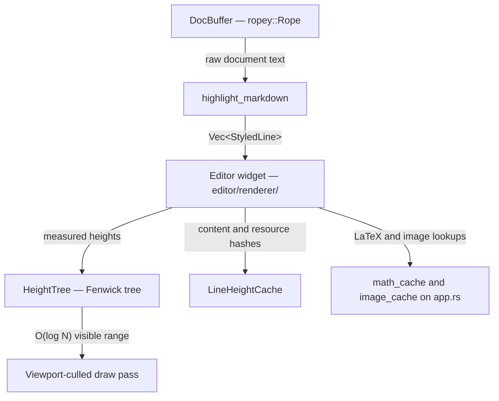
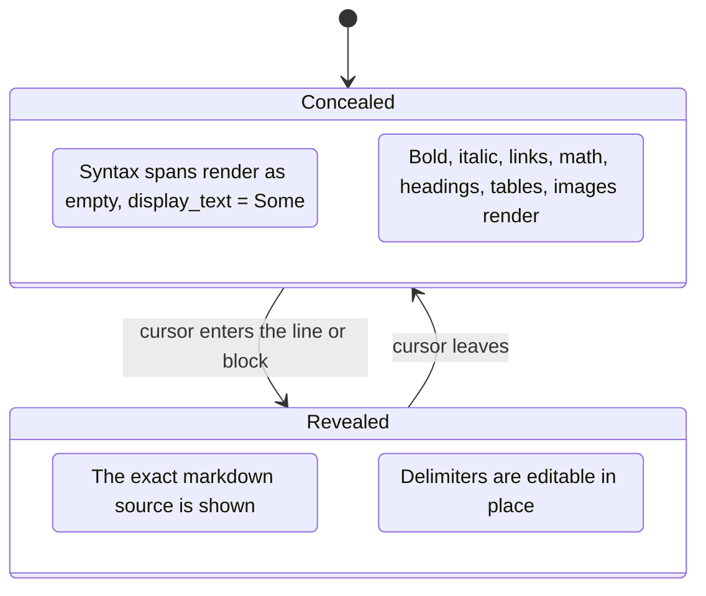
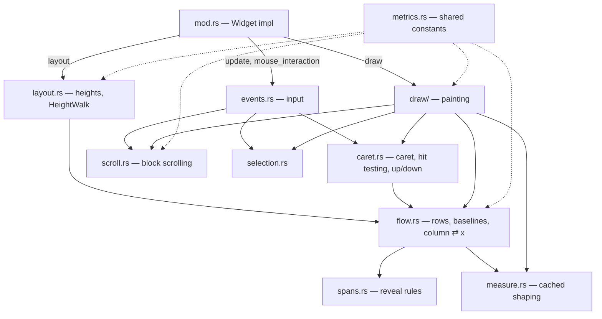

# Markdown Pipeline

The Markdown editor in `md-editor-native` is a custom `iced` widget built for large
technical notes: hybrid live preview, inline and display LaTeX, images, tables that scroll
on their own, and scrolling that stays smooth on documents far past the point where a naive
renderer stalls.

---

## Architecture Overview


```mermaid
graph TD
    A["DocBuffer — ropey::Rope"] -->|"raw document text"| B["highlight_markdown"]
    B -->|"Vec&lt;StyledLine&gt;"| C["Editor widget — editor/renderer/"]
    C -->|"measured heights"| D["HeightTree — Fenwick tree"]
    C -->|"content and resource hashes"| E["LineHeightCache"]
    D -->|"O(log N) visible range"| F["Viewport-culled draw pass"]
    C -->|"LaTeX and image lookups"| G["math_cache and image_cache on app.rs"]
```

Four modules under `native/src/editor/` plus the shell:

1. **`buffer.rs`** — rope text storage, transactions with inverse operations, undo runs,
   auto-pairing, list continuation, formatting commands, movement.
2. **`highlight.rs`** — markdown tokenization into `StyledLine`/`StyledSpan`, syntect code
   styling, and marker concealing.
3. **`layout_tree.rs` + `layout_cache.rs`** — the Fenwick spatial index and per-line
   measurement memoization.
4. **`renderer/`** — the `iced::advanced::Widget`: layout, drawing, hit testing, selection
   painting, and per-block horizontal scrolling, split into one module per concern (see
   [§5](#5-the-widget-layout-draw-and-culling-renderer)).

`app.rs` coordinates the pipeline. It owns `highlighted_lines`, the image and math render
caches, scroll state, and the background highlight tasks.

---

## 1. Text Storage & Undo Architecture (`buffer.rs`)

`DocBuffer` is backed by [`ropey::Rope`](https://docs.rs/ropey), which keeps inserts,
deletes, line lookup, and character-offset conversion efficient on large files instead of
reallocating one contiguous buffer per edit.

Editor actions are expressed as `EditorCommand` values applied through `DocBuffer::execute()`:

```rust
pub enum EditorCommand {
    InsertText(String), DeleteSelection, DeleteBackward, DeleteForward,
    MoveCursor { movement: Movement, extend: bool },
    SetCursor { line: usize, col: usize },
    SetSelection { anchor_line: usize, anchor_col: usize, focus_line: usize, focus_col: usize },
    SelectAll, ToggleCheckbox { line: usize },
    FormatBold, FormatItalic, FormatInlineCode, InsertLink,
    TypePaired(char), Undo, Redo,
}
```

`execute()` returns a `CommandResult { text_changed, projection_changed, media_changed }`,
so the shell knows whether to re-parse, refresh media caches, or merely rescroll.

### Human-Sized Undo Runs

A keystroke-by-keystroke undo stack forces a dozen `Ctrl+Z` presses to take back one
sentence. `commit_transaction` instead *coalesces* consecutive edits:

```rust
const UNDO_COALESCE_WINDOW: Duration = Duration::from_millis(300);
```

`can_coalesce(prev, next)` merges only when every one of these holds:

- the new transaction is a single operation;
- it is the same kind as the previous one — insert continues inserts, delete continues
  deletes;
- neither text contains a newline, so a run always breaks at a line boundary at the latest;
- the new character lands exactly where the previous one ended, so a cursor jump breaks the run;
- there was no active selection, so a selection-replacing edit is always its own step;
- less than `UNDO_COALESCE_WINDOW` has passed, so a deliberate pause starts a new step.

The result: one `Ctrl+Z` takes back a word-sized burst of typing (or of backspaces).

### Smart Auto-Pairing (`type_paired`)

Bracket and quote characters route through `TypePaired`; everything else inserts verbatim.

- **Brackets** — `PAIRS = [('(', ')'), ('[', ']'), ('{', '}')]`. Typing an opener inserts
  the pair and places the cursor between them.
- **Selection wrapping** — with a selection active, typing `(`, `[`, `{`, `"`, `'`, or
  `` ` `` wraps the selection rather than replacing it.
- **Skip-over** — typing a closer that already sits at the cursor steps over it instead of
  inserting a duplicate. The same applies to an identical quote directly ahead.
- **Contraction preservation** — `"`, `'`, and `` ` `` pair by default, but a quote typed
  immediately after an alphanumeric character is left single, so `don't`, `it's`, and
  `users'` do not sprout stray closers.

### List Continuation

Pressing `Enter` inside a list item continues it:

| Source line | After `Enter` |
| :--- | :--- |
| `- Buy milk` | `- Buy milk\n- ` |
| `* [ ] Code task` | `* [ ] Code task\n* [ ] ` |
| `1. Step one` | `1. Step one\n2. ` — the number increments |

Pressing `Enter` on an *empty* list item removes the marker and exits list mode. The list
parser works on character offsets, not byte slices, so a multibyte character next to the
marker cannot panic (there is a regression test for exactly that).

---

## 2. Hybrid Live Preview (`highlight.rs`)


```mermaid
stateDiagram-v2
    [*] --> Concealed
    Concealed --> Revealed : cursor enters the line or block
    Revealed --> Concealed : cursor leaves

    state Concealed {
        Markers : Syntax spans render as empty, display_text = Some
        Formatted : Bold, italic, links, math, headings, tables, images render
    }

    state Revealed {
        RawSource : The exact markdown source is shown
        DirectEditing : Delimiters are editable in place
    }
```

### Data Structures

```rust
pub struct StyledLine {
    pub spans: Vec<StyledSpan>,
    pub is_code_block: bool,
    pub is_math_block: bool,
    pub code_block_lang: Option<String>,
    pub is_blockquote: bool,
    pub block_id: usize,      // consecutive lines of one block share this
    pub is_block_fence: bool, // ``` or $$ — hidden in preview
    pub is_table_row: bool,
    pub table_cells: Vec<Vec<StyledSpan>>,
}

pub struct StyledSpan {
    pub text: String,                  // the raw markdown source for this span
    pub display_text: Option<String>,  // what preview shows; Some("") hides a marker
    pub color: Color,
    pub bold: bool, pub italic: bool, pub font_size: f32,
    pub is_code: bool,
    pub is_link: bool, pub link_target: Option<String>,
    pub is_heading: bool, pub heading_level: u8,
    pub is_checkbox: bool, pub is_checked: bool,
    pub is_rule: bool,
    pub is_image: bool, pub image_path: Option<String>, pub image_alt: Option<String>,
    pub is_math: bool,
    pub is_syntax: bool,               // this span is a marker like ** or $ or ```
    pub id: Option<String>,
}
```

The `text` field always holds the exact source, so nothing is lost by concealing: preview
just chooses `display_text` instead.

### Concealing Rules

- **Cursor away** — syntax markers (`**`, `*`, `~~`, `$`, `$$`, `` ``` ``, `[[`, `]]`) carry
  `is_syntax = true` and `display_text = Some("")`, so the reader sees clean typography.
- **Cursor present** — the markers on the active line, or throughout the active block for
  code, math, and tables, are revealed in place. There is no mode to toggle.
- **Fenced code** — `syntect` applies language-specific colouring, and a unit test asserts
  that highlighting preserves the full source text character for character.

### Highlight Scheduling (`app.rs`)

- Small documents are highlighted synchronously after a text change.
- Above `LARGE_DOC_LINE_THRESHOLD` (1,000 lines) highlighting is debounced by
  `HIGHLIGHT_DEBOUNCE` (80ms) while typing.
- Above `HUGE_DOC_LINE_THRESHOLD` (5,000 lines) a file opened from disk first gets plain
  placeholder lines, and a background task replaces them when ready — the document is
  editable immediately.
- Every highlight task carries a **generation id**. A result whose generation no longer
  matches is discarded, so a stale parse can never overwrite newer text.
- After highlighting completes, `app.rs` refreshes image discovery and queues LaTeX renders.

---

## 3. Spatial Indexing: the Fenwick Height Tree (`layout_tree.rs`)

Scanning every line each frame to find the visible range is `O(N)` and stalls on large
documents. `HeightTree` is a binary indexed tree over per-line visual heights:

```rust
pub struct HeightTree { tree: Vec<f32>, heights: Vec<f32> }

pub fn update_height(&mut self, idx: usize, new_height: f32); // O(log N)
pub fn prefix_sum(&self, idx: usize) -> f32;                  // O(log N)
pub fn find_line_at_y(&self, y: f32) -> usize;                // O(log N), binary lifting
pub fn get_height(&self, idx: usize) -> f32;                  // O(1)
```

| Operation | Brute-force scan | `HeightTree` |
| :--- | :--- | :--- |
| Total document height | O(N) | O(log N) — one `prefix_sum(n)` |
| Y offset of line *L* | O(L) | O(log N) |
| Line at a Y coordinate | O(N) | O(log N) binary lifting on prefix sums |
| Update one line's height | O(1) | O(log N) |

`update_height` short-circuits when the delta is below `1e-5`, so re-measuring a line to the
same height costs nothing. Each stored height is the sum of an optional block-top spacer
(24px before an inactive code or table block), the measured line height, and a table
scrollbar gutter when applicable.

---

## 4. Line Measurement Cache (`layout_cache.rs`)

Shaping glyphs to measure a line is the dominant cost in a layout pass, and it is
brutally slow in debug builds. `LineHeightCache` memoizes it per line:

```rust
pub struct LineHeightCache {
    pub hash: u64,               // line_hash ^ resource_hash
    pub is_editing: bool,
    pub active_col: Option<usize>,
    pub height: f32,
    pub valid: bool,
}
```

- `line_hash(line)` hashes the block flags, `block_id`, and every span's text,
  `display_text`, style flags, font size, link/image/math metadata, and id.
- `resource_hash(line, image_cache, math_cache)` folds in the *current dimensions* of any
  image or LaTeX render the line depends on — essential, because a late-arriving image or
  math bitmap changes the line's height after it was first measured.
- Layout width is handled separately: when `max_width` moves by more than 0.5px, every
  entry's `valid` flag is cleared, since word wrap changes everywhere at once.

A cached height is reused only when `valid`, the combined hash, `is_editing`, and
`active_col` all match. (The hash is a `DefaultHasher`, chosen for speed — it is a
collision-resistance-free hash for cache keying, not a cryptographic digest.)

---

## 5. The Widget: Layout, Draw, and Culling (`renderer/`)

`Editor` implements `iced::advanced::Widget`, not `canvas::Program` — it needs its own
layout, hit testing, and event handling, which the canvas abstraction does not provide.
Content is capped at `MAX_CONTENT_WIDTH = 880.0` so prose keeps a readable measure in a wide
window.

### Module map

The `Widget` methods in `renderer/mod.rs` are one-line delegations; the work lives in a
module per concern.


```mermaid
graph TD
    Widget["mod.rs — Widget impl"] -->|layout| Layout["layout.rs — heights, HeightWalk"]
    Layout --> Flow["flow.rs — rows, baselines, column ⇄ x"]
    Caret["caret.rs — caret, hit testing, up/down"] --> Flow
    Draw["draw/ — painting"] --> Flow
    Widget -->|draw| Draw
    Widget -->|"update, mouse_interaction"| Events["events.rs — input"]
    Events --> Caret
    Events --> Scroll["scroll.rs — block scrolling"]
    Events --> Selection["selection.rs"]
    Draw --> Caret
    Draw --> Scroll
    Draw --> Selection
    Flow --> Spans["spans.rs — reveal rules"]
    Flow --> Measure["measure.rs — cached shaping"]
    Draw --> Measure
    Metrics["metrics.rs — shared constants"] -.-> Layout
    Metrics -.-> Flow
    Metrics -.-> Draw
    Metrics -.-> Scroll
```

| To change… | Look in |
| :--- | :--- |
| How tall a line or block is | `layout.rs` — `line_height_for()` |
| Where rows break, row height, baseline alignment | `flow.rs` |
| A margin, row height, or any size two passes must agree on | `metrics.rs` |
| When a span reveals its markdown source | `spans.rs` |
| Where the caret lands, or what a click selects | `flow.rs` (inline lines), `caret.rs` (code lines, up/down) |
| Block cards, captions, code lines, table rows | `draw/blocks.rs`, `draw/captions.rs` |
| Paragraph text, images, equations, checkboxes | `draw/inline.rs` |
| Selection or search highlight, caret appearance | `draw/overlays.rs` |
| A key binding inside the editor | `events.rs` |
| Horizontal scrolling of code, tables, or math | `scroll.rs` — `scroll_extent()` |

### Inline layout (`flow.rs`)

Every line that isn't a code line, a rendered table row, or rendered block math is laid out
by `Flow::build`, and **that is the only place rows are broken**. Line heights, painting, the
caret, selection and search highlights, and click and hover hit testing all read the same
`Flow`, so the caret always sits on the painted text and a click lands where it is drawn.

A `Flow` is a list of rows and a list of items in source order. An item is a run of a
span's visible text (one word plus its trailing whitespace, or a piece of a word too long
for a row), a concealed marker with no width, a checkbox, or a rendered inline equation.
Each item records its x, its row, and the source columns it covers.

- **Breaking** is greedy by word. Trailing whitespace hangs past the right edge rather than
  forcing a break, and zero-width items never break a row.
- **Row height** is the larger of the tallest font's `visual_line_step()` and the row's
  content (ascent plus descent), plus `INLINE_MATH_ROW_PADDING` when an equation is on it.
- **Vertical alignment** is by baseline. Text of size `s` has its baseline `s ×
  BASELINE_FACTOR` below the top of its `s × LINE_BOX_FACTOR` line box; equations and
  checkboxes are centred on an axis `MATH_AXIS_HEIGHT` above the baseline. The content is
  centred in the row, so a single row of body text sits in the middle of its 36px.
- **Columns ⇄ x** use per-character advances. With `Shaping::Basic` they sum exactly to the
  width of the painted run, so offsets inside a word match the glyphs.

Painting merges a span's consecutive items on one row into a single text run, so a
paragraph costs a few `fill_text` calls per row, not one per word.

### Layout pass

Walks all lines once, but each line is a cache hit unless something about it actually
changed, and the walk maintains `block_ranges` for O(1) block lookups. A line's extent is
its body plus a caption band above the first line of a code block or table
(`BLOCK_CAPTION_HEIGHT`) and a scrollbar gutter below a table's last row. Total height is
`TOP_PAD + prefix_sum(n) + BOTTOM_PAD`.

`HeightWalk` carries the per-block memory that makes a line's height depend on earlier
lines — which code blocks and tables have opened, and which math block already took its
height — and is the one implementation behind `layout_lines()`, `total_height()`, and
`line_visual_y()`.

### Draw pass — the culled one

1. `find_line_at_y(viewport.y - bounds.y - TOP_PAD)` gives `visible_start`;
   the same call at the viewport's bottom edge gives `visible_end`.
2. `measure_blocks()` measures only blocks with a line in that range, and their chrome
   (cards, captions, language badges) is painted first.
3. Lines are drawn starting at `prefix_sum(visible_start)` and stop once the y position
   passes the viewport bottom. Each line gets its selection and search highlights, then one
   painter chosen by kind — rule, plain paragraph, code line, table row, or spans — then the
   caret.

**Full-document work in the draw pass is a performance regression**, and the rule is called
out again in [Contributor Guidelines](Contributor-Guidelines.md).

### Inline & Display LaTeX

`$...$` and `$$...$$` are rendered by `ratex-render` into bitmaps, cached on `app.rs` by
`(tex, scale_factor)` and delivered back through `Message::MathRendered`. Display math is
centred with its own background padding; inline math sits on the text baseline. Because the
render is asynchronous, its arrival changes `resource_hash` and the affected lines are
re-measured.

### Wide Blocks Scroll Independently

Tables, code blocks, and wide equations do not wrap awkwardly or stretch the layout: each
block keeps its own horizontal scroll offset, clamped to its own content width, so a wide
table scrolls sideways under the mouse wheel while vertical document scrolling is
unaffected.

### Hit Testing & Visual Movement

- Click and drag y positions map to line indices through `HeightTree`.
- Horizontal wheel and scrollbar interaction resolve the target block via `block_ranges`
  plus prefix sums.
- Visual up/down computes the current visual y from the tree, then hit-tests the target y,
  and preserves a `desired_visual_x` across consecutive arrow presses so the caret does not
  drift while moving through short lines.
- Horizontal placement still walks the visible spans, because column mapping depends on
  inline wrapping, font metrics, math and image widths, and hidden markers. The renderer
  caches single-character width measurements by character, font, and size to make that
  affordable.

---

## 6. Maintenance Notes

- Keep parsing in `highlight.rs`; do not add markdown rules to the renderer.
- Never measure or break inline text outside `flow.rs`. If painting, the caret, or hit
  testing needs to know where text is, ask the line's `Flow`.
- Keep height and invalidation logic in `layout_tree.rs`, `layout_cache.rs`, and
  `renderer/layout.rs`.
- Put any size that layout, painting, and hit testing must agree on in
  `renderer/metrics.rs`, never as a literal at one call site.
- Keep the draw pass proportional to visible content, never to document length.
- When adding media that can affect layout height, include its dimensions in
  `resource_hash`.
- When adding a block type, update block-range tracking (`layout.rs::record_block_range`),
  height measurement (`layout.rs::line_height_for`), draw metadata
  (`draw/blocks.rs::measure_blocks`), and hit testing and scrolling
  (`scroll.rs::scroll_extent`) together —
  they are one contract split across four call sites.
