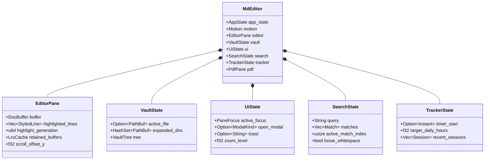

# Native Desktop GUI (`md-editor-native`)

The `md-editor-native` crate implements the graphical user interface for MD Editor. It is built using the [Iced](https://github.com/iced-rs/iced) framework (v0.14) with custom canvas rendering, async task execution via Tokio, and high-performance reactive subscriptions.

---

## 1. Application Lifecycle & Update Loop (`app.rs`)

The entrypoint initializes the `MdEditor` application struct, which implements Iced's `Application` (or `daemon`) pattern:

```mermaid
flowchart TD
    Init([Application Init]) --> ReadStartup[Read window geometry & last vault from SQLite]
    ReadStartup --> CreateWindow[Spawn Window with restored size/position]
    CreateWindow --> EventLoop{Iced Event Loop}
    
    EventLoop -->|User Input / OS Event| Update[app.rs update()]
    EventLoop -->|Timer Tick / Task Complete| Update
    
    Update --> HandleMsg[Match Message variant]
    HandleMsg --> ModifyState[Mutate sub-state: EditorPane, VaultState, UiState, etc.]
    ModifyState --> ReturnTask[Return iced::Task<Message>]
    
    ReturnTask --> View[app.rs view()]
    View --> Layout[Compose Chrome, Panels, and Canvases]
    Layout --> EventLoop
```

### State Updates

The `update()` method in [`app.rs`](file:///home/sur/repo/md-editor/native/src/app.rs) is the central dispatch router. When an event or async worker returns a message, `update()`:
1. Matches the specific enum variant from [`messages.rs`](file:///home/sur/repo/md-editor/native/src/messages.rs).
2. Updates the relevant sub-state struct.
3. Dispatches any necessary side-effect tasks (e.g., triggering a background highlight parse or saving a file).
4. Conditionally arms UI animation tickers if visual elements are transitioning.

---

## 2. Message Architecture (`messages.rs`)

The [`Message`](file:///home/sur/repo/md-editor/native/src/messages.rs) enum represents every possible interaction in the system:

```rust
pub enum Message {
    // Editor operations
    EditorCommand(EditorCommand),
    EditorScrolled(f32),
    HighlightCompleted(u64, Vec<StyledLine>),
    
    // Vault & file tree
    OpenVault,
    VaultLoaded(Result<VaultTree, String>),
    SelectFile(PathBuf),
    CreateFilePrompt,
    ConfirmDeleteFile,
    
    // PDF viewer & annotations
    OpenPdf(PathBuf),
    PdfPageRendered(u32, Handle),
    AddPdfHighlight(u32, Vec<PdfRect>, String),
    OpenLinkNotePicker(PdfAnnotation),
    
    // UI state & navigation
    ToggleSidebar,
    ToggleToc,
    ToggleBacklinks,
    ToggleCommandPalette,
    ShowToast(String),
    TickAnimation(Instant),
    
    // Search
    OpenSearch(SearchMode),
    SearchQueryChanged(String),
    NextSearchMatch,
    
    // Study Tracker
    TrackerToggleTimer,
    TrackerLogSession,
}
```

Every user action, keyboard shortcut, timer pulse, and asynchronous worker response is captured as a distinct, typed message.

---

## 3. Sub-State Separation

Rather than storing all application variables on a monolithic struct, state is decoupled into domain-specific sub-states:



- **`EditorPane`** ([`editor_state.rs`](file:///home/sur/repo/md-editor/native/src/editor_state.rs)): Owns the active `DocBuffer`, line heights, syntax highlight tokens, render caches for LaTeX and images, and the 32-file retained buffer LRU cache.
- **`VaultState`** ([`vault_state.rs`](file:///home/sur/repo/md-editor/native/src/vault_state.rs)): Owns the vault directory tree, directory expansion state, and active document paths.
- **`UiState`** ([`ui_state.rs`](file:///home/sur/repo/md-editor/native/src/ui_state.rs)): Tracks modal dialogs, active pane focus (`Editor` vs `Pdf`), zoom factor, and toast notifications.
- **`SearchState`** ([`search_state.rs`](file:///home/sur/repo/md-editor/native/src/search_state.rs)): Tracks search queries, matched ranges, match cycling indices, and loose-search toggles.
- **`TrackerState`** ([`tracker_state.rs`](file:///home/sur/repo/md-editor/native/src/tracker_state.rs)): Tracks active study interval timers, daily quotas, and milestone gates.

---

## 4. Reactive Subscriptions

MD Editor utilizes three background subscription streams in `app.rs`:

1. **Autosave Poll Subscription**:
   - Fires every 100ms.
   - Evaluates whether uncommitted edits exist in `DocBuffer` and whether `(Instant::now() - last_edit_instant) >= 400ms`.
   - If satisfied, initiates an atomic save to disk.
2. **Animation Frame Subscription (`iced::window::frames()`)**:
   - Armed **only** when `motion.is_animating()` is `true`.
   - When all panels have settled and toasts have cleared, this subscription yields `iced::Subscription::none()`.
   - **Guarantees 0% CPU consumption during user idle periods**.
3. **Filesystem Watcher Subscription**:
   - Uses the `notify` crate to watch the active vault folder.
   - External modifications (e.g., `git pull`, CLI edits) trigger `sync_path_from_disk()`, refreshing buffers and backlinks without requiring an app restart.

---

## 5. View Layer Components (`views/`)

The user interface is composed of modular view functions:

- **Sidebar** ([`sidebar.rs`](file:///home/sur/repo/md-editor/native/src/views/sidebar.rs)): Renders folder hierarchies, file badges (MD, PDF, image), right-click context menus (new note, delete, reveal in OS file manager).
- **Toolbar** ([`toolbar.rs`](file:///home/sur/repo/md-editor/native/src/views/toolbar.rs)): Fast switcher for vault status, TOC toggle, backlinks toggle, search launcher, and tracker dashboard.
- **Command Palette** ([`command_palette.rs`](file:///home/sur/repo/md-editor/native/src/views/command_palette.rs)): Overlay triggered via `Ctrl+P` for fuzzy action discovery and file switching.
- **PDF Viewer & Interactive PDF** ([`pdf_viewer.rs`](file:///home/sur/repo/md-editor/native/src/views/pdf_viewer.rs), [`interactive_pdf.rs`](file:///home/sur/repo/md-editor/native/src/views/interactive_pdf.rs)): Renders continuous rasterized pages, manages text drag selections, draws translucent highlight polygons, and coordinates reference popups.
- **Backlinks Panel** ([`backlinks.rs`](file:///home/sur/repo/md-editor/native/src/views/backlinks.rs)): Shows notes and PDF highlights pointing to the currently open document.
- **Table of Contents** ([`toc.rs`](file:///home/sur/repo/md-editor/native/src/views/toc.rs)): Outline of Markdown headings (H1-H6) or extracted/synthesized PDF bookmarks.
- **Toast Notifications** ([`toast.rs`](file:///home/sur/repo/md-editor/native/src/views/toast.rs)): Non-intrusive animated feedback messages at the bottom-right corner.
- **Modals** ([`modals.rs`](file:///home/sur/repo/md-editor/native/src/views/modals.rs)): Dialogs for creating files/folders, confirming destructive deletes, and adjusting settings.
- **Welcome View** ([`welcome.rs`](file:///home/sur/repo/md-editor/native/src/views/welcome.rs)): Clean zero-state when no vault is open, providing quick access to recent vaults and documentation.
