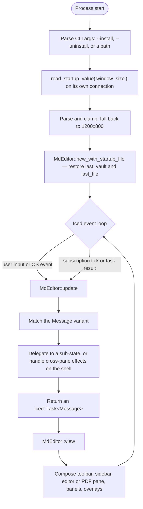
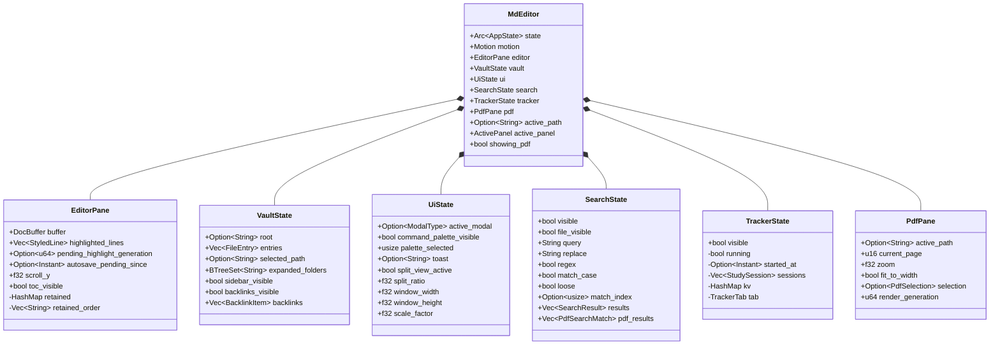

# Native Desktop GUI (`md-editor-native`)

`md-editor-native` implements the graphical shell. It is built on [Iced](https://github.com/iced-rs/iced)
0.14, using custom `Widget` implementations for the markdown editor and PDF pages, async
work through `iced::Task` on a Tokio runtime, and subscriptions that are armed only when
they have something to do.

---

## 1. Application Lifecycle (`main.rs`, `app.rs`)

`main.rs` starts the app through iced's function API rather than the older `Application`
trait:

```rust
iced::application(
    move || app::MdEditor::new_with_startup_file(startup_path.clone()),
    app::MdEditor::update,
    app::MdEditor::view,
)
.title(app::MdEditor::title)
.theme(|state: &app::MdEditor| state.theme())
.subscription(app::MdEditor::subscription)
.window(iced::window::Settings { size: restore_window_size(), icon, platform_specific, ..Default::default() })
.run()
```



`update()` is the central router. For each message it matches the variant, mutates the
relevant sub-state, dispatches side effects as tasks (a background highlight parse, an
atomic save, a PDF render), and arms animation only when something is actually moving.

A key structural rule: **a sub-state's `update` handles only messages that touch its own
fields.** Anything cross-cutting — a modal submit that creates a vault entry, opening a file,
computing backlinks — stays on the shell, which is the only place that owns the shared
`Arc<AppState>`.

---

## 2. Message Architecture (`messages.rs`)

`Message` is the complete event vocabulary of the application, grouped by domain:

| Group | Representative variants |
| :--- | :--- |
| **Vault** | `OpenVaultDialog`, `VaultOpened`, `VaultIndexed`, `CreateFileDialog`, `CreateFolderDialog` |
| **Sidebar** | `SidebarToggle`, `SidebarFileClicked`, `SidebarFolderToggled` |
| **Navigation** | `GlobalSearchOpen`, `SearchQueryChanged`, `SearchDebounceElapsed`, `SearchRegexToggled`, `SearchMatchCaseToggled`, `SearchReplaceAll`, `CommandPaletteOpen`, `NameModalSubmit`, `DeleteFileDialog` |
| **Editor** | `EditorCommand`, `EditorCommandNoScroll`, `EditorSave`, `EditorCheckboxToggle`, `EditorCursorMove`, `EditorScrolled`, `HighlightReady`, `HighlightDebounceElapsed`, `AutosaveElapsed`, `AnimationTick` |
| **PDF** | `PdfZoomChanged`, `PdfFitToWidth`, `PdfLoaded`, `PdfPageSizesLoaded`, `PdfRendered`, `PdfRenderFailed`, `PdfRenderSkipped`, `PdfScrolled`, `PdfLeftClicked`, `PdfRightClicked`, `PdfTocLoaded`, `PdfPageLinksLoaded`, `PdfReferencesLoaded`, `PdfSearchResult`, `PdfLinkPreviewResult` |
| **PDF study** | `PdfDocumentIdComputed`, `PdfPageTextLoaded`, `PdfSelectionChanged`, `PdfSelectionFinished`, `PdfCopySelection`, `PdfCreateHighlight`, `PdfQuickHighlight`, `PdfDeleteHighlight`, `PdfSearchLooseToggled`, `PdfOrphanReport`, `PdfAddQuickNote`, `PdfLinkNote`, `PdfOpenLinkedNote`, `PdfAnnotationFocused` |
| **Tracker** | `TrackerToggle`, `TrackerStart`, `TrackerStop`, `TrackerTabSelected`, `TrackerGateToggled`, `TrackerReadingToggled`, `TrackerProjectStatusChanged`, `TrackerConfigEdited`, `TrackerConfigSave`, `TrackerManualAdd`, `TrackerSessionDelete` |
| **Toast & media** | `ShowToast`, `ToastHide`, `MathRendered` |
| **System** | `KeyboardShortcut(Shortcut)`, `ToggleTOC`, `TocClicked`, `SplitViewToggle`, `SplitViewDragStart`, `SplitViewDragging`, `SplitViewDragEnd`, `WindowResized`, `WindowOpened`, `WindowRescaled`, `WindowCloseRequested`, `VaultFilesChanged` |

Two supporting enums live beside it:

```rust
pub enum Shortcut {
    Save, OpenVault, NewFile, Search, CommandPalette,
    ToggleSidebar, ToggleBacklinks, FocusMode,
    TableOfContents, StudyTracker, SplitView, Escape,
}

pub enum TrackerTab { Dashboard, Log, Projects, Gates, Reading, Config }
```

`Shortcut` is the indirection that lets the keyboard subscription and the command palette
trigger exactly the same handler.

---

## 3. Sub-State Separation

Rather than one monolithic struct, `MdEditor` composes domain sub-states, each owning its
own fields and the messages that touch only those fields.



- **`EditorPane`** (`editor_state.rs`) — the active `DocBuffer`, highlighted lines and the
  generation id that discards stale background highlights, the autosave timestamp, scroll
  offset, TOC visibility, and the retained-buffer registry capped at
  `MAX_RETAINED_BUFFERS = 32`. It also defines the timing constants:
  `HIGHLIGHT_DEBOUNCE = 80ms`, `AUTOSAVE_DEBOUNCE = 400ms`, `AUTOSAVE_POLL = 100ms`,
  `LARGE_DOC_LINE_THRESHOLD = 1_000`, `HUGE_DOC_LINE_THRESHOLD = 5_000`.
- **`VaultState`** (`vault_state.rs`) — vault root, file entries, sidebar selection and
  expansion, and the backlinks panel. Note that `active_path` deliberately stays on the
  shell: it is a cross-cutting "current document" shared by the editor, search, and PDF.
- **`UiState`** (`ui_state.rs`) — modals, the command palette and its highlighted row, the
  toast, split-view state and divider ratio, window size, and the display scale factor that
  drives PDF supersampling.
- **`SearchState`** (`search_state.rs`) — query and replacement text, the `regex`,
  `match_case`, and PDF-only `loose` flags, vault and PDF results, and a memoized
  in-document match cache keyed by `DocMatchKey` so `view` never rescans the buffer.
  `SEARCH_DEBOUNCE = 200ms`.
- **`TrackerState`** (`tracker_state.rs`) — timer state, loaded sessions, tracker
  key-values, active tab, and the JSON config editor content.
- **`PdfPane`** (`pdf_pane.rs`) — the PDF viewport, page caches, annotations, selection, and
  the render generation. Documented in detail in
  [PDF Viewer Internals](PDF-Viewer-Internals.md).

---

## 4. Reactive Subscriptions (`app.rs::subscription`)

Six streams are combined, and **five of the six return `Subscription::none()` when they
have nothing to do**:

1. **Keyboard** — `iced::event::listen_with` filters key presses and returns `None` for
   anything the app does not act on, so ordinary typing (handled by the focused editor
   widget) does not spawn a redundant update cycle. See [Keyboard Shortcuts](Keyboard-Shortcuts.md).
2. **Toast timeout** — armed only while `ui.toast` is set; fires `ToastHide` after 3s.
3. **Highlight debounce** — armed only while a highlight generation is pending; ticks every
   `HIGHLIGHT_DEBOUNCE` (80ms).
4. **Autosave poll** — armed only while `editor.autosave_pending_since` is set; ticks every
   `AUTOSAVE_POLL` (100ms) and writes once `AUTOSAVE_DEBOUNCE` (400ms) has elapsed since the
   last keystroke. The poll is deliberately finer than the debounce because its phase is
   independent of when the user stopped typing.
5. **Search debounce** — armed only while a query keystroke is pending; ticks every
   `SEARCH_DEBOUNCE` (200ms), so a ten-character query runs one FTS/PDF scan rather than ten.
6. **Filesystem watcher** — a `notify` recursive watch on the vault, debounced by
   `VAULT_WATCH_DEBOUNCE = 300ms`, emitting `VaultFilesChanged` with the changed paths. A
   `SELF_WRITE_GRACE` of 3s suppresses events caused by the app's own saves. External edits
   (`git pull`, a CLI change) refresh buffers and the link index without a restart.

Animation frames are armed the same way, from `motion.is_animating()`; see
[Design Tokens, Motion & Palette](Design-Tokens-Motion-and-Palette.md).

---

## 5. View Layer Components (`views/`)

- **Sidebar** (`sidebar.rs`) — the folder/file tree with type-appropriate icons, a per-row
  delete (trash) button, and a header offering *open vault*, *new file*, and *new folder*.
- **Toolbar** (`toolbar.rs`) — sidebar toggle, the active file's name with a saved/unsaved
  indicator, split-view toggle, table of contents, global search, command palette, and the
  study tracker.
- **Command palette** (`command_palette.rs`) — the `Ctrl+P` overlay. Owns the single command
  registry and the ranking that interleaves commands with vault files, capped at
  `MAX_RESULTS = 40`.
- **PDF viewer** (`pdf_viewer.rs`) and **interactive PDF** (`interactive_pdf.rs`) — the
  continuous page list, toolbar, and search bar; page bitmaps wrapped in a custom `Widget`
  for hit testing and drag selection; and five canvas overlay layers for annotations,
  focus outlines, search matches, the live selection, and reference underlines.
- **Backlinks panel** (`backlinks.rs`) — notes and PDF highlights pointing at the open
  document.
- **Table of contents** (`toc.rs`) — Markdown headings H1–H6, or the PDF outline (embedded
  bookmarks, or a recovered one marked as synthetic).
- **Toast** (`toast.rs`) — a single animated feedback message that fades in and out.
- **Modals** (`modals.rs`) — create file, create folder, delete confirmation, quick note, and
  link-note dialogs.
- **Link note picker** (`link_note_picker.rs`) — a searchable in-app vault picker for
  attaching a PDF highlight to an existing note or a new note path.
- **Tracker** (`tracker.rs`) — the six-tab study dashboard and the JSON configuration schema.
- **Icons** (`icons.rs`) — the vector icon set, drawn directly on an iced canvas rather than
  loaded as font glyphs or bitmaps.
- **Welcome** (`welcome.rs`) — the zero-state: the app icon, wordmark, an
  *Open Existing Vault* button, and the `Ctrl+O` hint.
