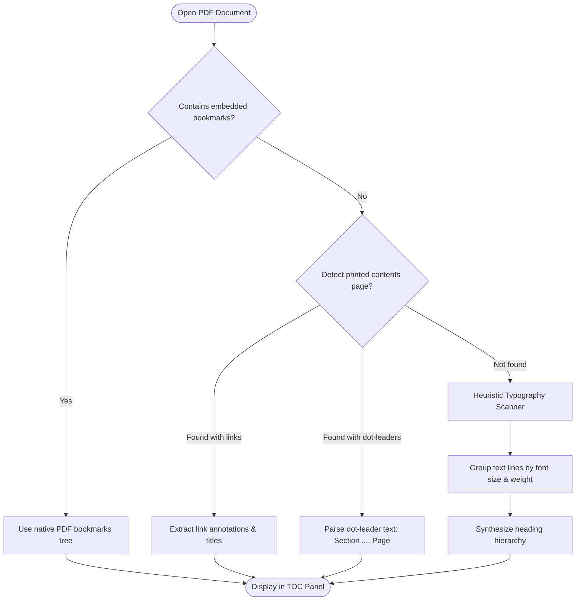

# PDF Engine & Sidecar Annotations

The PDF subsystem in MD Editor is engineered for reading academic papers, technical documentation, and dense textbooks directly beside your Markdown notes. It treats the original PDF file as strictly immutable, storing all highlights, notes, and bookmark metadata as external sidecar records in SQLite.

---

## Architecture & Threading Model (`core/src/pdf.rs`)

Google's [PDFium](https://pdfium.googlesource.com/pdfium/) library is a C++ engine that stores bindings and thread-local state in process-global singletons. Concurrently creating multiple `Pdfium` instances or accessing handles across multiple threads causes fatal race conditions and segmentation faults.

MD Editor enforces a **single background worker thread architecture**:

```mermaid
sequenceDiagram
    participant UI as Iced UI Thread
    participant PriorityQ as Priority Channel
    participant NormalQ as Standard Work Channel
    participant Worker as Dedicated PDFium Worker
    participant Cache as Memory Image Cache

    Note over UI,Worker: User scrolls to Page 14
    UI->>PriorityQ: Request priority render: Page 14 (scale 2.0)
    UI->>NormalQ: Request prefetch: Page 15, Page 16
    
    rect rgb(30, 45, 60)
        Note over Worker: Worker loop checks PriorityQ first
        PriorityQ->>Worker: Pop Page 14 request
        Worker->>Worker: Rasterize page into RGBA buffer
        Worker-->>UI: Send raw pixel buffer (Handle)
    end

    UI->>Cache: Store rendered handle
    UI->>UI: Draw Page 14 on Canvas

    rect rgb(20, 30, 40)
        Note over Worker: PriorityQ is empty; process NormalQ
        NormalQ->>Worker: Pop Page 15 prefetch
        Worker->>Worker: Rasterize Page 15
        Worker-->>Cache: Populate cache in background
    end
```

### Worker Queue Prioritization
- **`priority_sender: Sender<PriorityRender>`**: Receives render commands for the page currently visible in the user's viewport.
- **`sender: Sender<PdfCommand>`**: Receives background tasks: text extraction for search indexing, reference scanning, and prefetching off-screen pages.
- The worker thread always empties the priority queue before servicing background prefetch requests.

---

## 1. Coordinate Normalization & Continuous Viewing

PDF files and desktop graphical interfaces use fundamentally different coordinate spaces:
- **PDF Space**: Origin `(0, 0)` is at the **bottom-left** corner of the page. Units are points ($1/72$ inch).
- **Screen Canvas Space**: Origin `(0, 0)` is at the **top-left** corner of the viewport. Units are device-independent pixels.

[`pdf.rs`](file:///home/sur/repo/md-editor/core/src/pdf.rs) continuously normalizes coordinates into unit fractions $[0.0, 1.0]$:
$$\text{norm}_x = \frac{x}{\text{page\_width}}, \quad \text{norm}_y = \frac{\text{page\_height} - y}{\text{page\_height}}$$

This ensures that highlight bounding boxes and search match overlays remain pixel-perfect regardless of DPI scaling, window resizing, or zoom factors.

---

## 2. Table of Contents & Outline Recovery

Many academic PDFs and scanned books lack embedded bookmarks. MD Editor implements a multi-tier TOC recovery pipeline:



Even PDFs without embedded bookmarks receive a structured, clickable table of contents.

---

## 3. Heuristic In-Text Reference Detection (`references.rs`)

Academic papers frequently reference equations (e.g. `(3.14)`), figures (e.g. `Figure 4`), tables (e.g. `Table 1.2`), and sections (e.g. `Section 2.1`) without embedding hyperlinks.

[`references.rs`](file:///home/sur/repo/md-editor/core/src/references.rs) analyzes the extracted text layer of the PDF:
1. **Detection**: Scans for regular expression patterns matching citation formats.
2. **Target Resolution**: Locates the page and bounding box where the figure, equation, or table is defined.
3. **Hover Preview**: Recognized references are rendered on the PDF canvas with a subtle dotted underline. Right-clicking or hovering displays an **instant popup preview** of the referenced equation or figure without forcing the reader to scroll away from their reading position.
4. **Caching**: Resolved references are stored in the SQLite `pdf_references` table (keyed by the file's SHA-256 hash), so scanning runs only once per document.

---

## 4. Loose-Whitespace Text Search

PDF text extractors often insert line breaks mid-sentence, break words across hyphens at column margins, or introduce variable spacing.

MD Editor's PDF search engine includes a **Loose Whitespace Mode**:
- Normalizes internal whitespace sequences `\s+` into flexible wildcard matchers.
- Recognizes hyphenated line breaks (e.g., `algo-` at the end of a line followed by `rithm` on the next line).
- Allows users to search for multi-word phrases and find exact matches even when the phrase spans across lines or columns.

---

## 5. Non-Destructive Sidecar Highlights & Annotations

When you highlight text or write a note in a PDF, the source `.pdf` file on disk is **never modified**.

### Annotation Schema & Persistence
Annotations are persisted to SQLite table `pdf_annotations`:
- `ranges_json`: Serialized character index intervals on the PDF text layer.
- `rects_json`: Bounding boxes `[x, y, w, h]` relative to page dimensions.
- `color`: Highlight color token. Colors cycle automatically across five calm pastel tones:
  1. `Yellow` (`#F6E05E`)
  2. `Green` (`#68D391`)
  3. `Blue` (`#63B3ED`)
  4. `Pink` (`#F687B3`)
  5. `Orange` (`#FBD38D`)
- `note`: User comment or quick note text.
- `linked_note_path`: Path to an associated Markdown note in the vault.

### Orphan & Drift Detection
If a PDF file is updated externally (e.g., recompiled from LaTeX), stored text offsets might shift. MD Editor includes an integrated drift validator:
- Compares the saved `selected_text` with the text currently extracted under the saved bounding boxes.
- Flags annotations whose underlying text has changed or drifted, alerting the user to re-align their notes.

---

## 6. Linked Markdown Notes & Deep Linking (`pdf://`)

You can create or append PDF highlights directly into Markdown notes via the **Link Note Picker** modal:

```markdown
## Highlight from Introduction to Algorithms (Page 42)

> "A divide-and-conquer algorithm breaks down a problem into two or more sub-problems of the same or related type..."
> 
> [Jump to passage in PDF](pdf://a8f3b2c1?page=42&annotation=ann_91e0a2)

### Notes
This definition directly relates to our discussion in [[Lecture 3 Notes]].
```

### Deep Link Protocol (`pdf://`)
- Clicking a `pdf://` link inside any Markdown note switches focus to the PDF pane, opens the target document, scrolls smoothly to page 42, and highlights the specific annotation with a transient pulse animation.
- Backlinks are reciprocal: the **Backlinks Panel** lists all Markdown notes referencing the active PDF or specific highlight.
