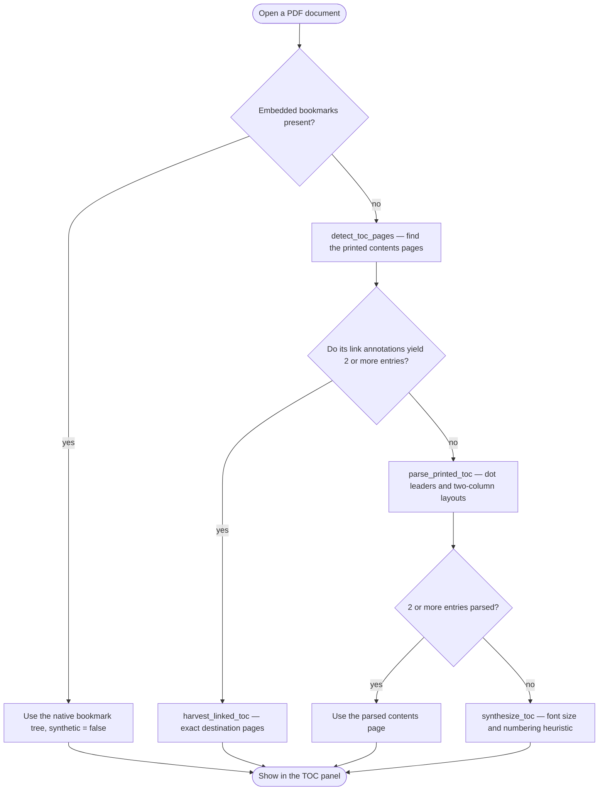

# PDF Engine & Sidecar Annotations

The PDF subsystem is built for reading papers, specifications, and textbooks beside your
notes. It treats the original file as strictly immutable: every highlight, note, bookmark,
and resolved cross-reference is an external record in SQLite.

This page covers the engine in `core/src/pdf.rs` and `core/src/references.rs`. The native
side — viewport state, scheduling invariants, and navigation — is in
[PDF Viewer Internals](PDF-Viewer-Internals.md).

---

## 1. Threading Model (`core/src/pdf.rs`)

`pdfium-render` stores its bindings in a process-global cell, so the application must never
create a second `Pdfium` binding, and PDFium handles must not be shared across threads.
`PdfRenderer::new()` therefore spawns **one** worker thread that owns the binding and one
cached open document:

```rust
pub struct PdfRenderer {
    sender: Sender<PdfCommand>,               // standard work
    priority_sender: Sender<PriorityRender>,  // the page the reader is looking at
    visible_range: Arc<Mutex<Option<(u16, u16, String)>>>,
}
```



```mermaid
sequenceDiagram
    participant UI as Iced UI thread
    participant PriorityQ as Priority channel
    participant NormalQ as Standard channel
    participant Worker as PDFium worker thread
    participant Cache as PdfPane page cache

    Note over UI,Worker: The reader jumps to page 14
    UI->>PriorityQ: render_page_priority(page 14, scale)
    UI->>NormalQ: Wake
    UI->>NormalQ: prefetch pages 15 and 16, page text, links

    rect rgb(30, 45, 60)
        Note over Worker: Drain the priority channel before each standard command
        PriorityQ->>Worker: newest priority request wins, older ones are dropped
        Worker->>Worker: Rasterize the page to RGBA
        Worker-->>UI: DynamicImage
    end

    UI->>Cache: Store the decoded handle and dimensions
    UI->>UI: Draw page 14

    rect rgb(20, 30, 40)
        Note over Worker: Priority channel empty, take one standard command
        NormalQ->>Worker: prefetch page 15
        Worker->>Worker: Rasterize page 15
        Worker-->>Cache: Populate the cache in the background
    end
```

### Scheduling rules

1. Receive a standard command; drain any others already available into `pending_commands`.
2. **Before each standard command, drain the priority channel.** If several priority
   requests are queued, only the newest is rendered — the reader has already scrolled past
   the others.
3. Process exactly one standard command, then repeat.

`PdfCommand::Wake` exists only to unblock `receiver.recv()` after a priority request is
sent; it performs no work of its own. The design **cannot interrupt an operation already in
flight** — a priority page waits for the current command to finish — but it does guarantee
the target page never queues behind a backlog of prefetches, link extractions, or searches.

### The command surface

Standard channel: `PageCount`, `ExtractText`, `PageSizes`, `RenderPage`, `GetToc`,
`GetReferences`, `GetEmbeddedToc`, `GetLinks`, `SearchText`, `RenderLinkPreview`,
`GetPageText`, `Wake`. Priority channel: `PriorityRender { path, page_index, scale, resp }`.

Every command carries a `SyncSender` for its reply, so the async caller on the Tokio side
blocks on a channel rather than on PDFium.

---

## 2. Document Identity & Text Caching

```rust
pub fn compute_provisional_id(path: &Path) -> Result<(String, u64, Option<i64>), String>
```

The `document_id` is the SHA-256 of **the first 1 MiB of the file plus its length**, in hex.
It is deliberately content-only:

- reading a bounded prefix keeps opening a 500-page PDF cheap;
- **mtime is excluded on purpose** — including it would orphan every annotation whenever the
  file was copied, restored from a backup, or re-downloaded. The mtime is still returned and
  recorded in `pdf_documents` for bookkeeping.

Extracted document text is cached in `pdf_text_cache`, keyed by vault-relative path and
invalidated by size and mtime, so reopening a vault does not re-run extraction. Empty
results are cached too, so a scanned PDF with no text layer is not retried on every open.

---

## 3. Coordinate Spaces

- **PDF space** — origin at the **bottom-left**, units are points (1/72 inch).
- **Screen space** — origin at the **top-left**, units are logical pixels.

Character bounding boxes arrive from PDFium in bottom-left origin. `to_top_left(rect,
page_height)` converts to the top-left convention used by `LinkInfo`, `ReferenceLink.bbox`,
and the preview crop, so hit testing has one convention to reason about. Annotation and
search rectangles stay in bottom-left PDF points and are converted at draw time by
`search_rect_to_view_rect`; reference underlines are already top-left and convert with a
plain `* zoom`.

Because rectangles are stored in PDF space rather than in pixels, highlights stay aligned
across zoom changes, window resizes, and HiDPI scale factors.

---

## 4. Table of Contents Recovery

`get_toc(path)` returns `(Vec<TocEntry>, synthetic)`. Embedded bookmarks are used when
present and `synthetic` is `false`. Otherwise an outline is recovered from the document
itself, best source first:



The heuristics are guarded against fabricating junk:

- titles dominated by symbols or Private-Use-Area math glyphs are rejected;
- a synthesized outline is discarded when its candidates cluster onto too few pages — an
  index or bibliography — or appear too densely, which is equation noise.

So a real paper recovers its section structure, while a scanned or structureless PDF
correctly yields an *empty* outline rather than a dump of page content. The TOC panel marks
a recovered outline as synthetic.

`recover_toc(doc, &pages)` runs the whole chain; `recover_toc_from_texts(&pages)` runs the
text-only subset (no document handle) for the reference resolver.

---

## 5. Internal Reference Recognition (`core/src/references.rs`)

Many PDFs reference their own equations, figures, tables, and sections by number — "see
equation (3.14)", "Figure 1.1", "Section 3.2" — without carrying link annotations for those
mentions.

```rust
pub fn resolve_references(pages: &[PdfPageText], toc: &[TocEntry]) -> Vec<ReferenceLink>
```

The resolver is **pure**: it reads already-extracted page text plus the outline, touches no
PDFium, and is therefore `Send`, cheap (roughly 15–30ms for a full textbook), and unit
testable without a window.

### Two passes

1. **Build a target map** (label → location) per family:
   - *equations* — parenthesised numbers in the right margin beside display math. A token
     whose left edge is past `RIGHT_MARGIN_FRAC = 0.62` of the page width is treated as a
     label, never as a call-site;
   - *figures and tables* — caption lines matching `Figure N[.M]` / `Table N[.M]`;
   - *sections* — leading section numbers taken from the outline.
   A label found at two locations is dropped as ambiguous.
2. **Scan call-sites** — in-prose mentions — and emit a `ReferenceLink` **only when the
   label matches a unique target**.

> **No target ⇒ no link.** That single rule is what keeps precision high: stray numbers —
> intervals, quantities, years — never become bogus links.

Precision rules learned from a real corpus: reject bare four-or-more-digit parenthesised
numbers (citation years like `(2003)`); capture dotted figure and table numbers, or
`Figure 1.1` and `Figure 1.2` collapse into one target; and require a dotted section number,
because bare chapter integers are too coarse to aim at.

### Chunked scanning

References need the whole text layer, but PDFium is single-threaded, and priority renders
only drain *between* worker commands — so one monolithic full-document command would block
page rendering for half a second or more. The native side instead resolves references as a
chunked background task:

1. `get_embedded_toc(path)` for section targets — cheap, no text scan;
2. extract text one page at a time with `get_page_text(path, i)`, so queued priority page
   renders interleave between pages;
3. if there were no embedded bookmarks, recover the outline from the text just collected
   with `recover_toc_from_texts(&pages)` — no second scan;
4. run `resolve_references(&pages, &toc)` on the async thread.

For bookmark-less PDFs the full scan already happens for TOC recovery, so references are
effectively free; for bookmarked PDFs the chunking is what keeps first-open rendering
responsive.

### Caching and versioning

Results are cached in `pdf_references` keyed by `document_id`, stored as
`(RESOLVER_VERSION, links)`. `get_pdf_references` discards entries whose version does not
match the current resolver, so changing the algorithm invalidates stale results instead of
serving them.

> **Bump `references::RESOLVER_VERSION` whenever the resolver's output for the same input
> would change.** It is currently `2`.

### Preview aiming

Because a `ReferenceLink` is turned into a `LinkInfo` with a destination page, the existing
right-click preview path renders it with no special-casing. One adjustment: a caption sits
*beside* its artwork, not on it, so `scan_caption_callsites` nudges the preview target off
the caption — figures up (caption-below convention), tables down (caption-above) — by
`CAPTION_PREVIEW_SHIFT = 110.0` points, about a third of the 300pt preview window, so the
figure fills the frame instead of being clipped.

Recognized references are drawn with a subtle accent **underline**. Those rects set
`OverlayRect.thin`, which bypasses the minimum-size clamp that keeps highlight rectangles
legibly tall, letting the underline render as a true hairline.

### Development tools

Two examples in `core/examples/` support work on the resolver:

```bash
cargo run --example dump_refs -- <file.pdf>   # resolved references with surrounding text
cargo run --example bench_refs -- <file.pdf>  # text-scan cost per document
```

---

## 6. Text Search

```rust
pub fn search_text(&self, path: &str, query: &str, regex: bool, match_case: bool)
    -> Result<Vec<PdfSearchMatch>, String>
```

The worker walks each page's text layer, builds the page string alongside a
`char_indices` map back into PDFium's own character indices, finds matches (as a compiled
`regex` when `regex` is set, otherwise as a literal), and converts each match into
`PdfRect`s via `text_page.segments_subset`.

**Loose whitespace mode** is a native-side convenience built on the same regex path
(`app.rs::search_pdf`): the query is split on whitespace, each token is `regex::escape`d, and
they are rejoined with `\s+`.

```rust
let pattern = query.split_whitespace()
    .map(regex::escape)
    .collect::<Vec<_>>()
    .join(r"\s+");
```

That lets a phrase match even when the extracted text puts a line break or a run of spaces
between the words — which is exactly what happens when a sentence wraps across a PDF line or
column. It does **not** rejoin words hyphenated across a line break; a word split as
`algo-` / `rithm` still needs to be searched in halves.

---

## 7. Non-Destructive Sidecar Highlights

Highlighting text or writing a note never modifies the `.pdf` on disk.

```rust
pub struct PdfAnnotation {
    pub id: String,
    pub document_id: String,
    pub page_index: u16,
    pub kind: PdfAnnotationKind,        // Highlight | Note
    pub color: PdfAnnotationColor,      // Yellow | Green | Blue | Pink | Orange
    pub selected_text: String,
    pub ranges: Vec<PdfTextRange>,      // character intervals on the page text layer
    pub rects: Vec<PdfRect>,            // bounding boxes in PDF points
    pub note: Option<String>,
    pub linked_note_path: Option<String>,
    pub markdown_anchor: Option<String>,
    pub created_at: i64,
    pub updated_at: i64,
}
```

**Colour cycling.** `PdfAnnotationColor::next()` advances
Yellow → Green → Blue → Pink → Orange → Yellow. `PdfPane::next_highlight_color` steps
through it after each quick highlight, so successive highlights stay visually distinct
without the reader choosing a colour every time. The explicit
`Message::PdfCreateHighlight(color)` path lets you pick one deliberately.

**Annotation survival.** Because `document_id` is content-derived, copying or re-downloading
a PDF keeps its annotations. If the id *does* change, `save_pdf_document` adopts rows
previously recorded for the same vault path — but only when the file size also matches, so
annotations belonging to a genuinely different file that replaced the old one stay orphaned
rather than being silently reattached to the wrong text.

**Orphan and drift report.** `Message::PdfOrphanReport` compares each highlight's stored
`selected_text` against the text currently under its saved rectangle and reports how many
have drifted. Because page text is loaded lazily per visible page, the report also states
how many of the total annotations were actually checkable.

---

## 8. Linked Markdown Notes & the `pdf://` Deep Link

Selecting text in a PDF and choosing **Link to Note** opens a searchable in-app vault picker
(`views/link_note_picker.rs`): pick an existing note, or pick a folder and type a new note
name. The markdown is generated by `native/src/pdf_notes.rs`:

```markdown
---
type: pdf-note
source_pdf: papers/Introduction to Algorithms.pdf
---

# Divide and conquer

## Page 42

> A divide-and-conquer algorithm breaks down a problem into two or more
> sub-problems of the same or related type...

[Open highlight in PDF](pdf://papers/Introduction to Algorithms.pdf?page=42&annotation=abcdef123456)

### Notes

This definition connects to [[Lecture 3 Notes]].
```

Behaviour worth knowing:

- A **new** note gets `type: pdf-note` / `source_pdf:` frontmatter and an `# H1` title
  derived from its filename (`shared pdf note.md` becomes `# Shared pdf note`).
- Reusing an **existing** note **appends** another `## Page N` section after a `---` rule,
  rather than overwriting the file.
- Re-linking the same highlight is **idempotent** — `append_linked_pdf_note_section` checks
  for the generated link and returns the file unchanged if it is already present.
- Page numbers in the heading and the link are **1-based**, while `page_index` is 0-based.
- The link target is the **vault-relative PDF path**, not the `document_id`; relative paths
  are resolved against the note's own location.
- The visible markdown carries no debug identifiers. The annotation id lives only inside the
  `pdf://` link, where it is needed for exact navigation.

Ctrl+clicking (or Cmd+clicking) a `pdf://` link — link spans are activated with the modifier
held — turns on split view, opens the document, scrolls to the page, and focuses the
annotation. Backlinks are reciprocal: the Backlinks panel of a note
lists the highlights that point at it, and opening a linked note from a PDF switches to
split view **without** resetting the PDF to page 1.
