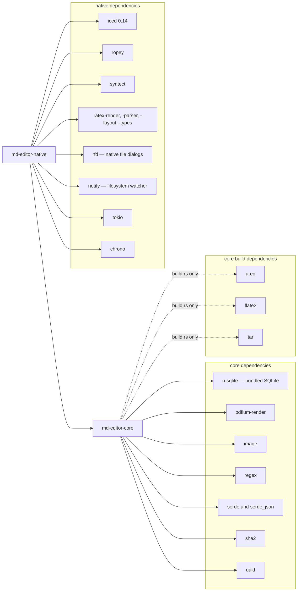

# Repository Structure

MD Editor is a Cargo workspace with two members: `md-editor-core` (the headless domain
engine) and `md-editor-native` (the Iced desktop interface). The workspace pins Rust
edition 2024 and version `1.0.0`.

---

## Workspace Directory Tree

```
md-editor/
├── Cargo.toml                  # Workspace manifest: members core + native, edition 2024
├── Cargo.lock                  # Pinned dependency graph
├── README.md                   # Project overview, screenshots, build instructions
├── LICENSE                     # GNU General Public License v3.0
├── md-editor.png               # Application icon, embedded into the binary
├── images/                     # README screenshots and the intro animation
├── tests-fixtures/             # Sample PDFs used by core tests
│   └── pdf/                    # dummy.pdf, large-500-pages.pdf
├── wiki/                       # This documentation set — the only docs tree
├── .github/workflows/          # CI: windows-build.yml
├── core/                       # md-editor-core crate
│   ├── Cargo.toml              # rusqlite (bundled), pdfium-render, image, regex,
│   │                           # serde, serde_json, sha2, uuid
│   ├── build.rs                # Thin wrapper that calls build_pdfium::setup_pdfium()
│   ├── build_pdfium.rs         # Downloads/caches the platform PDFium shared library
│   ├── pdfium/                 # Build-script output: the copied shared library
│   ├── examples/
│   │   ├── dump_refs.rs        # Prints resolved references with surrounding text
│   │   └── bench_refs.rs       # Reports text-scan cost per document
│   └── src/
│       ├── lib.rs              # Module declarations, `pub use state::AppState`
│       ├── config.rs           # settings key/value helpers + pre-init startup reader
│       ├── file_index.rs       # Wikilink parsing, resolution, bidirectional backlinks
│       ├── massive_tests.rs    # Combinatorial and stress suite (cfg(test) only)
│       ├── pdf.rs              # PDFium worker, render queues, text, TOC recovery, search
│       ├── references.rs       # Internal cross-reference resolver (pure, no PDFium)
│       ├── state.rs            # AppState, SQLite schema, WAL setup, DB path resolution
│       ├── tracker.rs          # Study session + tracker key/value persistence
│       ├── types.rs            # FileEntry, SearchResult, BacklinkTarget, BacklinkItem
│       └── vault.rs            # Traversal, path jailing, atomic writes, FTS rebuild
└── native/                     # md-editor-native crate
    ├── Cargo.toml              # iced 0.14, ropey, syntect, ratex-*, rfd, notify,
    │                           # tokio, chrono, image, regex, serde, uuid
    └── src/
        ├── main.rs             # Entrypoint, CLI args, window geometry, Linux desktop entry
        ├── app.rs              # MdEditor shell: update router, view composition, tasks
        ├── messages.rs         # Message, Shortcut, TrackerTab enums
        ├── theme.rs            # Design tokens: type scale, spacing grid, radii, colors
        ├── motion.rs           # One easing curve, three durations, animation state
        ├── fuzzy.rs            # score() and score_path() for the command palette
        ├── search.rs           # Reusable in-file line matching (plain + regex)
        ├── pdf_notes.rs        # Linked-note path normalization and markdown formatting
        ├── pdf_pane.rs         # PDF viewport, cache, annotation, and navigation state
        ├── ui_state.rs         # Modals, palette, toast, split view, window geometry
        ├── editor_state.rs     # EditorPane: buffer, highlights, retained-buffer registry
        ├── vault_state.rs      # Vault root, file entries, expansion, backlinks panel
        ├── tracker_state.rs    # Timer, sessions, tracker key/values, active tab
        ├── search_state.rs     # Query/replace, flags, results, memoized doc matches
        ├── editor/             # Custom markdown editor implementation
        │   ├── mod.rs          # Module declarations
        │   ├── buffer.rs       # DocBuffer over ropey::Rope, undo runs, auto-pairing
        │   ├── highlight.rs    # StyledLine/StyledSpan parser, syntect, marker concealing
        │   ├── layout_cache.rs # Per-line measurement cache keys and hashing helpers
        │   ├── layout_tree.rs  # HeightTree — Fenwick tree over visual line heights
        │   └── renderer.rs     # The iced Widget: layout, draw, hit test, selection
        └── views/              # View-layer components
            ├── mod.rs          # Module declarations
            ├── backlinks.rs    # Incoming connections pane (notes, PDFs, highlights)
            ├── command_palette.rs # Ctrl+P overlay, command registry, ranking
            ├── icons.rs        # Vector icons drawn on an iced canvas
            ├── interactive_pdf.rs # Page bitmap widget: hit testing, selection, clicks
            ├── link_note_picker.rs # Modal for attaching a PDF highlight to a note
            ├── modals.rs       # Create file/folder, delete confirm, quick note, link note
            ├── pdf_viewer.rs   # Toolbar, search bar, continuous page list, overlay canvas
            ├── search.rs       # In-file and global search panels
            ├── sidebar.rs      # Vault file tree and its header actions
            ├── toast.rs        # Animated feedback toast
            ├── toc.rs          # Markdown heading outline and PDF bookmark tree
            ├── toolbar.rs      # Top bar: sidebar, split view, TOC, search, palette, tracker
            ├── tracker.rs      # Study tracker dashboard, tabs, and config schema
            └── welcome.rs      # Zero-state view when no vault is open
```

> `target/` (build output, the PDFium cache, and a debug settings database) is generated
> and git-ignored.

---

## Detailed File & Responsibility Matrix

### Core Services (`core/src/`)

| File | Primary Responsibility |
| :--- | :--- |
| `lib.rs` | Declares the modules and re-exports `AppState`. |
| `state.rs` | Owns `AppState`, the `rusqlite::Connection`, the full schema DDL, WAL/synchronous pragmas, `PRAGMA user_version` migrations, database path resolution, legacy migration, and all PDF sidecar queries. |
| `config.rs` | `get_sys_config` / `set_sys_config` over the `settings` table, plus `read_startup_value` which opens its own connection before `AppState` exists (used for window geometry). |
| `vault.rs` | Vault root indexing, tree listing, path jailing (`resolve_vault_path_checked`), atomic `write_file`, create/rename/delete, FTS5 rebuild, `search_vault`, and backlink queries. |
| `file_index.rs` | Parses `[[target]]` and `[[target\|alias]]` wikilinks, resolves them by exact path then shortest matching basename, and maintains `outgoing` and `incoming` maps. |
| `pdf.rs` | The PDFium FFI boundary: worker thread, priority and standard channels, page rendering, text extraction, page sizes, links, bookmarks, TOC recovery, search, link previews, and the `document_id` content hash. |
| `references.rs` | Pure resolver that turns already-extracted page text plus an outline into `ReferenceLink`s for equations, figures, tables, and sections. Never touches PDFium. |
| `tracker.rs` | `StudySession` and `TrackerKv` models with their SQLite persistence helpers. |
| `types.rs` | `FileEntry`, `SearchResult`, `BacklinkTarget`, `BacklinkItem`. |
| `massive_tests.rs` | Eight combinatorial/stress tests: wikilink variants, graph topologies, index fuzzing, settings upserts, tracker volume, recursive vault operations, FTS indexing, and file lifecycle. |

### Native GUI Application (`native/src/`)

| File | Primary Responsibility |
| :--- | :--- |
| `main.rs` | Parses `--install` / `--install-desktop`, `--uninstall` / `--uninstall-desktop`, and a bare path argument; restores and clamps window size; installs the Linux desktop entry and multi-size icons; starts the `iced::application`. |
| `app.rs` | The `MdEditor` shell: `update()` routing, `view()` composition, subscriptions (keyboard, toast, highlight debounce, autosave, search debounce, animation frames, filesystem watcher), and every cross-pane effect. |
| `messages.rs` | `Message` (the complete event vocabulary), `Shortcut`, and `TrackerTab`. |
| `theme.rs` | Six type sizes, seven spacing steps on a 2px grid, three radii, the dark colour palette, `fade()`, and the custom iced `Theme`. |
| `motion.rs` | `EASE = Easing::EaseOutQuad`; durations `FAST`, `PANEL`, `OVERLAY`; panel widths; the `Motion` animation state and `is_animating()`. |
| `fuzzy.rs` | `score()` — in-order matching with word-boundary, CamelCase, run, and distance rules — and `score_path()`, which favours the filename. |
| `editor/buffer.rs` | `DocBuffer` over `ropey::Rope`: transactions with inverse ops, undo-run coalescing, auto-pairing, list continuation, formatting commands, movement. |
| `editor/highlight.rs` | `highlight_markdown()` producing `StyledLine`/`StyledSpan`, with syntect for fenced code and marker concealing via `is_syntax` + `display_text`. |
| `editor/layout_tree.rs` | `HeightTree`, a Fenwick tree over visual line heights, giving O(log N) prefix sums and y-to-line lookups. |
| `editor/layout_cache.rs` | `LineHeightCache` plus `line_hash()` and `resource_hash()` so a line is remeasured only when its content, edit state, active column, layout width, or media dimensions change. |
| `editor/renderer.rs` | The `iced::advanced::Widget` implementation: layout, viewport-culled drawing, hit testing, visual cursor movement, selection painting, and per-block horizontal scrolling. |

---

## Workspace Crate Dependencies



### Inviolable Dependency Rules

1. **No circular dependencies.** `md-editor-core` must never depend on `md-editor-native`.
2. **No UI in core.** The core crate must never take a dependency on a GUI or text-shaping
   toolkit (`iced`, `winit`, `ratex-render`).
3. **Pure FFI containment.** `pdfium-render` is reachable only through `core/src/pdf.rs`;
   exactly one `Pdfium` binding may exist per process.
