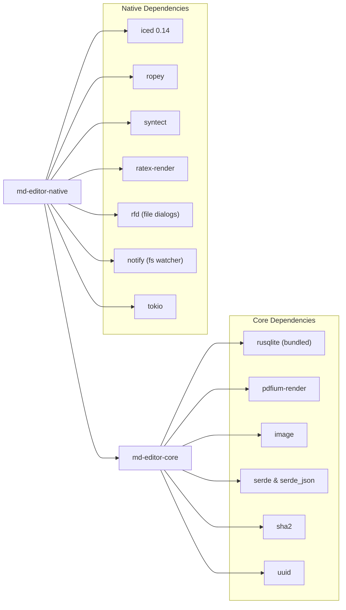

# Repository Structure

The MD Editor codebase is arranged as a Cargo workspace with two member crates: `md-editor-core` (the headless domain engine) and `md-editor-native` (the Iced graphical interface).

---

## Workspace Directory Tree

```
md-editor/
├── Cargo.toml                  # Workspace manifest defining core and native members
├── Cargo.lock                  # Pinned dependency graph
├── README.md                   # Project overview, screenshots, and introduction
├── guide.md                    # Gateway architectural summary
├── LICENSE                     # GNU General Public License v3.0
├── md-editor.png               # High-resolution application icon
├── docs/                       # Engineering specifications and deep architecture notes
│   ├── FEATURES.md             # Complete feature specification
│   ├── LAUNCH.md               # Release verification checklist & durability invariants
│   ├── markdown-editor-arch.md # Markdown canvas & rendering pipeline reference
│   └── pdf-viewer-arch.md      # PDFium multi-threaded scheduling architecture
├── images/                     # Screenshots and animated demo assets
├── tests-fixtures/             # Sample vaults and test documents
├── wiki/                       # GitHub Wiki documentation tree
├── core/                       # md-editor-core crate
│   ├── Cargo.toml              # Dependencies: rusqlite, pdfium-render, image, serde, sha2
│   ├── build.rs                # Build script calling PDFium linker
│   ├── build_pdfium.rs         # Dynamic platform binary fetcher for PDFium
│   └── src/
│       ├── lib.rs              # Public library exports
│       ├── config.rs           # Key-value SQLite settings and startup helpers
│       ├── file_index.rs       # In-memory file registry, wikilinks, and backlinks graph
│       ├── massive_tests.rs    # Stress, combinatorial, and durability test suite
│       ├── pdf.rs              # PDFium FFI wrapper, worker thread, priority channels
│       ├── references.rs       # Heuristic reference detector (equations, figures, tables)
│       ├── state.rs            # AppState context, SQLite schema, WAL setup, migrations
│       ├── tracker.rs          # Study tracker data structures and database operations
│       ├── types.rs            # Common core types (FileEntry, SearchResult, BacklinkItem)
│       └── vault.rs            # Vault traversal, path sanitization, and atomic writes
└── native/                     # md-editor-native crate
    ├── Cargo.toml              # Dependencies: iced, ropey, syntect, ratex, tokio, rfd
    └── src/
        ├── main.rs             # Executable entrypoint, CLI flags, Linux desktop integration
        ├── app.rs              # Root Iced Application, update loop, subscriptions
        ├── messages.rs         # Message enum defining all user and async UI events
        ├── theme.rs            # Design tokens: typography scale, 2px spacing grid, radii, colors
        ├── motion.rs           # Motion subsystem: single easing curve, 3 durations, 0% idle CPU
        ├── fuzzy.rs            # Fuzzy search algorithm with contextual scoring heuristics
        ├── search.rs           # Markdown text search utilities
        ├── pdf_notes.rs        # Formatting helpers for linked Markdown notes
        ├── pdf_pane.rs         # Interactive PDF viewport state
        ├── ui_state.rs         # Modals, toasts, active pane focus, zoom level
        ├── editor_state.rs     # DocBuffer retention cache (LRU 32), highlight generations
        ├── vault_state.rs      # File tree hierarchy, directory expanded set, active file
        ├── tracker_state.rs    # State for active study timers, goals, and logs
        ├── search_state.rs     # Active query state, match offsets, loose search toggles
        ├── editor/             # Custom canvas markdown editor implementation
        │   ├── mod.rs          # Module declarations
        │   ├── buffer.rs       # DocBuffer (ropey::Rope), undo/redo runs, auto-pairing
        │   ├── highlight.rs    # Tokenizer, syntect highlighting, Typora syntax concealing
        │   ├── layout_cache.rs # Memoized line height cache with invalidation keys
        │   ├── layout_tree.rs  # Fenwick tree (HeightTree) for O(log N) line height prefix sums
        │   └── renderer.rs     # Iced Canvas Program (viewport culling, LaTeX math, wide blocks)
        └── views/              # View layer components
            ├── backlinks.rs    # Incoming connections pane (Markdown & PDF highlights)
            ├── command_palette.rs # Unified Ctrl+P modal launcher
            ├── icons.rs        # Vector UI iconography drawn directly on canvas
            ├── interactive_pdf.rs # Interactive PDF canvas (selection, highlight overlays)
            ├── link_note_picker.rs# Modal dialog to attach PDF highlight to a note
            ├── modals.rs       # Create file, delete confirm, and settings modals
            ├── pdf_viewer.rs   # Continuous PDF page renderer
            ├── search.rs       # In-file and global search panels
            ├── sidebar.rs      # Vault file tree and context menus
            ├── toast.rs        # Smooth animated feedback toast
            ├── toc.rs          # Heading outline & PDF bookmarks tree
            ├── toolbar.rs      # Main navigation and tool switch bar
            ├── tracker.rs      # Study session timer and milestone dashboard
            └── welcome.rs      # Zero-state empty workspace view
```

---

## Detailed File & Responsibility Matrix

### Core Services (`core/src/`)

| File | Primary Responsibility |
| :--- | :--- |
| [`lib.rs`](file:///home/sur/repo/md-editor/core/src/lib.rs) | Re-exports all core modules and types for consumer crates. |
| [`state.rs`](file:///home/sur/repo/md-editor/core/src/state.rs) | Owns `AppState`, SQLite database connection (`rusqlite::Connection`), schema definitions, WAL journal mode configuration, and schema migrations. |
| [`config.rs`](file:///home/sur/repo/md-editor/core/src/config.rs) | Provides key-value settings helpers (`get_sys_config`, `set_sys_config`) and standalone pre-initialization config readers (`read_startup_value`). |
| [`vault.rs`](file:///home/sur/repo/md-editor/core/src/vault.rs) | Handles vault directory tree listing, path sanitization (`resolve_vault_path_checked`), atomic file writes (`write_file`), file deletion, and link renaming. |
| [`file_index.rs`](file:///home/sur/repo/md-editor/core/src/file_index.rs) | Indexes vault files, parses `[[target]]` and `[[target\|alias]]` wikilinks, resolves links by shortest path, and maintains the bidirectional backlink graph. |
| [`pdf.rs`](file:///home/sur/repo/md-editor/core/src/pdf.rs) | Wraps Google PDFium FFI, spawns the dedicated single worker thread, exposes priority render queues, extracts text, handles coordinate normalization, and parses bookmarks. |
| [`references.rs`](file:///home/sur/repo/md-editor/core/src/references.rs) | Scans extracted PDF text layers for unlinked equations, figures, tables, and sections, returning target destinations for hover previews. |
| [`tracker.rs`](file:///home/sur/repo/md-editor/core/src/tracker.rs) | Domain models and SQLite persistence for deep study sessions, pomodoro logs, milestones, and daily activity. |
| [`types.rs`](file:///home/sur/repo/md-editor/core/src/types.rs) | Common data structures: `FileEntry`, `SearchResult`, `BacklinkItem`, and `VaultTree`. |
| [`massive_tests.rs`](file:///home/sur/repo/md-editor/core/src/massive_tests.rs) | Deterministic stress tests, multi-threading race condition checks, and 500-variant combinatorial wikilink parsing tests. |

### Native GUI Application (`native/src/`)

| File | Primary Responsibility |
| :--- | :--- |
| [`main.rs`](file:///home/sur/repo/md-editor/native/src/main.rs) | Application entrypoint, CLI argument parser (`--install-desktop`, `--uninstall-desktop`), window geometry persistence, and desktop file generation. |
| [`app.rs`](file:///home/sur/repo/md-editor/native/src/app.rs) | Root Iced `Application` implementation, coordinating `update()`, `view()`, background Tokio tasks, and timer subscriptions. |
| [`messages.rs`](file:///home/sur/repo/md-editor/native/src/messages.rs) | Exhaustive enum defining all synchronous UI actions and asynchronous worker responses. |
| [`theme.rs`](file:///home/sur/repo/md-editor/native/src/theme.rs) | Design token system: 6-step typography scale, 7-step 2px spacing scale, 3 corner radii, and semantic color palette. |
| [`motion.rs`](file:///home/sur/repo/md-editor/native/src/motion.rs) | Animation curves (`EaseOutQuad`), 3 standardized durations, animated property state, and dynamic frame subscription (0% idle CPU). |
| [`fuzzy.rs`](file:///home/sur/repo/md-editor/native/src/fuzzy.rs) | Substring and fuzzy matching engine with scoring bonuses for word boundaries, CamelCase initials, consecutive runs, and filenames over paths. |
| [`editor/buffer.rs`](file:///home/sur/repo/md-editor/native/src/editor/buffer.rs) | `DocBuffer` text storage backed by `ropey::Rope`, grouping edits into human-sized undo runs, auto-pairing brackets/quotes, and list continuation. |
| [`editor/highlight.rs`](file:///home/sur/repo/md-editor/native/src/editor/highlight.rs) | Parses markdown lines into `StyledLine` and `StyledSpan`, concealing markdown markers when the cursor is away (Typora-style hybrid editing). |
| [`editor/layout_tree.rs`](file:///home/sur/repo/md-editor/native/src/editor/layout_tree.rs) | Fenwick tree (`HeightTree`) storing line heights for $O(\log N)$ prefix sum queries and spatial line lookups. |
| [`editor/layout_cache.rs`](file:///home/sur/repo/md-editor/native/src/editor/layout_cache.rs) | Memoization table for measured line heights with invalidation hashing. |
| [`editor/renderer.rs`](file:///home/sur/repo/md-editor/native/src/editor/renderer.rs) | `iced::widget::canvas::Program` implementation, executing viewport-culled draw passes, LaTeX math rasterization, and block-level horizontal scrolling. |

---

## Workspace Crate Dependencies



### Inviolable Dependency Rules

1. **No Circular Dependencies**: `md-editor-core` must never depend on `md-editor-native`.
2. **No UI in Core**: Core crate must never include dependencies on GUI toolkits (`iced`, `winit`, `ratex-render`).
3. **Pure FFI Containment**: `pdfium-render` must only be interfaced through `core/src/pdf.rs`. Native views interact with PDF functionality via safe messages and handles.
