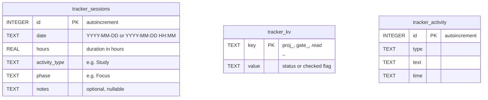

# Study Tracker

MD Editor ships an integrated study tracker: a timer, a session log, and a **configurable
curriculum** of phases, projects, checkpoint gates, and reading lists. It lives inside the
workspace, beside the notes and papers it is tracking, and its data is in the same portable
SQLite database as everything else.

It is opened from the toolbar or from the command palette (`Ctrl+P` → *Study Tracker*), and
closed with `Escape`.

---

## 1. Storage

Three tables in `md_editor_settings.sqlite`, plus one `settings` key:



- **`tracker_sessions`** — one row per logged interval, whether timed or entered by hand.
- **`tracker_kv`** — the checkbox and status state of the curriculum: project statuses, gate
  item ticks, reading item ticks. Written through
  `tracker::set_kv(state, key, value)`, an upsert.
- **`tracker_activity`** — created by the schema and available for an activity feed; the
  current UI does not write to it.
- **`settings['tracker_config']`** — the curriculum itself, as JSON. It lives in `settings`
  rather than `tracker_kv` because it is one document, not a set of flags, and it is only
  accepted after `parse_config` validates it.

### Domain types (`core/src/tracker.rs`)

```rust
pub struct StudySession {
    pub id: i64,
    pub date: String,
    pub hours: f32,
    pub activity_type: String,
    pub phase: String,
    pub notes: Option<String>,
}

pub struct TrackerKv { pub key: String, pub value: String }
```

### Persistence helpers

| Function | Behaviour |
| :--- | :--- |
| `save_session(state, session)` | Inserts a row; `id` is assigned by SQLite |
| `delete_session(state, id)` | Removes one row |
| `get_sessions(state)` | All sessions, `ORDER BY date DESC`. A malformed row is skipped **and logged** — silently dropping study history would hide corruption |
| `get_total_hours(state)` | `SELECT SUM(hours) FROM tracker_sessions` |
| `get_kv(state)` | All key/values, ordered by key |
| `set_kv(state, key, value)` | Upsert via `ON CONFLICT(key) DO UPDATE` |

---

## 2. The Interface (`views/tracker.rs`, `tracker_state.rs`)

Six tabs: **Dashboard**, **Log**, **Projects**, **Gates**, **Reading**, **Config**.

### Dashboard

Four KPI cards computed from the loaded sessions and the parsed config:

| Card | Value | Caption |
| :--- | :--- | :--- |
| `TOTAL TIME` | Sum of every session's hours, one decimal | Accumulated |
| `SESSIONS` | Session count | Total sessions |
| `AVERAGE` | Total ÷ count | Per session |
| `CURRICULUM` | Number of configured phases | Configured roadmap |

Below them: the timer control (*Start Timer* / *Stop Timer*), a summary of projects, gates,
and reading tracks, and recent history.

### The timer

Deliberately minimal — one button, no dialog:

- **Start** records `Instant::now()` and toasts *"Study timer started"*.
- **Stop** computes `elapsed.as_secs_f32() / 3600.0`, floored at `0.01` hours so a very short
  session still records something, and saves a `StudySession` **immediately** with
  `date` = `chrono::Local::now()` as `"%Y-%m-%d %H:%M"`, `activity_type = "Study"`,
  `phase = "Focus"`, and no notes. It toasts *"Study session saved"*.

There is no pause, no pomodoro cycle, and no post-stop dialog. To record an activity type or
notes, use the Log tab's manual entry, which takes a date, an hours value, and free-text
notes.

### Log

The session history, newest first, with per-row delete, and the manual-entry form described
above.

### Projects, Gates, Reading

These render whatever the configuration defines:

- **Projects** — each project shows its id, its phase, and a status the user cycles; the
  choice is stored as `tracker_kv["proj_<id>"]`.
- **Gates** — checkpoint groups, each a titled list of criteria you tick off. Gates are a
  *self-assessment checklist*, not an enforcement mechanism: nothing in the app blocks
  progress on an unticked gate.
- **Reading** — sections of titles, each carrying a priority (`critical`, `important`), that
  you tick as you finish them.

### Config

A JSON editor over `TrackerConfig`. `TrackerConfigSave` runs `parse_config` first, which
requires at least one phase and at least one project; an invalid document is rejected rather
than saved, and a stored config that fails to parse falls back to the built-in default.

```json
{
  "PHASES":   [{ "id": "1A", "title": "Mathematics", "year": "Year 1", "months": "Months 1-4" }],
  "PROJECTS": [{ "id": "1.1", "phase": "1A", "name": "SVD from scratch" }],
  "GATES":    [{ "id": "1A", "title": "Gate 1A - Mathematics",
                 "items": ["Derive SVD from eigendecomposition"] }],
  "READING":  [{ "section": "Textbooks - Mathematics",
                 "items": [{ "priority": "critical", "title": "Linear Algebra Done Right" }] }]
}
```

---

## 3. The Default Curriculum

Out of the box the tracker is seeded with a concrete four-year roadmap toward research in
efficient machine learning — 17 phases (`1A` Mathematics through `4C` Original Research),
20 projects, 6 checkpoint gates, and a reading list spanning mathematics, systems, deep
learning, and efficiency papers.

This is a **starting point, not a fixed structure.** The Config tab replaces it wholesale:
the tracker itself knows nothing about machine learning, only about phases, projects, gates,
and reading sections. A language course, a thesis, or a certification path fits the same
four collections.

---

## 4. Lifecycle Notes

- `TrackerState::new` loads sessions and key/values once at startup, and validates the
  stored config before adopting it.
- Opening the panel (`TrackerToggle`) reloads from disk, so an external edit to the database
  or a change made in another session is picked up.
- Side effects that belong to the global UI are emitted as `Message::ShowToast` tasks rather
  than reaching back into the shell — the tracker never touches another pane's state.
