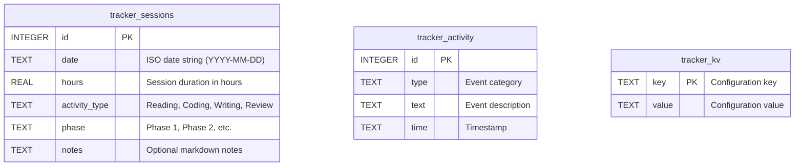

# Study Tracker Subsystem

MD Editor includes an integrated study and research tracker designed for deep-work intervals, reading logs, milestone gates, and course progression. Unlike external habit trackers, the tracker runs inside your desktop workspace directly alongside your notes and PDFs.

---

## 1. Domain Model & SQLite Schema

All tracker data resides in the portable SQLite settings database (`md_editor_settings.sqlite`) across three dedicated tables:



### Struct Definitions ([`core/src/tracker.rs`](file:///home/sur/repo/md-editor/core/src/tracker.rs))

```rust
#[derive(Debug, Clone, Serialize, Deserialize)]
pub struct StudySession {
    pub id: i64,
    pub date: String,
    pub hours: f32,
    pub activity_type: String,
    pub phase: String,
    pub notes: Option<String>,
}

#[derive(Debug, Clone, Serialize, Deserialize)]
pub struct TrackerKv {
    pub key: String,
    pub value: String,
}
```

---

## 2. Core Tracker Operations

[`core/src/tracker.rs`](file:///home/sur/repo/md-editor/core/src/tracker.rs) exposes high-level persistence helpers:

- **`save_session(state, session)`**: Inserts a new study interval.
- **`delete_session(state, id)`**: Removes an errant or test entry.
- **`get_sessions(state)`**: Retrieves all logged sessions in descending date order.
- **`get_total_hours(state)`**: Queries SQLite for cumulative study duration:
  ```sql
  SELECT SUM(hours) FROM tracker_sessions;
  ```
- **`get_kv(state)` / `set_kv(state, key, value)`**: Manages custom tracker configuration (e.g. daily target hours, active milestone gates, pomodoro interval lengths).

---

## 3. UI State & Workflow ([`views/tracker.rs`](file:///home/sur/repo/md-editor/native/src/views/tracker.rs))

The study tracker is accessible from the top toolbar or via the Command Palette (`Ctrl+P` -> `Open Tracker`).

```
┌─────────────────────────────────────────────────────────────┐
│  STUDY TRACKER                              [Active: 00:42] │
├─────────────────────────────────────────────────────────────┤
│  Today: 2.5 hrs  /  Target: 4.0 hrs  [████████░░░░░] 62%    │
│  Total Vault Study Time: 124.5 hrs                          │
├─────────────────────────────────────────────────────────────┤
│  [ Start Timer ]   [ Pause ]   [ Log Custom Session ]       │
├─────────────────────────────────────────────────────────────┤
│  Milestone Gates:                                           │
│  [x] Complete Chapter 4 Reading                             │
│  [x] Exercise Proofs 4.1 - 4.8                              │
│  [ ] Implement Binary Indexed Tree (Fenwick)                │
├─────────────────────────────────────────────────────────────┤
│  Recent History:                                            │
│  • 2026-09-08: 1.5 hrs — Paper Review: Attention Mechanisms │
│  • 2026-09-07: 2.0 hrs — Core Architecture Implementation   │
└─────────────────────────────────────────────────────────────┘
```

### Key Workflows

1. **Active Interval Timer**:
   - Starting a timer tracks time elapsed in real-time.
   - When stopped, opens a session logger pre-filled with the exact duration, prompting for activity type (e.g., *Paper Review*, *Coding*, *Lecture Notes*) and optional summary notes.
2. **Daily Quotas & Visual Progress**:
   - Configure your target daily study hours (stored in `tracker_kv` as `daily_target_hours`).
   - Progress bar visually indicates current progress toward your goal.
3. **Milestone Gates**:
   - Establish sequential project or study phases.
   - Gates ensure prerequisites are completed before progressing to the next stage of research.
